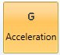
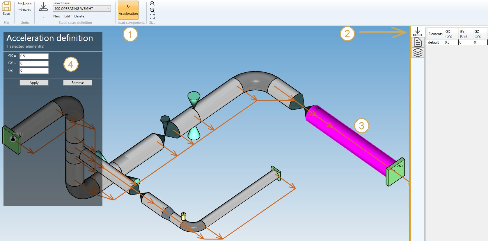

# Acceleration

By checking **Static acceleration** in **Applied loads** you can define acceleration loads on elements of the model.

You can also define **DEFAULT** accelerations that will be applied to all elements of the model :

| Property | Unit Metric | Unit USA |
| -------- | ---- | ---- |
| GX | fraction of G | fraction of G |
| GY | fraction of G | fraction of G |
| GZ | fraction of G | fraction of G |

If you check this option, you will see this **button** in the ribbon :

1. Select the **Acceleration** button
2. Open the **Data panel** on the right
3. Select one or more elements
4. Define the new **vector acceleration** for these elements
5. Apply

You can **undo** this command.

Click on the **Remove** button to delete the load on selected elements.

You can **undo** this command.

You can also change the size of the drawn accelerations by clicking on these buttons :

