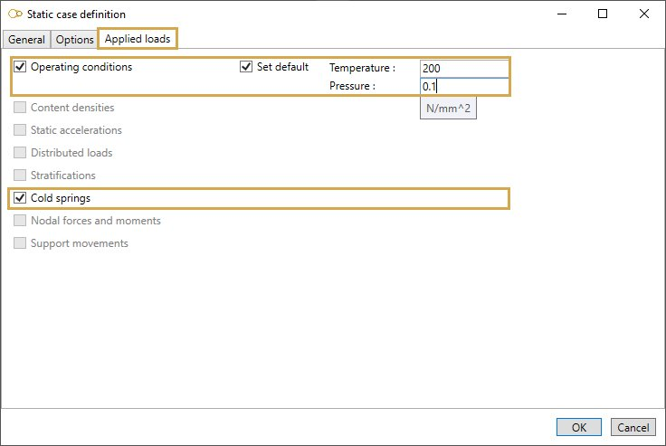

# Cold spring

Suggested equation :

    1. None

## 1. Options

In options, you can :

1. Take the operating conditions from another static case
2. Use **cold modulus**

This case automatically includes the "Secondary case" and "Disable spring hangers" options.

## 2. Applied loads

### 2.1 Operating conditions

Click [here](https://documentation.metapiping.com/Loads/StaticCases/Snow.html#21-operating-conditions) for more information about operating conditions.

### 2.2 Cold springs

    The length of elements that will be altered by an explicit amount will causes forces, moments and 
    stresses in the piping system.

You can define cold spring (pre-stress) on several elements of the model.

If you check this option, you will see this **button** :

1. Select the **Coldspring** button
2. Open the right **Data panel**
3. Select one or more elements
4. Define the new **extension** for these elements
5. Apply

| Property | Unit Metric | Unit USA | Remark |
| -------- | ---- | ---- | -- |
| Length change | mm | in | Positive value for extension |

You can **undo** this command.

Click on the **Remove** button to delete the load on selected restraints.

You can **undo** this command.
