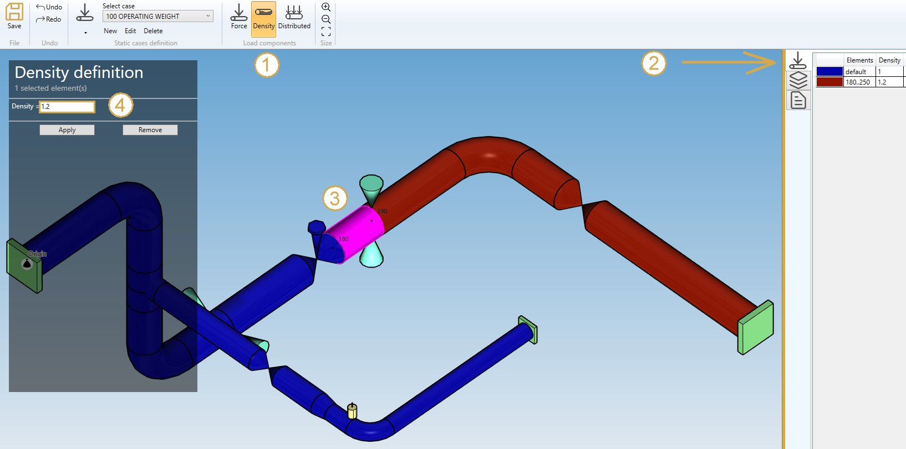

# Content density

By checking **Content densities** in **Applied loads** you can define fluid densities on elements of the model.

You can also define the **DEFAULT** fluid density so that you only have to define the elements that doesn't *follow* the default density. If no default density is set, and no density is specified on some elements, the default density provided in **Model options** or directly in **Data** will be used.

If you check this option, you will see this **button** in the ribbon :

1. Select the **Density** button
2. Open the right **Data panel**
3. Select one or more elements
4. Define the new **density** for these elements
5. Apply

You can **undo** this command.

Click on the **Remove** button to delete the density on selected elements.
