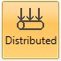
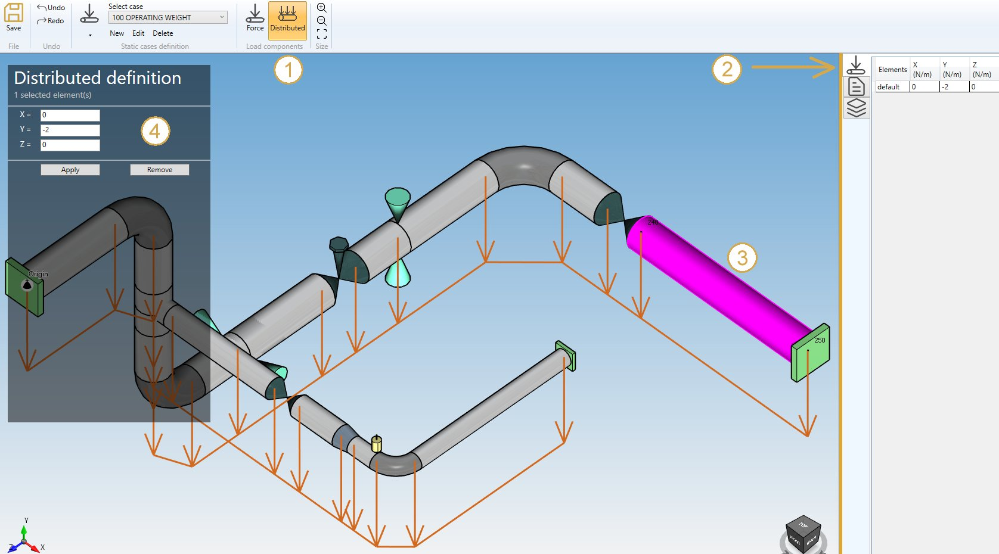
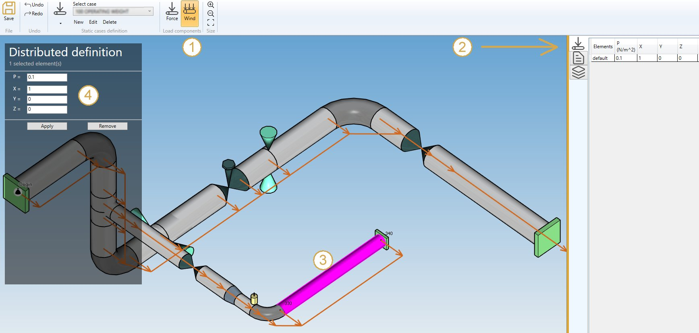
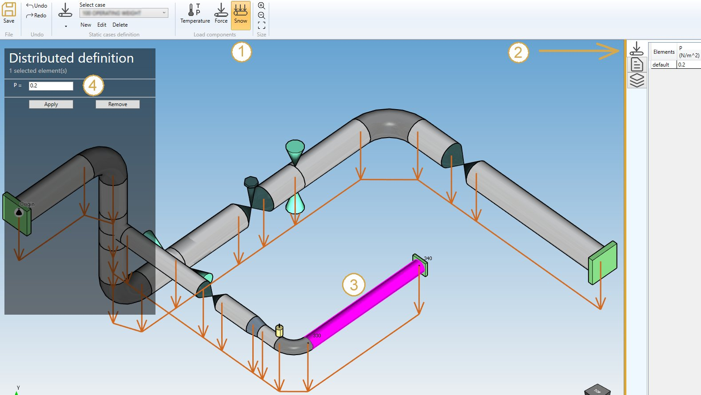

# Distributed loads

By checking **Distributed loads** in **Applied loads** you can define distributed loads on elements of the model. There are three types of distributed loads: simple distributed load (force per unit length), wind and snow.

Simple distributed loads may be applied for weight and occasional cases other than wind and snow cases. Wind loads may only be applied for wind cases and snow loads for snow cases.

## 1. Simple distributed load (distributed)

You can define **DEFAULT** distributed loads that will be applied to all elements of the model :

| Property | Unit Metric | Unit USA |
| -------- | ---- | ---- |
| FX | N/m | lb/ft |
| FY | N/m | lb/ft |
| FZ | N/m | lb/ft |

If you check this option, you will see this **button** in the ribbon :

1. Select the **Distributed** button
2. Open the right **Data panel**
3. Select one or more elements
4. Define the new **vector force** for these elements
5. Apply

You can **undo** this command.

Click on the **Remove** button to delete the load on selected elements.

You can **undo** this command.

You can also change the size of the drawed forces by clicking on these buttons :

### 2. Wind load

You can define **DEFAULT** wind loads that will be applied to all elements of the model.

Define the wind **pressure** and **direction** :

| Property | Unit Metric | Unit USA |
| -------- | ---- | ---- |
| Pressure | N/m² | lb/ft² |
| Dir. /X | - | - |
| Dir. /Y | - | - |
| Dir. /Z | - | - |

If you check this option, you will see this **button** in the ribbon :

1. Select the **Wind** button
2. Open the right **Data panel**
3. Select one or more elements
4. Define the new **pressure** and **direction** for these elements
5. Apply

You can **undo** this command.

Click on the **Remove** button to delete the wind load on selected elements.

You can **undo** this command.

You can also change the size of the drawed forces by clicking on these buttons :

### 3. Snow load

You can define **DEFAULT** snow loads that will be applied to all elements of the model.

Define the snow **pressure** (direction is vertical downwards) :

| Property | Unit Metric | Unit USA |
| -------- | ---- | ---- |
| Pressure | N/m² | lb/ft² |

If you check this option, you will see this **button** in the ribbon :

1. Select the **Snow** button
2. Open the right **Data panel**
3. Select one or more elements
4. Define the new **pressure** for these elements
5. Apply

You can **undo** this command.

Click on the **Remove** button to delete the snow load on selected elements.

You can **undo** this command.

You can also change the size of the drawed forces by clicking on these buttons :

