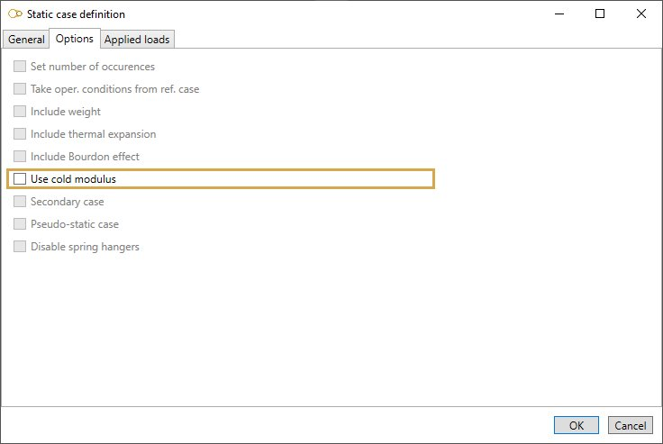
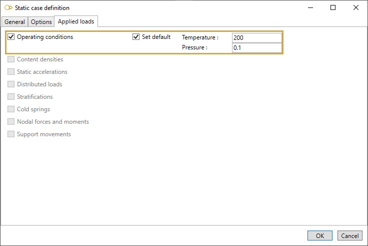

# Dummy

    This load is used to define Operating conditions

Suggested equation :

    1. None

## 1. Options

In options, you can :

1. Use **cold modulus**

## 2. Applied loads

### 2.1 Operating conditions

Click [here](https://documentation.metapiping.com/Loads/StaticCases/Snow.html#21-operating-conditions) for more information about operating conditions.

