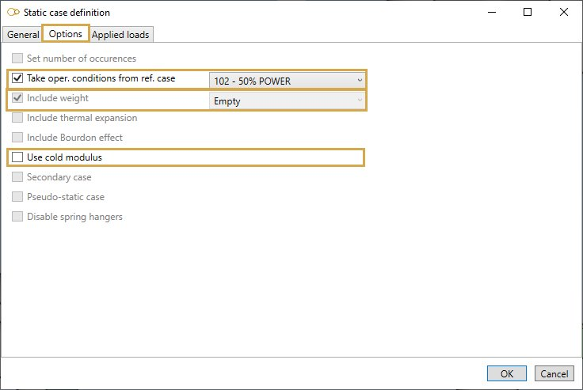
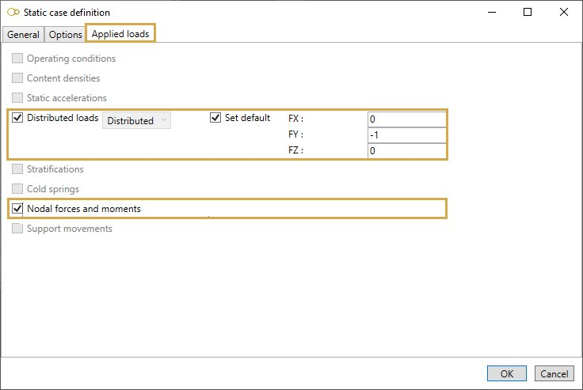

# Sustained - Empty

Suggested equation :

    2. Equation 9 (Design)

## 1. Options

In options, you can :

1. Take the operating conditions from another static case
2. Use **cold modulus**

This case automatically includes the "empty" weight.

## 2. Applied loads

The applied loads are the same (except the content densities ) as explained on **Sustained - Operating** page.

It is possible to define specific loads :

1. Distributed loads

Click [here](https://documentation.metapiping.com/Loads/StaticCases/Operating.html#22-distributed-loads) for more information about distributed loads.

2. Nodal forces and moments

Click [here](https://documentation.metapiping.com/Loads/StaticCases/Operating.html#23-nodal-forces-and-moments) for more information about nodal forces and moments.
