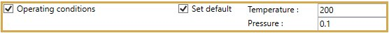
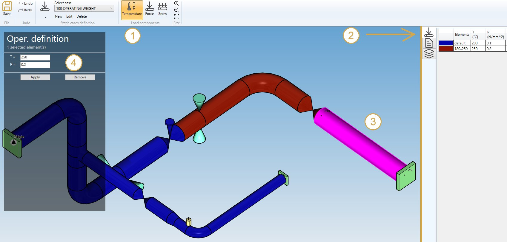

# Operating conditions

You can define operating conditions on elements of the model.

The temperature is used for multiple purposes :
- the Young modulus Eh is evaluated at this temperature if the **Hot modulus** option is used. The Young modulus at room temperature Ec is used otherwise if no reference case is specified
- thermal expansion is applied if **Include thermal expansion** is checked
- the allowable stress Sh for non-Class 1 piping is evaluated at this temperature if the **Hot allowable** option is used. The design temperature is used otherwise

The pressure is used for multiple purposes :
- the longitudinal stress due to pressure thrust
- the stiffening effect on elbows and miter bends
- the SIF reducing effect on elbows and miter bends 

You can define **DEFAULT** operating conditions that will be applied on all elements of the model.

Define the default **temperature** and **pressure** of the load :

| Property | Unit Metric | Unit USA |
| -------- | ---- | ---- |
| Temperature | °C | °F |
| Pressure | N/m² | lb/ft² |

If you check this option, you will see this **button** in the ribbon:

1. Select the **Temperature** button
2. Open the right **Data panel**
3. Select one or more elements
4. Define the new **temperature** and **pressure** for these elements
5. Apply

You can **undo** this command.

Click on the **Remove** button to delete the wind load on selected elements.

You can **undo** this command.
