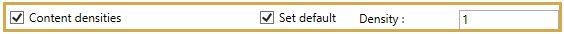
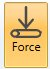
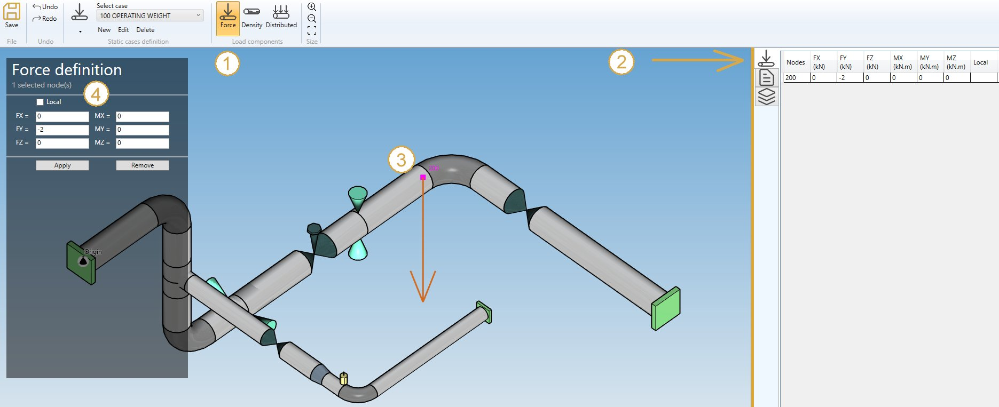

# Sustained - Operating

Suggested equation :

    2. Equation 9 (Design)

## 1. Options

In options, you can :

1. Take the operating conditions from another static case
2. Use **cold modulus**

This case automatically includes the operating weight.

## 2. Applied loads

It is possible to define specific loads :

### 2.1 Content densities

You can now define the fluid density in all elements of the model.

You can also define the **DEFAULT** fluid density so that you only have to define the elements that doesn't *follow* the default density.

If you check this option, you will see this **button** :

1. Select the **Density** button
2. Open the right **Data panel**
3. Select one or more elements
4. Define the new **density** for these elements
5. Apply

You can **undo** this command.

Click on the **Remove** button to delete the density on selected elements.

### 2.2 Distributed loads

You can now define distributed loads on elements of the model.

You can also define **DEFAULT** distributed loads that will be applied on all elements of the model.

Define the vector of the load :

| Property | Unit Metric | Unit USA |
| -------- | ---- | ---- |
| FX | N/m | lb/ft |
| FY | N/m | lb/ft |
| FZ | N/m | lb/ft |

If you check this option, you will see this **button** :

1. Select the **Distributed** button
2. Open the right **Data panel**
3. Select one or more elements
4. Define the new **distributed load** for these elements
5. Apply

You can **undo** this command.

Click on the **Remove** button to delete the distributed load on selected elements.

You can **undo** this command.

You can also change the size of the drawed forces by clicking on these buttons :

### 2.3 Nodal forces and moments

You can define nodal forces and moments on nodes of the model.

If you check this option, you will see this **button** :

1. Select the **Force** button
2. Open the right **Data panel**
3. Select one or more nodes
4. Define the new **force and moment** on these nodes
5. Apply

You can **undo** this command.

Click on the **Remove** button to delete the force/moment on selected nodes.

You can **undo** this command.

You can also change the size of the drawed forces by clicking on these buttons :

