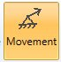

# Occasional - SAM

Suggested equation :

    3. Equation 9 B (occasional)

## 1. Options

In options, you can :

1. Take the operating conditions from another static case
2. Use **cold modulus**

This case automatically includes the "Secondary case" and "Pseudo-static case" options.

## 2. Applied loads

It is possible to define specific loads :

### 2.1 Operating conditions

Click [here](https://documentation.metapiping.com/Loads/StaticCases/Snow.html#21-operating-conditions) for more information about operating conditions.

### 2.2 Support movements

You can define movements on support of the model.

If you check this option, you will see this **button** :

1. Select the **Movement** button
2. Open the right **Data panel**
3. Select one or more restraints
4. Define the new **vector displacement** and **vector rotation** for these restraints
5. Apply

| Property | Unit Metric | Unit USA |
| -------- | ---- | ---- |
| DX | mm | in |
| DY | mm | in |
| DZ | mm | in |
| RX | rad | rad |
| RY | rad | rad |
| RZ | rad | rad |

The values can be set in **local** axis.

You can **undo** this command.

Click on the **Remove** button to delete the load on selected restraints.

You can **undo** this command.

You can also change the size of the drawed forces by clicking on these buttons :

