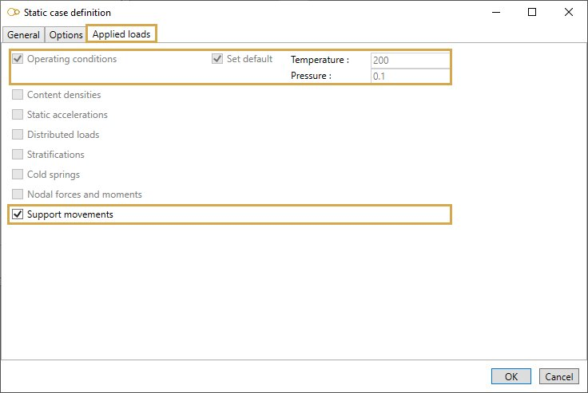

# Settlement

No suggested equation !

## 1. Options

In options, you can :

1. Take the operating conditions from another static case
2. Use **cold modulus**

This case automatically includes the "Secondary case" and "Disable spring hangers" options.

## 2. Applied loads

### 2.1 Operating conditions

Click [here](https://documentation.metapiping.com/Loads/StaticCases/Snow.html#21-operating-conditions) for more information about operating conditions.

### 2.2 Support movements

Click [here](https://documentation.metapiping.com/Loads/StaticCases/SAM.html#22-support-movements) for more information about operating conditions.