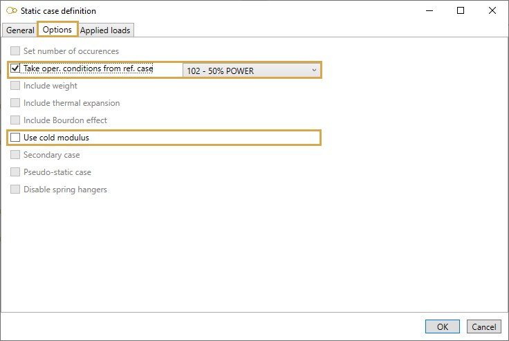
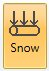

# Occasional - Snow

Suggested equation :

    3. Equation 9 B (occasional)

## 1. Options

In options, you can :

1. Take the operating conditions from another static case
2. Use **cold modulus**

## 2. Applied loads

It is possible to define specific loads :

### 2.1 Operating conditions

You can define operating conditions on elements of the model.

You can also define **DEFAULT** operating conditions that will be applied on all elements of the model.

Define the default **temperature** and **pressure** of the load :

| Property | Unit Metric | Unit USA |
| -------- | ---- | ---- |
| Temperature | °C | °F |
| Pressure | N/m² | lb/ft² |

If you check this option, you will see this **button** :

1. Select the **Temperature** button
2. Open the right **Data panel**
3. Select one or more elements
4. Define the new **temperature** and **pressure** for these elements
5. Apply

You can **undo** this command.

Click on the **Remove** button to delete the wind load on selected elements.

You can **undo** this command.

### 2.2 Distributed snow load

You can define distributed snow loads on elements of the model.

You can also define **DEFAULT** distributed snow loads that will be applied on all elements of the model.

Define the **pressure** of the load (direction is vertical downwards
) :

| Property | Unit Metric | Unit USA |
| -------- | ---- | ---- |
| Pressure | N/m² | lb/ft² |

If you check this option, you will see this **button** :

1. Select the **Snow** button
2. Open the right **Data panel**
3. Select one or more elements
4. Define the new **pressure** for these elements
5. Apply

You can **undo** this command.

Click on the **Remove** button to delete the snow load on selected elements.

You can **undo** this command.

You can also change the size of the drawed forces by clicking on these buttons :

### 2.3 Nodal forces and moments

Click [here](https://documentation.metapiping.com/Loads/StaticCases/Operating.html#23-nodal-forces-and-moments) for more information about nodal forces and moments.