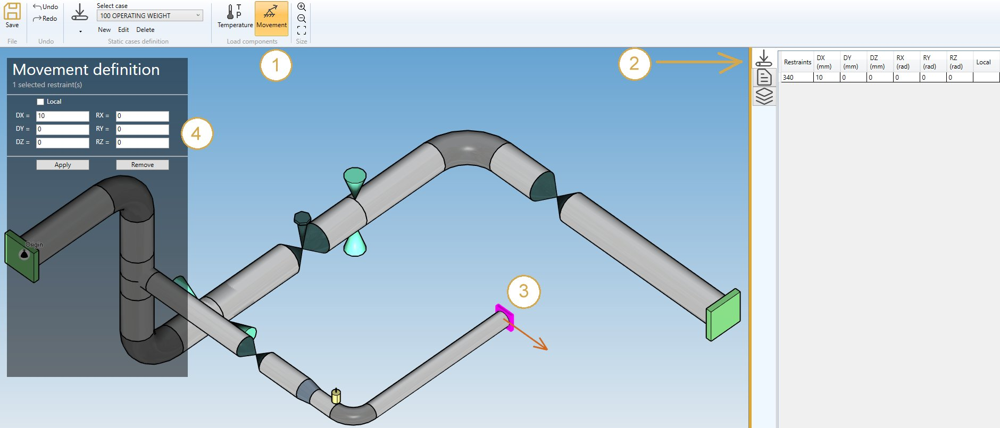
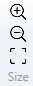

# Support movements

You can define movements on supports of the model.

If you check this option, you will see this **button** in the ribbon :

1. Select the **Movement** button
2. Open the right **Data panel**
3. Select one or more restraints
4. Define the new **vector displacement** and **vector rotation** for these restraints
5. Apply

| Property | Unit Metric | Unit USA |
| -------- | ---- | ---- |
| DX | mm | in |
| DY | mm | in |
| DZ | mm | in |
| RX | rad | rad |
| RY | rad | rad |
| RZ | rad | rad |

The values can be set in **local** axis.

You can **undo** this command.

Click on the **Remove** button to delete the load on selected restraints.

You can **undo** this command.

You can also change the size of the drawn movements by clicking on these buttons :

