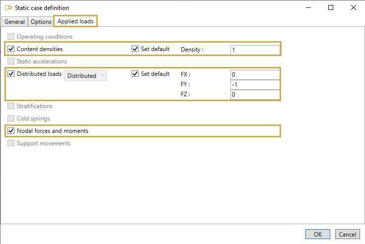

# Sustained - Test

Suggested equation :

    6. Test

## 1. Options

In options, you can :

1. Take the operating conditions from another static case
2. Include **Bourdon effect**
3. Use **cold modulus**

This case automatically includes the test weight.

## 2. Applied loads

The applied loads are the same as explained on **Sustained - Operating** page.

It is possible to define specific loads :

1. Content densities

Click [here](https://documentation.metapiping.com/Loads/StaticCases/Operating.html#21-content-densities) for more information about content densities.

2. Distributed loads

Click [here](https://documentation.metapiping.com/Loads/StaticCases/Operating.html#22-distributed-loads) for more information about distributed loads.

3. Nodal forces and moments

Click [here](https://documentation.metapiping.com/Loads/StaticCases/Operating.html#23-nodal-forces-and-moments) for more information about nodal forces and moments.
