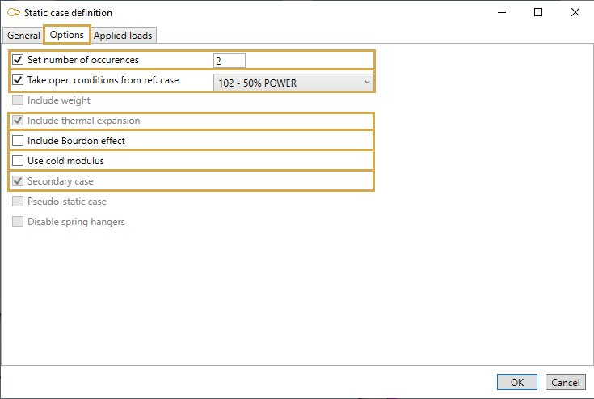
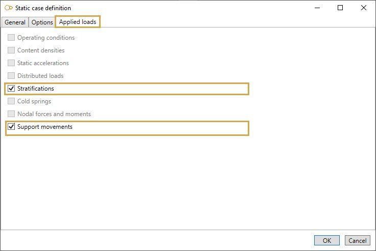

# Thermal expansion

Suggested equation :

    7. Equation 12

## 1. Options

In options, you can :

1. Set the number of occurences of this load
2. Take the operating conditions from another static case
3. Include the **Bourdon effect**
4. Use **cold modulus**

This case automatically includes the "Thermal expansion" and "Secondary case" options.

## 2. Applied loads

It is possible to define specific loads :

### 2.1 Stratifications

    Thermal stratification occurs when there is a non-constant, time independent temperature
    distribution in the pipe wall. Typically, this situation occurs where there is stagnation
    or circulation of fluids in layers in the pipe.

You can define stratifications on several elements of the model.

If you check this option, you will see this **button** :

1. Select the **Stratification** button
2. Open the right **Data panel**
3. Select one or more elements
4. Define the new **stratification** for these elements
5. Apply

<ins>Method</ins> :

- Horiz. Linear
- Horiz. Step
- Horiz. Laminar
- Horiz. Gu
- Skewed

<ins>Properties</ins> :

Depending on the selected method, the properties can be :

**Horiz. Linear** :

| Property | Definition | Unit Metric | Unit USA |
| -------- | -- | ---- | ---- |
| Alpha | Mean coef. of thermal expansion of pipe | 10^-6mm/mm/°C | 10^-6in/in/°F |
| T1 | Temperature at bottom of the pipe | °C | °F |
| T2 | Temperature at top of the pipe | °C | °F |

**Horiz. Step** :

| Property | Definition | Unit Metric | Unit USA |
| -------- | -- | ---- | ---- |
| Alpha | Mean coef. of thermal expansion of pipe | 10^-6mm/mm/°C | 10^-6in/in/°F |
| T1 | Temperature at bottom of the pipe | °C | °F |
| T2 | Temperature at top of the pipe | °C | °F |
| V1 | Vertical coordinate of the discontinuity | mm | in |

**Horiz. Laminar** :

| Property | Definition | Unit Metric | Unit USA |
| -------- | -- | ---- | ---- |
| Alpha | Mean coef. of thermal expansion of pipe | 10^-6mm/mm/°C | 10^-6in/in/°F |
| T1 | Temperature at bottom of the pipe | °C | °F |
| T2 | Temperature at top of the pipe | °C | °F |
| V1 | Vertical coordinate of the laminar flow (down) | mm | in |
| V2 | Vertical coordinate of the laminar flow (up) | mm | in |

**Horiz. Gu** :

| Property | Definition | Unit Metric | Unit USA |
| -------- | -- | ---- | ---- |
| Alpha | Mean coef. of thermal expansion of pipe | 10^-6mm/mm/°C | 10^-6in/in/°F |
| Gu | stratification value inside the pipe | °C/mm | °F/in |

**Skewed** :

Stratification definition in **LOCAL COORDINATES** (U, V, W) :

| Property | Definition | Unit Metric | Unit USA |
| -------- | -- | ---- | ---- |
| Alpha | Mean coef. of thermal expansion of pipe | 10^-6mm/mm/°C | 10^-6in/in/°F |
| Gu | stratification value inside the pipe in U direction| °C/mm | °F/in |
| Gv | stratification value inside the pipe in V direction| °C/mm | °F/in |
| VX | X component of the local V vector | - | - |
| VY | Y component of the local V vector | - | - |
| VZ | Z component of the local V vector | - | - |

You can **undo** this command.

Click on the **Remove** button to delete the load on selected restraints.

You can **undo** this command.

### 2.2 Support movements

Click [here](https://documentation.metapiping.com/Loads/StaticCases/SAM.html#22-support-movements) for more information about support movements.