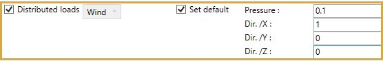

# Occasional - Wind

Suggested equation :

    3. Equation 9 B (occasional)

## 1. Options

In options, you can :

1. Take the operating conditions from another static case
2. Use **cold modulus**

## 2. Applied loads

It is possible to define specific loads :

### 2.1 Distributed wind load

You can define distributed wind loads on elements of the model.

You can also define **DEFAULT** distributed loads that will be applied on all elements of the model.

Define the **pressure** and the applied vector of the load :

| Property | Unit Metric | Unit USA |
| -------- | ---- | ---- |
| Pressure | N/m² | lb/ft² |
| Dir. /X | - | - |
| Dir. /Y | - | - |
| Dir. /Z | - | - |

If you check this option, you will see this **button** :

1. Select the **Wind** button
2. Open the right **Data panel**
3. Select one or more elements
4. Define the new **pressure** and **direction vector** for these elements
5. Apply

You can **undo** this command.

Click on the **Remove** button to delete the wind load on selected elements.

You can **undo** this command.

You can also change the size of the drawed forces by clicking on these buttons :

### 2.2 Nodal forces and moments

Click [here](https://documentation.metapiping.com/Loads/StaticCases/Operating.html#23-nodal-forces-and-moments) for more information about nodal forces and moments.