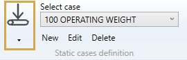
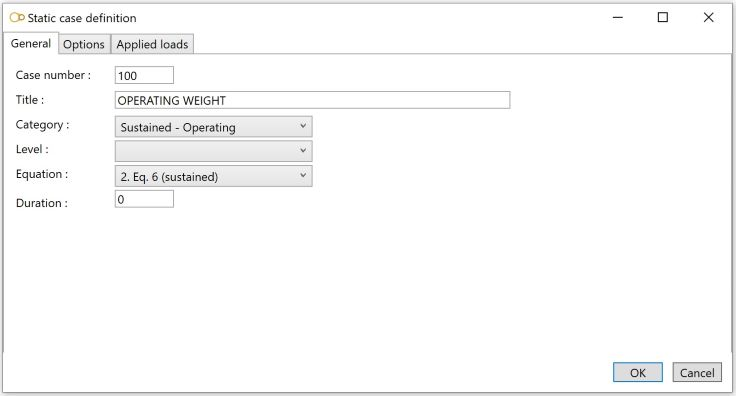

# Static cases

    This load consists of internal or external loadings on the piping system. MetaPiping will
    calculate corresponding displacements, rotations, forces, moments and stresses.

When selecting **Static cases** load type, all existing loads are listed in the combobox :

The loads appear with the **Case number** + **Title**.

## 1. General

When editing, the definition window shows the **General** tab :

Enter a **Case number** and a **Title**.

<ins>Category</ins> :

- Sustained - Operating
- Sustained - Test
- Sustained - Empty
- Sustained - Design
- Occasional - Wind
- Occasional - Snow
- Occasional - Distributed
- Occasional - Acceleration
- Occasional - SAM
- Thermal expansion
- Settlement
- Cold spring
- Dummy (for oper. cond.)
- User defined

>Click on the menu below for explanation of all static cases options and applied loads.

<ins>Level</ins> :

Documentation will come soon…

<ins>Equation</ins> :

(Code-dependent !)

