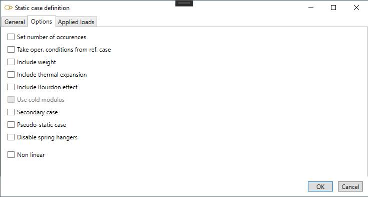
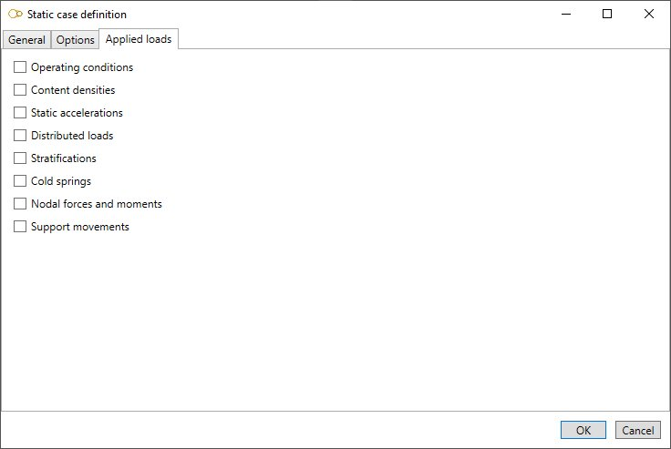

# Static cases

    Static cases consist of internal and/or external static loadings on the piping system. MetaPiping 
    will calculate corresponding displacements, rotations, forces, moments and stresses.

All existing static cases are listed in the combobox with their **Case number** + **Title** :

When editing or creating a static case, the definition window shows up. There are three tabs : General, Options and Applied loads.

## 1. General

Enter a **Case number** and a **Title**.

<ins>Category</ins> :

- Sustained - Operating
- Sustained - Test
- Sustained - Empty
- Sustained - Design
- Occasional - Wind
- Occasional - Snow
- Occasional - Distributed
- Occasional - Acceleration
- Occasional - SAM
- Thermal expansion
- Settlement
- Cold spring
- Dummy (for oper. cond.)
- User defined

Depending on the chosen category, some options are pre-selected in tab **Options** and the loads that may be applied are listed in tab **Applied loads**.

<ins>Level</ins> :

This field is intended for nuclear piping codes only. The possible values are : A (normal conditions), B (upset), C (emergency), D (faulted) and T (test). 

<ins>Equation</ins> :

The equations to be verified are code-dependent. For example, here are the equations for code RCC-M Class 2:

- 1- None (no stress calculation)
- 2- Equation 6 (sustained)
- 3- Equation 10 B (occasional)
- 4- Equation 10 C (occasional)
- 5- Equation 10 D (occasional)
- 6- Equation 10 T (test)
- 7- Equation 7 (thermal expansion)
- 8- Equation 8 (thermal expansion + sustained)
- S- Equation 9 (settlement)

## 2. Options

- **Set number of occurences** : enter the number of cycles (thermal expansion cases only)
- **Take oper. conditions from ref. case** : select the load case which pressure and temperature will be used for Young modulus, Bourdon effect and bend stiffening. If no reference case is selected and no operating conditions are defined for the load case, room temperature is used and no pressure is considered
- **Include weight** : if checked, the weight is considered in the calculation. Four options are available: operating weight, test weight, empty weight and design weight. Design weight is equivalent to operating weight, except that spring hangers are pinned. Design weight can be useful for determining the installation force to be exerted on the spring hangers
- **Include thermal expansion** : if checked, thermal expansion is considered in the calculation
- **Include Bourdon effect** : if checked, expansion due to internal pressure is considered in the calculation
- **Use cold modulus** : if checked, Young modulus at room temperature is used for this case (only if **Hot modulus** is set in **Model options**)
- **Secondary case** : to be checked for displacement-type cases like thermal expansion. Depending on the piping code (e.g. RCC-M Class 2), the moments may be multiplied by Ec/Eh when the **Hot modulus** is used
- **Pseudo-static cases** : to be checked for dynamic cases that are calculated as static cases (e.g. earthquake calculated with a pseudo-static acceleration)
- **Disable spring hangers** : for some cases like settlement and cold springing, it is common practice to readjust the spring hangers to their design parameters. This is equivalent to disabling the spring hangers

## 3. Applied loads

Select the loads that will be applied to the load case. For some loads like temperature and pressure, it is possible to set default values that will apply to all elements. The user can of course supersede the default values for some elements by selecting them and specifying different values.