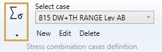
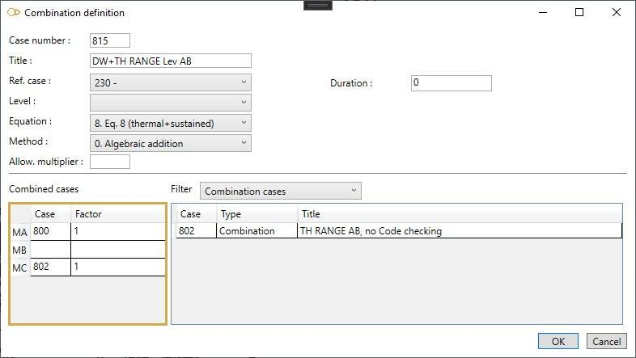
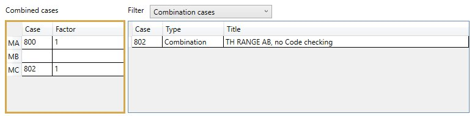

# Stress combination cases

    This load consists of combining the results of load cases, dynamic cases or previously calculated
    combination cases to form a new case and of calculating additive stresses which are based on the
    resultant moments of the constituent cases.

{: .warning }
> ATTENTION, this case can be used for all piping codes except Class 1 and ASME HDPE Code.

Click [here](https://documentation.metapiping.com/Analysis/Codes.html) for more information about the piping codes.

When selecting **Stress combination cases** load type, all existing loads are listed in the combobox :

The loads appear with the **Case number** + **Title**.

## 1. General

When editing, the definition window shows this screen :

Enter a **Case number** and a **Title**.

<ins>Ref. case</ins> :

Operating pressures (and allowable stresses) of the reference case will be used for this case. The calculation of allowable stresses depend of the current **calculation code**.

Click [here](https://documentation.metapiping.com/Analysis/Codes.html) for more information about all possible codes.

Documentation will come soon…

<ins>Level</ins> :

Documentation will come soon…

<ins>Equation</ins> :

(Code-dependent !)

<ins>Method</ins> :

- 0- Algebraic addition
- 1- Absolute addition
- 2- SRSS
- 3- Seismic
- 4- Maximum absolute
- 5- Maximum resultant
- 6- Algebraic maximum
- 7- Algebraic minimum
- 8- Range
- 9- Max resultant moment range
- S- Max thermal stress range

Documentation will come soon…

<ins>Allowable multiplier</ins> :

Documentation will come soon…

## 2. Combined cases

Enter the **number** of the case and a cooresponding **factor**.

    MA = Sustained load case
    MB = Occasional load case
    MC = Thermal load case

On right side, as a reminder, the list of all cases. You can filter them by selecting the type :

- All
- Static
- Dynamic
- Combination