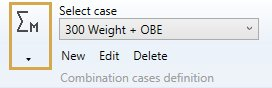
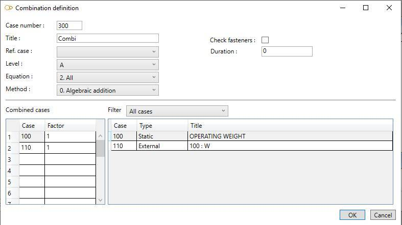
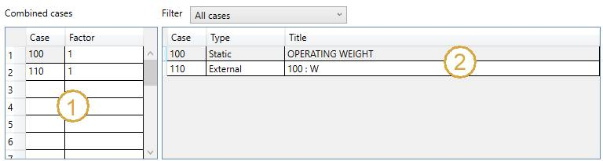

# Combination cases

    This case consists of combining the results of load cases, dynamic cases or previously calculated
    combination cases to form a new case.

When selecting **Combination cases**, all existing combinations are listed in the combobox :

The cases appear with their **Case number** + **Title**.

## 1. General

When editing, the definition window shows up :

Enter a **Case number** and a **Title**.

<ins>Ref. case</ins> :

<ins>Level</ins> :

This field is intended for nuclear codes only. The possible values are : A (normal conditions), B (upset), C (emergency), D (faulted) and T (test). 

<ins>Equation</ins> :

- 1- None
- 2- All

<ins>Method</ins> :

- 0- Algebraic addition
- 1- Absolute addition
- 2- SRSS
- 3- Seismic
- 4- Maximum absolute
- 6- Algebraic maximum
- 7- Algebraic minimum
- 8- Range
- 9- Max resultant moment range

<ins>Check fasteners</ins> :

If checked, the fasteners will be verified.

## 2. Combined cases

Enter the **number** of the constituent cases and the corresponding **factor** (1) :

On right side, as a reminder, the list of all cases (2). You can filter them by selecting the type :

- All
- Static
- Dynamic
- Combination
- External cases
