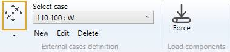
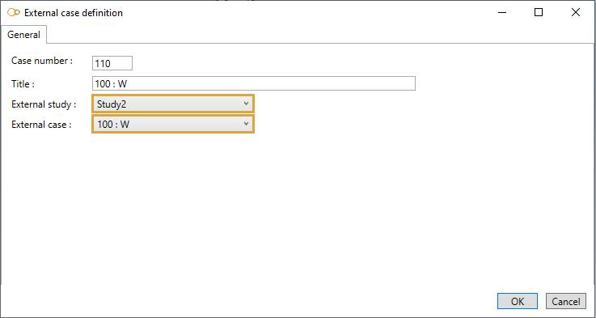
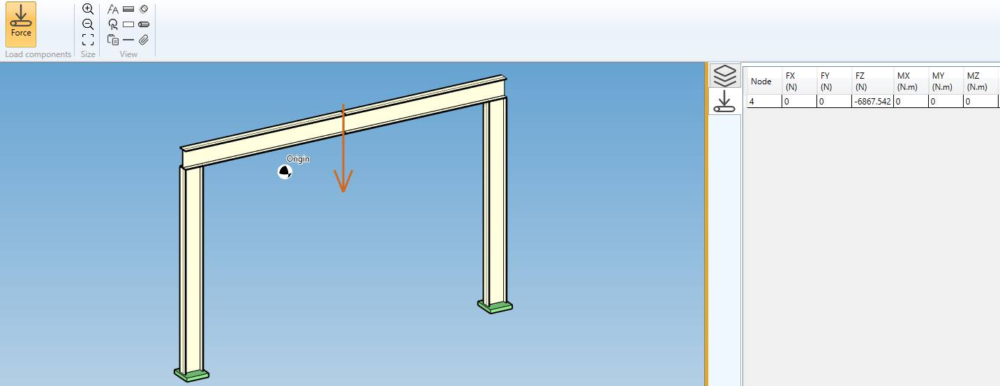

# External cases

External loads can be applied on the model via **links** between piping nodes and structure nodes.

One or more **piping** studies must be linked to the current **structure** study.

Click [here](https://documentation.metapiping.com/Explorer/Study.html#32-study-link) for more information about study link.

One or more **link** must be created between piping nodes and structure nodes.

Click [here](https://documentation.metapiping.com/Structure/Elements/Link.html) for more information about link.

When selecting **External cases**, all existing cases are listed in the combobox :

The cases appear with their **Case number** + **Title**.

When editing, the definition window shows up :

## 1. General

Enter a **Case number** and a **Title**.

Select an external study in the list.

Select then an external case.

## 2. Forces

You will see this **button** in the ribbon :

You can only see that the **reactions** on the supports in the piping study become **forces/moments** on several nodes of the current structure (thanks to links).

>This screen is not interactable

| Property | Unit Metric | Unit USA |
| -------- | ---- | ---- |
| FX | N | lb |
| FY | N | lb |
| FZ | N | lb |
| MX | N.m | lb.ft |
| MY | N.m | lb.ft |
| MZ | N.m | lb.ft |
