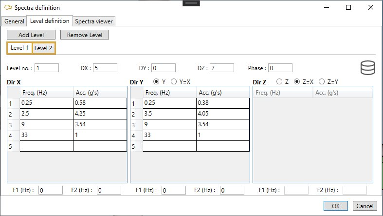

# Secondary floor response cases

    This load describes the floor response spectra for each support level. This analysis is used to
    obtain bound solutions for simple multilevel cases (including single level cases) for which the
    dynamic loading is entirely due to movements at the support points.
    The "levels" are groups of supports which are moving in parallel and are entered using the level
    number field on supports.

{: .warning }
>Attention, to obtain the complete solution for multilevel problems, it is necessary to calculate the primary and secondary parts of the solution separately and then to combine them.

MetaStructure will calculate the bounds for the **SECONDARY** part of the solution v(t) for displacements, rotations, forces, moments and stresses due to the dynamic support movement loading.

When selecting **Secondary floor response cases**, all existing secondary floor response cases are listed in the combobox :

The cases appear with their **Case number** + **Title**.

## 1. General

When editing, the definition window shows up :

Enter a **Case number** and a **Title**.

<ins>Event</ins> :

Select a **Spectra** : *R.G. 1.60 - 2% Damping* in this example.

See §2.

<ins>Level</ins> :

This field is intended for nuclear piping codes only. The possible values are : A (normal conditions), B (upset), C (emergency), D (faulted) and T (test). 

<ins>Equation</ins> :

The equations are code-dependent.

<ins>Method</ins> :

The solutions for each group of supports are combined using one of the following method in order to obtain the total secondary response :

- 0- Absolute
- 1- SRSS

<ins>Treat as primary</ins> :

Secondary floor response cases are treated as secondary by default. Depending on the code, the moments may then be multiplied by Ec/Eh (like thermal expansion). If **Treat  as primary** is checked, the moments are not multiplied by Ec/Eh. This is recommended when the total seismic moments (primary + secondary) are used in combination with the dead weight moments in the equation for occasional stresses.

<ins>X, Y, Z multipliers</ins> :

This factor multiplies the X, Y, Z component of the loading.

 If a factor is zero or blank, then the corresponding loading component will be zero.

<ins>Check fasteners</ins> :

If checked, the fasteners will be verified.

## 2. Spectra definition

In this example, we use this **Spectra loading** :

It contains 2 **LEVELS** with corresponding spectra :

Click [here](https://documentation.metapiping.com/Loads/Structure/Spectra.html) for more information about the spectra definition.

## 3. Primary floor response cases

Click [here](https://documentation.metapiping.com/Loads/Structure/PrimaryCases.html) for more information about the primary floor response cases.