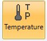
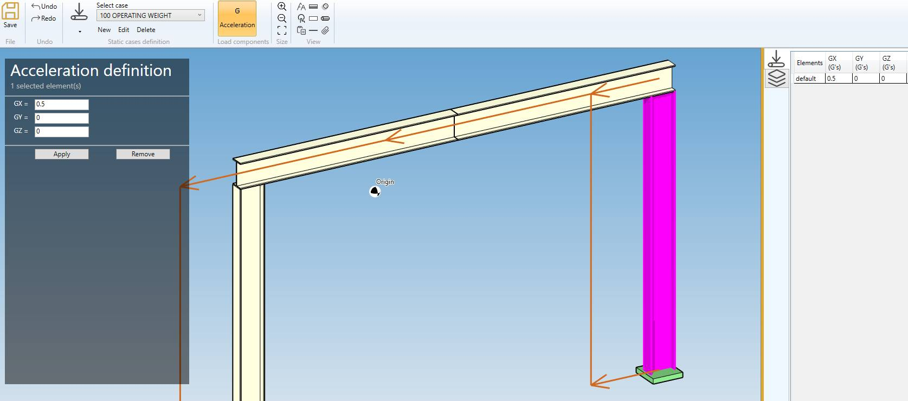

# Static cases

    Static cases consist of internal and/or external static loadings on the piping system. 
    MetaStructure will calculate corresponding displacements, rotations, forces, moments and stresses.

All existing static cases are listed in the combobox with their **Case number** + **Title** :

When editing or creating a static case, the definition window shows up. There are three tabs : General, Options and Applied loads.

## 1. General

Enter a **Case number** and a **Title**.

<ins>Level</ins> :

This field is intended for nuclear codes only. The possible values are : A (normal conditions), B (upset), C (emergency), D (faulted) and T (test). 

<ins>Equation</ins> :

- 1- None (no stress calculation)
- 2- All

<ins>Check fasteners</ins> :

If checked, the fasteners will be verified.

## 2. Options

- **Take oper. conditions from ref. case** : select the load case which temperature will be used for thermal expansion and Young modulus. If no reference case is selected and no operating conditions are defined for the load case, room temperature is used.
- **Include weight** : if checked, the weight is considered in the calculation.
- **Include thermal expansion** : if checked, thermal expansion is considered in the calculation
- **Pseudo-static cases** : to be checked for dynamic cases that are calculated as static cases (e.g. earthquake calculated with a pseudo-static acceleration)

## 3. Applied loads

Select the loads that will be applied to the load case. For some loads like temperature, it is possible to set default values that will apply to all elements. The user can of course supersede the default values for some elements by selecting them and specifying different values.

---

### 3.1 Operating conditions

You can define operating conditions on elements of the model.

The temperature is used for Young modulus, allowable stress and also for thermal expansion if **Include thermal expansion** is checked.

You can define **DEFAULT** operating conditions that will be applied on all elements of the model.

Define the default **temperature** of the load :

| Property | Unit Metric | Unit USA |
| -------- | ---- | ---- |
| Temperature | °C | °F |

If you check this option, you will see this **button** in the ribbon:

1. Select the **Temperature** button
2. Open the right **Data panel**
3. Select one or more elements
4. Define the new **temperature** for these elements
5. Apply

You can **undo** this command.

Click on the **Remove** button to delete the operating load on selected elements.

---

### 3.2 Static accelerations

By checking **Static acceleration** in **Applied loads** you can define acceleration loads on elements of the model.

You can also define **DEFAULT** accelerations that will be applied to all elements of the model :

| Property | Unit Metric | Unit USA |
| -------- | ---- | ---- |
| GX | fraction of G | fraction of G |
| GY | fraction of G | fraction of G |
| GZ | fraction of G | fraction of G |

If you check this option, you will see this **button** in the ribbon :

1. Select the **Acceleration** button
2. Open the **Data panel** on the right
3. Select one or more elements
4. Define the new **vector acceleration** for these elements
5. Apply

You can **undo** this command.

Click on the **Remove** button to delete the load on selected elements.

You can also change the size of the drawn accelerations by clicking on these buttons :

---

### 3.3 Distributed loads

By checking **Distributed loads** in **Applied loads** you can define distributed loads on elements of the model. There are three types of distributed loads: simple distributed load (force per unit length), wind and snow.

Simple distributed loads may be applied for weight and occasional cases other than wind and snow cases. Wind loads may only be applied for wind cases and snow loads for snow cases.

#### 3.3.1 Simple distributed load (distributed)

You can define **DEFAULT** distributed loads that will be applied to all elements of the model :

| Property | Unit Metric | Unit USA |
| -------- | ---- | ---- |
| FX | N/m | lb/ft |
| FY | N/m | lb/ft |
| FZ | N/m | lb/ft |

If you check this option, you will see this **button** in the ribbon :

1. Select the **Distributed** button
2. Open the right **Data panel**
3. Select one or more elements
4. Define the new **vector force** for these elements
5. Apply

You can **undo** this command.

Click on the **Remove** button to delete the load on selected elements.

You can also change the size of the drawn forces by clicking on these buttons :

#### 3.3.2 Wind load

You can define **DEFAULT** wind loads that will be applied to all elements of the model.

Define the wind **pressure** and **direction** :

| Property | Unit Metric | Unit USA |
| -------- | ---- | ---- |
| Pressure | N/m² | lb/ft² |
| Dir. /X | - | - |
| Dir. /Y | - | - |
| Dir. /Z | - | - |

If you check this option, you will see this **button** in the ribbon :

1. Select the **Wind** button
2. Open the right **Data panel**
3. Select one or more elements
4. Define the new **pressure** and **direction** for these elements
5. Apply

You can **undo** this command.

Click on the **Remove** button to delete the wind load on selected elements.

You can also change the size of the drawed forces by clicking on these buttons :

#### 3.4.3 Snow load

You can define **DEFAULT** snow loads that will be applied to all elements of the model.

Define the snow **pressure** (direction is vertical downwards) :

| Property | Unit Metric | Unit USA |
| -------- | ---- | ---- |
| Pressure | N/m² | lb/ft² |

If you check this option, you will see this **button** in the ribbon :

1. Select the **Snow** button
2. Open the right **Data panel**
3. Select one or more elements
4. Define the new **pressure** for these elements
5. Apply

You can **undo** this command.

Click on the **Remove** button to delete the snow load on selected elements.

You can also change the size of the drawed forces by clicking on these buttons :

---

### 3.5 Nodal forces and moments

You can define nodal forces and moments on nodes of the model.

If you check this option, you will see this **button** in the ribbon :

1. Select the **Force** button
2. Open the right **Data panel**
3. Select one or more nodes
4. Define the new **force and moment** on these nodes
5. Apply

| Property | Unit Metric | Unit USA |
| -------- | ---- | ---- |
| FX | kN | kips |
| FY | kN | kips |
| FZ | kN | kips |
| MX | kN.m | kips.ft |
| MY | kN.m | kips.ft |
| MZ | kN.m | kips.ft |

You can **undo** this command.

Click on the **Remove** button to delete the force/moment on selected nodes.

You can also change the size of the drawed forces by clicking on these buttons :

---

### 3.6 Support movements

You can define movements on supports of the model.

If you check this option, you will see this **button** in the ribbon :

1. Select the **Movement** button
2. Open the right **Data panel**
3. Select one or more restraints
4. Define the new **vector displacement** and **vector rotation** for these restraints
5. Apply

| Property | Unit Metric | Unit USA |
| -------- | ---- | ---- |
| DX | mm | in |
| DY | mm | in |
| DZ | mm | in |
| RX | rad | rad |
| RY | rad | rad |
| RZ | rad | rad |

The values can be set in **local** axis.

You can **undo** this command.

Click on the **Remove** button to delete the load on selected restraints.

You can also change the size of the drawn movements by clicking on these buttons :

