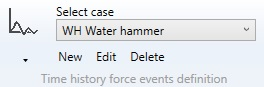
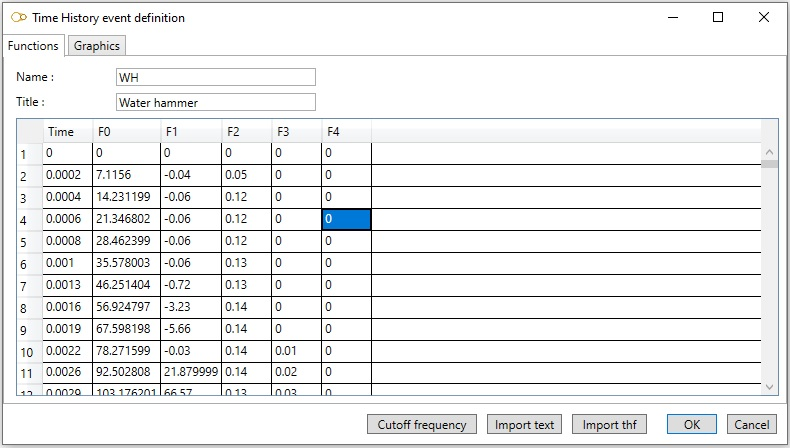
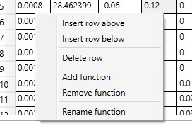
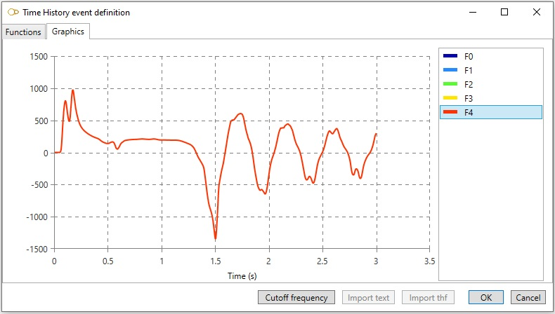
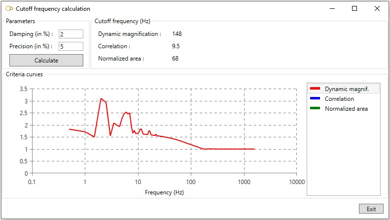
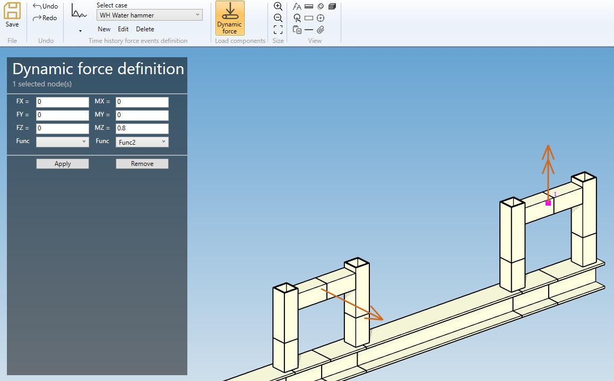

# Time history events

    This case consists of the definition of forces and moments time histories.

When selecting **Time history events**, all existing time history events are listed in the combobox :

 

The cases appear with their **Name** + **Title**.

## 1. Event definition

When editing or creating an event, the definition window shows up :

### 1.1 Functions

Enter a **Name** and a **Title** for the time history event.

The data are saved in a text file located in the study folder with **Name** as root and **.thev** as extension. **Name** must therefore be a valid file name root.

The time steps are entered in the first column is ascending order. The first time step must be 0. The functions are entered in the following column.

To insert or delete a row, add, remove or rename a function, right click and select the desired action in the pop-up. 

### 1.2 Graphics

Select a function on the right list to visualize it :

### 1.3 Cutoff frequency

Click on button **Cutoff frequency** to evaluate the cutoff frequency of the time histories :

The cutoff frequency fR depends on the critical damping ratio (in percent) and the accepted precision (in percent).

The precision is defined as the difference between the rigid response (with no dynamic effects) and the actual response of an oscillator of frequency fR subjected to the time histories.

The difference is evaluated by means of 3 different criteria :
- dynamic magnification
- normalized area
- correlation

It's up to the engineer to decide which criteria to use. He may conservatively take the highest frequency.

The curve of the precision versus frequency for a given criteria can be displayed by clicking on the criteria in the bottom right list.

### 1.4 Import text

The time histories may be imported from a plain text file in the following format :

| Line | Input |
| -------- | ----------- |
| 1 | Name of the event (must be a valid file name root) |
| 2 | Title |
| 3 | Number of functions Nf, number of time steps Nt and number of components Nc |
| 4 | Functions IDs (x Nf) |
| Next Nc lines | Node name, force direction X, force direction Y, force direction Z, force function index, moment direction X, moment direction Y, moment direction Z, moment function index |
| Next Nt lines | Time t, followed by the value of the Nf functions at time t |

The data entered in each lines must be separated by white spaces or tabs. The function indices start from 1.

**Example**

Let's define an event with name **WH** and title **Water hammer**.

A force is applied to node **A10** in direction X with the following values:
- time 0: 0
- time 0.1: 200
- time 0.5: 250

A moment is applied to node **A20** in direction Z with the following values:
- time 0: 0
- time 0.1: -100
- time 0.5: -200

The text file will be as follows:

    WH
    Water hammer
    2  3  2
    Fmult  Mmult
    A10  1  0  0  1  0  0  0  0
    A20  0  0  0  0  0  0  1  2
    0    0    0
    0.1  200  -100
    0.5  250  -200

### 1.5 Import thf

Import the time histories from a PIPESTRESS .thf file.

## 2. Applying forces and moments

You can apply forces and moments for the event by clicking on **Dynamic force** in the ribbon.

Select one or several nodes, and enter the force and moment direction and function :

