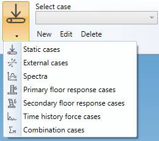

# Structure loads

Click on the **LOAD** button to have access to the **load case types** :

After selection, the choice becomes the **current load case type**.

>**External cases** is visible only if there is at least one linked study and one or more links between piping nodes and structure nodes.

## 1. Edition

For all case types, you can **create**, **modify** or **remove** a selected case :

- **New** : open an empty window of **current load case type** : press OK to create the load
- **Edit** : open a window of **current load case type** with the selected case :  press OK to modify the load case
- **Delete** : remove the selected case
- **Selection** : list of all cases of the **current load case type**

