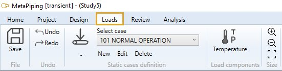
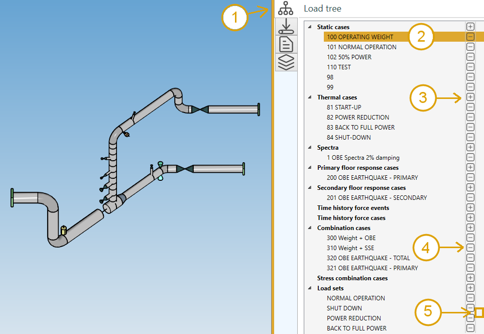

# Loads

The **LOADS** ribbon tab lets you create static, dynamic, thermal transient and combined load cases.

## 1. Ribbon menu

### 1.1 File

During the **load case** definition, every command is automatically saved in a temporary file (conception.~metaL).

You can decide to save the last modifications or cancel it and return to the study screen.

A floppy disk on the left side of the ribbon indicates the state of the file on disk :

 means that everything has been saved.

 means that something has changed and the MetaL need to be saved.

{: .warning }
>If the application crashes, MetaPiping will prompt to reopen the last modifications.

### 1.2 Undo/Redo

Every command in MetaPiping is stored in a **command list**.

You can *navigate* through this list by pressing the **Undo/Redo** buttons.

## 2. Load tree

All loads can be viewed, created, edited, moved and removed in a single treeview :

1. Select the load treeview tab
2. Select a load to edit (double click)
3. Add a load of a particular category
4. Remove a load
5. Insert a load between two others

>Tip: you can also move a load by draging a load and drop it on another one of the same category.
