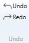
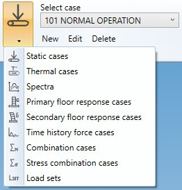
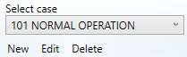

# Loads

The **LOADS** ribbbon tab let you create static, dynamic, transient thermic and combined loads.

## 1. Ribbon menu

### 1.1 File

During the **load** definition, every command is automatically saved in a temporary file (conception.~metaL).

You can decide to save the last modifications or cancel it and return to the study screen.

A floppy disk on the left side of the ribbon indicates the sate of the file on disk :

 means that everything has been saved.

 means that something has changed and the MetaL need to be saved.

{: .warning }
>If the application crashes, MetaPiping will prompt to reopen the last modifications

### 1.2 Undo/Redo

Every command in MetaPiping is stored in a **command list**.

You can *navigate* through this list by pressing the **Undo/Redo** buttons.

## 2. Load cases

Click on the **LOAD** button to have access to the **load types** :

- Static cases : Click [here](https://documentation.metapiping.com/Loads/StaticCases/index.html) to have more information about all possible static cases
- Thermal case : Click [here](https://documentation.metapiping.com/Loads/ThermalCases.html) to have more information about thermal cases
- Spectra : Click [here](https://documentation.metapiping.com/Loads/Spectra.html) to have more information about spectra
- Primary floor response cases : Click [here](https://documentation.metapiping.com/Loads/PrimaryCases.html) to have more information about primary floor response cases
- Secondary floor response cases : Click [here](https://documentation.metapiping.com/Loads/SecondaryCases.html) to have more information about secondary floor response cases
- Time history cases : Click [here](https://documentation.metapiping.com/Loads/TimeHistoryCases.html) to have more information about time history cases
- Combination cases : Click [here](https://documentation.metapiping.com/Loads/CombinationCases.html) to have more information about combination cases
- Stress combination cases : Click [here](https://documentation.metapiping.com/Loads/StressCombinationCases.html) to have more information about stress combination cases
- Load sets : Click [here](https://documentation.metapiping.com/Loads/LoadSets.html) to have more information about load sets

After selection, the choice becomes the **current load type**.

### 2.1 Edition

For all cases, you can **create**, **modify** or **remove** a selected case :

- **New** : open an empty window of **current load type** : press OK to create the load
- **Edit** : open a window of **current load type** with the selected case :  press OK to modify the load
- **Delete** : remove the selected case
- **Selection** : list of all cases of the **current load type**