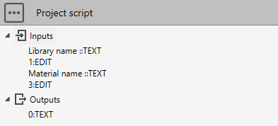

# 1. MaterialLibraryModel

A **MaterialLibraryModel** is a database containing a list of MaterialModel.

| Name | Return | Description |
| --- | ----------- | ----------- |
| GetMaterialByDescription() | MaterialModel | Access to a materialModel by its description (param1) |
| MaterialDescriptionExists() | bool | Return True if a material exists with this description (param1) |
| SetRefTemperature() | - | Set the reference temperature (param1) for all materials [°C in metric units] |
| SetThermalExpansionOption() | - | Set the thermal expansion option (param1) for all materials (0, 1 or 2 by default) - see below |
| AddMaterial() | MaterialModel | Add an empty materialModel to the library (without description) |
| DeleteMaterial() | - | Delete the materialModel (param1) from the library |
| Save() | - | Save the library |

ThermalExpansionOption values :
- 0 : Linear thermal expansion (LTE)
- 1 : Mean coefficient calculated by linear interpolation of LTE values
- 2 : Mean coefficient calculated by linear interpolation of submitted values of α

## 1.1 MaterialModel

A **MaterialModel** represents the definition of a material.

| Name | Return | Description |
| --- | ----------- | ----------- |
| Description |  | The description of the material |
| MaterialType |  | The type of material |
| MaxTemperature |  | Temperature max [°C in metric units] |
| RO |  | Density [kg/m³ in metric units] |
| SG |  | Poisson's ratio |
| Properties |  | List of MaterialProperties |
| Properties.Count | int | Number of MaterialProperties |
| Properties.[i] | MaterialProperties | ith MaterialProperties |
| AddProperties() | MaterialProperties | Add a new line of properties for a temperature |
| Deleteproperties() | - | Delete a MaterialProperties (param1) |

## 1.2 MaterialType

To access the **MaterialType** property of a **MaterialModel**, you need to import the object from *Cwantic.MetaPiping.Core* :

```python
# Python script   
from Cwantic.MetaPiping.Core import MaterialType
```

| Values : |
| --- | 
| MaterialType.CarbonSteel | 
| MaterialType.LowAlloySteel | 
| MaterialType.MartensiticSteel | 
| MaterialType.AusteniticSteel |
| MaterialType.NickelChromeSteel | 
| MaterialType.NickelCopperSteel | 
| MaterialType.Other |
| MaterialType.Composite | 
| MaterialType.HDPE | 

Example :

```python
# Python script   
from Cwantic.MetaPiping.Core import MaterialType
...
if mat.MaterialType == MaterialType.CarbonSteel:
    ...
```

## 1.3 MaterialProperties

| Property | Description | Unit Metric | Unit USA |
| -------- | ----------- | ---- | ---- |
| TE | Temperature | °C | °F |
| EH | Modulus of Elasticity | kN/mm² | 10^6.psi |
| EX | Thermal Expansion | 10^-6.mm/mm/°C | 10^-6.in/in/°F |
| SH | Non-Class 1 Allowable Stress | N/mm² | ksi |
| SY | Yield Stress | N/mm² | ksi |
| SU | Ultimate Tensile Stress | N/mm² | ksi |
| SM | Class 1 Allowable Stress | N/mm² | ksi |
| CR | Creep | N/mm² | ksi |
| GH | Shear Modulus | kN/mm² | 10^6.psi |
| CO | Class 1 Thermal Conductivity | kJ/hr/m/°C | btu/hr/ft/°F |
| DI | Class 1 Thermal Diffusivity | mm²/s | ft²/hr |

## 1.4 Example 1

User wants to get the first temperature of a specific MaterialModel (Inputs[1]) from a specific library (Inputs[0]). Result as a text in Outputs[0].

```python
# Python script   
libname = study.Inputs[0]
matname = study.Inputs[1]

lib = study.getMaterialLibraryModel(libname)
if lib != None:
    mat = lib.GetMaterialByDescription(matname)
    if mat != None:
        study.Outputs[0] = str(mat.Properties[0].TE)
    else:
        study.Outputs[0] = "Material not found !"
else:
    study.Outputs[0] = "Library not found !"
```

## 1.5 Example 2

User wants to create a material library with a name (Inputs[1]) and only one material (Inputs[3]) with 2 temperatures. Result as a text in Outputs[0].



```python
# Create a material library with one material
# © Cwantic
from Cwantic.MetaPiping.Core import MaterialType

libname = study.Inputs[1]
matname = study.Inputs[3]

# Check the input values 
if libname != "" and matname != "":
    # Check that libname doesn't already exist
    lib = study.getMaterialLibraryModel(libname)
    if lib == None:
        # Create the library with common properties for all materials
        lib = study.createMaterialLibraryModel(libname)
        lib.SetRefTemperature(20.0)
        lib.SetThermalExpansionOption(0)
        
        # Add one material to library
        mat = lib.AddMaterial()
        mat.Description = matname
        mat.MaterialType = MaterialType.AusteniticSteel
        mat.MaxTemperature = 500
        mat.RO = 7000
        mat.SG = 0.3
        
        # Add all properties to material for temp 20
        properties = mat.AddProperties()
        properties.TE = 20
        properties.EH = 200
        properties.EX = 0
        properties.SY = 215
        properties.SH = 153.3
        
        # Add all properties to material for temp 500
        properties = mat.AddProperties()
        properties.TE = 500
        properties.EH = 159.3
        properties.EX = 9.25
        properties.SY = 109
        properties.SH = 72.7
        
        # Save library
        lib.Save()
        
        study.Outputs[0] = "OK"
    else:
        study.Outputs[0] = "Library already exists !"
else:
    study.Outputs[0] = "Invalid names !"
```