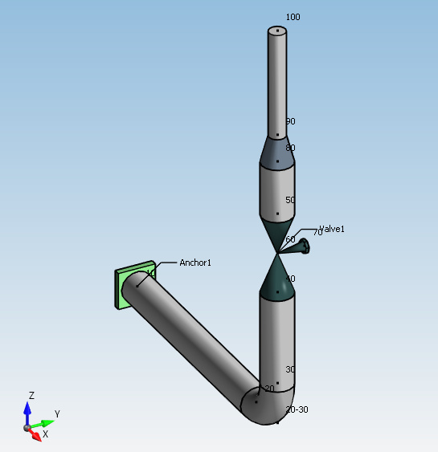

# Model

**Model** is the class that describes the whole piping/structure geometry and loadings.

>Extension *.metaL on disk. **JSON** format.

```python
# Python script
from Cwantic.MetaPiping.Core import Model

metal = Model()
```

## 1. Properties

| Name | Type | Description |
| --- | ----------- | ----------- |
| Plant | string | Plant |
| Engineer | string | Engineer |
| Title | string | Title |
| Units | Units | System units |
| ZVertical | bool | True if Z vertical, otherwise Y vertical |
| CalculationCode | CalculationCode | Piping or Structure code |
| DefaultRoomTemperature | float | Default room temperature |
| DefaultOperatingDensity | float | Default operating density |
| DefaultTestDensity | float | Default test density |
| DefaultDesignCondition | OperatingCondition | Default design condition |
| ColdModulus | bool | True if cold modulus is used for all cases |
| HotAllowable | bool | True if allowable stress at operating temperature is used, otherwise design temperature is used |
| PressureStiffening | bool | True if pressure correction for bends |
| PressureElongation | bool | True if pressure elongation is considered for thermal expansion and test cases |
| SimplePressureStress | bool | True if simplified formula is used for pressure stress |
| ModalAnalysis | bool | True if modal extraction is performed |
| ModalRefCase | StaticCase | Young modulus is evaluated at the temperature of the reference case (Hot modulus option only) |
| CutOffFrequency | float | Cut-off frequency for modal extraction |
| MassGenerationFrequency | float | Frequency for automatic mass point generation |
| NbMaxModes | int | Maximum number of extracted mode shapes |
| MassModeling | int | |
| BranchModeling | TeeModeling | |
| BranchForcesAtSurface | bool | |
| ThermalCyclesPerElement | bool | |
| TrueTransientRange | bool | |
| AlternativeKe | bool | |
| Average3Sm | bool | |
| OptimizedResidualMoments | bool | |
| OutputFatigueAtAllPoints | bool | |
| OutputEq12And13Always | bool | |
| ExtrapolateFatigueCurves | bool | |
| ExtrapolateCreepCurves | bool | |
| RB3661_15 | bool | |
| ReducerModulus | ReducerModulus | |
| RB3662_24 | bool | |
| RB3662_Relaxation | bool | |
| SteelToConcreteRatio | float | |
| ConsistentMasses | bool | |

REM : a model must have one calculation code of type PipingCode or StructureCode.

[Click here for more information about Units, OperatingCondition, TeeModeling and ReducerModulus](https://documentation.metapiping.com/Python/Classes/types.html)

[Click here for more information about CalculationCode](https://documentation.metapiping.com/Python/Classes/code.html)

The class **Model** also provides lists of the objects contained in the piping/structure model:

| Name | Description |
| ---- | ----------- |
| Nodes | List of **Node** |
| Elements | List of **Element** |
| LumpedMasses | List of **LumpedMass** |
| Restraints | List of **Restraint** |
| Materials | List of **Material** |
| Sections | List of **Section** |
| DLCSs | List of **DLCS** (Defined Local Coordinate System) |
| Tees | Dictionary<**Node**, **Tee**>, for piping only |
| UserSIFs | List of **UserSIF** (User-defined SIF), for piping only |
| RestrainedNodes | List of restrained nodes |
| Layers | List of **Layer** |
| Specifications | List of the specification names (string), for piping only |
| Joints | List of **Joint**, for structure only |
| PipingCodes | List of **PipingCode**, for piping only |
| DesignConditions | List of **OperatingCondition**, for piping only |
| Soils | List of **Soil**, for piping only |
| Links | List of **NodeLink**, for structure only |
| ModalSets | List of **ModalSet** |

REM : a piping model can have multiple PipingCode for different lines but only one calculation code at a time.

[Click here for more information about Node](https://documentation.metapiping.com/Python/Classes/node.html)

[Click here for more information about Element and Tee](https://documentation.metapiping.com/Python/Classes/element.html)

[Click here for more information about LumpedMass, DLCS, UserSIF, Layer, Joint, PipingCode, OperatingCondition, Soil and NodeLink](https://documentation.metapiping.com/Python/Classes/types.html)

[Click here for more information about Restraint](https://documentation.metapiping.com/Python/Classes/restraint.html)

[Click here for more information about Material](https://documentation.metapiping.com/Python/Classes/material.html)

[Click here for more information about Section](https://documentation.metapiping.com/Python/Classes/section.html)

[Click here for more information about ModalSet](https://documentation.metapiping.com/Python/Classes/loadcase.html)

The class **Model** also provides lists of load cases :

| Name | Description |
| ---- | ----------- |
| StaticCases | List of **StaticCase** |
| THFCases | List of **THFCase** |
| RPrimCases | List of **RPrimCase** |
| RSecCases | List of **RSecCase** |
| CombiCases | List of **CombiCase** |
| StressCases | List of **StressCase** |
| RSpectra | List of **RSpectrum** |
| ThermalCases | List of **ThermalCase** |
| LoadSets | List of **LoadSet** |
| ExternalCases | List of **ExternalCase** |
| THFEvents | List of **THFEvent** |

[Click here for more information about all Loadcase types](https://documentation.metapiping.com/Python/Classes/loadcase.html)

The class **Model** also provides constants values (in MKS units) for restraint's default stiffness :

| Name | Value | Description |
| ---- | ----- | ----------- |
| ANCH_TSTIFF | 1.75e13 | |
| ANCH_RSTIFF | 1.13e12 | |
| ROTR_STIFF | 1.13e12 | |
| RSTN_STIFF | 8.75e8 | |
| SNUB_STIFF | 2.625e8 | |
| VSUP_STIFF | 8.75e8 | |
| VSUP_KPIN | 1.75e13 | |
| SPRS_TSTIFF | 17.513 | |
| SPRS_RSTIFF | 0.136 | |
| SPRF_TFLEX | 5.71e-14 | |
| SPRF_RFLEX | 8.851e-13 | |

Example of piping model (without loadings) :



JSON *.metaL :

```json
{
  "Version": 1,
  "JobNumber": 1,
  "ZVertical": true,
  "InputUnits": 0,
  "OutputUnits": 0,
  "DefaultRoomTemperature": 21.11,
  "DefaultOperatingDensity": 0.0,
  "DefaultTestDensity": 0.0,
  "ColdModulus": true,
  "HotAllowable": false,
  "PressureStiffening": false,
  "PressureElongation": false,
  "SimplePressureStress": false,
  "MassModeling": 3,
  "BranchModeling": 0,
  "BendMeshAngle": 15.0,
  "DefaultDesignCondition": {
    "Line": 15,
    "T": 21.11
  },
  "DesignConditions": [],
  "CalculationCode": {
    "Code": "8",
    "Edition": 11,
    "Target": 0
  },
  "PipingCodes": [],
  "Layers": [
    {
      "Name": "0"
    }
  ],
  "Soils": [],
  "Nodes": [
    {
      "Line": 16,
      "Name": "10",
      "Coor": "0,0,0",
      "IsCoorInput": true,
      "JointType": 2
    },
    {
      "Name": "20",
      "Coor": "0.8476,0,0",
      "JointType": 2
    },
    {
      "Name": "20-30",
      "Coor": "1,0,0"
    },
    {
      "Name": "30",
      "Coor": "1,0,0.1524",
      "JointType": 2
    },
    {
      "Name": "40",
      "Coor": "1,0,0.5",
      "JointType": 2
    },
    {
      "Line": 22,
      "Name": "60",
      "Coor": "1,0,0.65"
    },
    {
      "Name": "70",
      "Coor": "1,0.1,0.65"
    },
    {
      "Name": "50",
      "Coor": "1,0,0.8",
      "JointType": 2
    },
    {
      "Name": "80",
      "Coor": "1,0,1",
      "JointType": 2
    },
    {
      "Name": "90",
      "Coor": "1,0,1.1016",
      "JointType": 2
    },
    {
      "Name": "100",
      "Coor": "1,0,1.5",
      "JointType": 2
    }
  ],
  "Sections": [
    {
      "Line": 13,
      "Section": "PipeSection",
      "Name": "1",
      "LinearMass": 16.1,
      "Description": "4\" Sch 40-Std-40S",
      "Diameter": 0.1143,
      "Thickness": 0.0060199999999999993
    },
    {
      "Line": 14,
      "Section": "PipeSection",
      "Name": "2",
      "LinearMass": 5.44,
      "Description": "2\" Sch 40-Std-40S",
      "Diameter": 0.06032,
      "Thickness": 0.00391
    }
  ],
  "Materials": [
    {
      "Line": 2,
      "Material": "RegularMaterial",
      "Name": "100",
      "Type": 1,
      "Target": 0,
      "ThermalExpansionOption": 2,
      "RefTemperature": 21.1,
      "Density": 7850.0,
      "Poisson": 0.3,
      "MaxTemperature": 371.0,
      "Description": "SA-106 A",
      "Properties": [
        {
          "TE": 21.0,
          "EH": 202700000000.0,
          "EX": 1.152E-05,
          "SH": 94500000.0,
          "SY": 206900000.0,
          "SU": 0.0,
          "SM": 110300000.0,
          "CR": 0.0,
          "GH": 0.0,
          "E2": 0.0,
          "CO": 0.0,
          "DI": 0.0
        },
        {
          "TE": 65.0,
          "EH": 200000000000.0,
          "EX": 1.188E-05,
          "SH": 94500000.0,
          "SY": 194400000.0,
          "SU": 0.0,
          "SM": 110300000.0,
          "CR": 0.0,
          "GH": 0.0,
          "E2": 0.0,
          "CO": 0.0,
          "DI": 0.0
        },
        {
          "TE": 93.0,
          "EH": 198600000000.0,
          "EX": 1.206E-05,
          "SH": 94500000.0,
          "SY": 189600000.0,
          "SU": 0.0,
          "SM": 110300000.0,
          "CR": 0.0,
          "GH": 0.0,
          "E2": 0.0,
          "CO": 0.0,
          "DI": 0.0
        },
        {
          "TE": 149.0,
          "EH": 195100000000.0,
          "EX": 1.242E-05,
          "SH": 94500000.0,
          "SY": 182700000.0,
          "SU": 0.0,
          "SM": 110300000.0,
          "CR": 0.0,
          "GH": 0.0,
          "E2": 0.0,
          "CO": 0.0,
          "DI": 0.0
        },
        {
          "TE": 204.0,
          "EH": 192400000000.0,
          "EX": 1.278E-05,
          "SH": 94500000.0,
          "SY": 176500000.0,
          "SU": 0.0,
          "SM": 110300000.0,
          "CR": 0.0,
          "GH": 0.0,
          "E2": 0.0,
          "CO": 0.0,
          "DI": 0.0
        },
        {
          "TE": 260.0,
          "EH": 188200000000.0,
          "EX": 1.314E-05,
          "SH": 94500000.0,
          "SY": 168200000.0,
          "SU": 0.0,
          "SM": 110300000.0,
          "CR": 0.0,
          "GH": 0.0,
          "E2": 0.0,
          "CO": 0.0,
          "DI": 0.0
        },
        {
          "TE": 316.0,
          "EH": 182700000000.0,
          "EX": 1.332E-05,
          "SH": 94500000.0,
          "SY": 158600000.0,
          "SU": 0.0,
          "SM": 105500000.0,
          "CR": 0.0,
          "GH": 0.0,
          "E2": 0.0,
          "CO": 0.0,
          "DI": 0.0
        },
        {
          "TE": 343.0,
          "EH": 179300000000.0,
          "EX": 1.35E-05,
          "SH": 94500000.0,
          "SY": 153100000.0,
          "SU": 0.0,
          "SM": 100700000.0,
          "CR": 0.0,
          "GH": 0.0,
          "E2": 0.0,
          "CO": 0.0,
          "DI": 0.0
        },
        {
          "TE": 371.0,
          "EH": 175800000000.0,
          "EX": 1.368E-05,
          "SH": 86200000.0,
          "SY": 148200000.0,
          "SU": 0.0,
          "SM": 99300000.0,
          "CR": 0.0,
          "GH": 0.0,
          "E2": 0.0,
          "CO": 0.0,
          "DI": 0.0
        }
      ]
    }
  ],
  "Elements": [
    {
      "Line": 19,
      "Element": "Pipe",
      "Node1": 0,
      "Node2": 1,
      "DL": "0.8476,0,0",
      "Material": 0,
      "Layer": 0,
      "Section": 0
    },
    {
      "Line": 20,
      "Element": "Bend",
      "Node1": 1,
      "Node2": 3,
      "DL": "0.1524,0,0.1524",
      "Material": 0,
      "Layer": 0,
      "Section": 0,
      "DL1": "0.1524,0,0",
      "DL2": "0,0,0.1524",
      "Node3": 2,
      "Radius": 0.1524,
      "Angle": 1.570796326794897
    },
    {
      "Line": 21,
      "Element": "Pipe",
      "Node1": 3,
      "Node2": 4,
      "DL": "0,0,0.3476",
      "Material": 0,
      "Layer": 0,
      "Section": 0
    },
    {
      "Line": 22,
      "Element": "Valve",
      "Node1": 4,
      "Node2": 7,
      "DL": "0,0,0.3",
      "Material": 0,
      "Label": "Valve1",
      "Layer": 0,
      "Mass": 100.0,
      "Section": 0,
      "ThicknessFactor": 3.0,
      "Type": 0,
      "PB": 5,
      "PC": 6,
      "BL": "0,0.1,0",
      "IsStemEmpty": true
    },
    {
      "Line": 23,
      "Element": "Pipe",
      "Node1": 7,
      "Node2": 8,
      "DL": "0,0,0.2",
      "Material": 0,
      "Layer": 0,
      "Section": 0
    },
    {
      "Line": 24,
      "Element": "Reducer",
      "Node1": 8,
      "Node2": 9,
      "DL": "0,0,0.1016",
      "Material": 0,
      "Layer": 0,
      "Section": 0,
      "Section2": 1
    },
    {
      "Line": 26,
      "Element": "Pipe",
      "Node1": 9,
      "Node2": 10,
      "DL": "0,0,0.3984",
      "Material": 0,
      "Layer": 0,
      "Section": 1
    }
  ],
  "Restraints": [
    {
      "Line": 17,
      "Restraint": "Anchor",
      "Node": 0,
      "AttachedElement": 0,
      "Label": "Anchor1",
      "Layer": 0
    }
  ],
  "LumpedMasses": [],
  "Tees": [],
  "DLCSs": [],
  "UserSIFs": [],
  "Specifications": [],
  "Links": [],
  "StaticCases": [],
  "THFEvents": [],
  "THFCases": [],
  "RSpectra": [],
  "RPrimCases": [],
  "RSecCases": [],
  "CombiCases": [],
  "StressCases": [],
  "ThermalCases": [],
  "LoadSets": [],
  "ExternalCases": []
}
```
