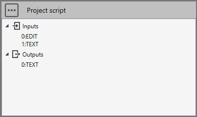

# study

The **study** object gives access to several methods and can be used only in [Project script](https://documentation.metapiping.com/Python/Study.html).

## 1. Properties

| Name | Return | Description |
| --- | ----------- | ----------- |
| Inputs | array of string | Access to an item [i] in Project script's Inputs |
| Outputs | array of string | Access to an item [i] in Project script's Outputs |
| getDirectory() | string | Get the current study directory|
| createMetal() | metal | Create an empty metal object |
| getMetal() | metal | Access to current metal object of the study |
| getMetal(directory) | metal | Return the first metal in directory if exists. None otherwise |
| saveMetal(metal, directory) | - | Save the metal in directory |
| getSolution() | solution | Access to current Solution object of the study |
| disposeSolution() | - | Dispose the solution |
| getMaterialLibraryModel(name) | MaterialLibraryModel | Access to a material library by its name (without .materials) |
| createMaterialLibraryModel(name) | MaterialLibraryModel | Create a material library by a name (without .materials) |
| showInformation(title, info) | - | Add 2 strings into the description of a study (one for column 1 and one form column 2)|
| getScriptDirectory() | string | Return the current script directory |
| copyDirectoryToTemp(directory) | string | Return the new unic TEMP directory where the copy has been done |
| createVariableWindow() | VariableWindow | Return an empty window |
| createCommand(name, metal) | CustomCommand | Return an empty command with a name and a metal |
| executeCommand(command, directory) | - | Execute a CustomCommand (from createCommand) and the directory of the metal |
| solvePipingModel(solvername, sandbox) | solution | Solve current connected metal with a solver. sandbox = True means not in the study folder |
| solvePipingModel(metal, solvername, directory) | solution | Solve metal with a solver in directory |
| analysePipingElement(analysename, solution, node1name, node2name, loadcase, template, options, keepreport) | - | Launch a Finite element Analysis of a piping element |

See [metal](https://documentation.metapiping.com/Python/Classes/metal.html) for more information.

See [solution](https://documentation.metapiping.com/Python/Classes/solution.html) for more information.

See [libraries](https://documentation.metapiping.com/Python/Classes/libraries.html) for more information about materialLibraryModel.

## 2. Examples

### 2.1 Inputs/Outputs

Imagine a **brick** (script) composed of an EDIT control (user can write something) and a TEXT control (text link from another brick).

We want that when clicking on **Run** button, the script returns as result the combination of the EDIT and the TEXT :



```python
# Python script    
study.Outputs[0] = study.Inputs[0] + " " + study.Inputs[1]
```

### 2.2 getDirectory()

Imagine user wants to save content in a text file in the current study directory :
```python
# Python script   
dir = study.getDirectory()
filename = os.path.join(dir, "info.txt")
with open(filename,'w') as f:
	f.write(content)
```

### 2.3 createMetal()

The **metal** object contains the whole definition of a piping : (geometry, loads, code and edition...).

Imagine user wants to create an empty model for the current study :

>REM : a model contains default values but must have at least one layer

>REM : the model of the study must be named "conception.metaL"

```python
# Python script
from Cwantic.MetaPiping.Core import Layer

metal = study.createMetal()

layer = Layer("0")
metal.Layers.Add(layer) # Attention ! metal.Layers is a C# list. Use Add instead of append

dir = study.getDirectory()
filename = os.path.join(dir, "conception.metaL")

metal.SaveToFile(filename)
```

See [metal](https://documentation.metapiping.com/Python/Classes/metal.html) for more information.

### 2.4 loadMetal() vs getMetal()

Imagine user wants to check if a metaL is connected (result as a text in Outputs[0]).


```python
# Python script
if study.Inputs[0] != "":
    metal = study.loadMetal(study.Inputs[0])
    if metal != None:
        study.Outputs[0] = "Metal connected"
    else:
        study.Outputs[0] = "Invalid metal !"
else:
    study.Outputs[0] = "No metaL connected !"
```

>loadMetal() can load a metaL file based on its filename. Usefull if you want to manipulate a metaL outside the study directory !

Or with the shortcut getMetal() :

```python
# Python script
metal = study.getMetal()
if metal != None:
    study.Outputs[0] = "Metal connected"
else:
    study.Outputs[0] = "No metaL connected !"
```
>getMetal() load the current metaL in the study if it is connected !

See [metal](https://documentation.metapiping.com/Python/Classes/metal.html) for more information.

### 2.5 saveMetal()

    saveMetal(metal, directory)

The metal can be saved in a specified directory. If there is already a metal file in the directory, it will replace it otherwise a 'conception.metaL' file will be created.

```python
# Python script
metal = study.getMetal()
if metal != None:
    documents = os.path.expanduser('~/Documents')
    study.saveMetal(metal, documents)
```

>saveMetal() also save the *.fre file next to the metal.

### 2.6 getSolution()

The **solution** object contains all results after calculation.

Imagine user wants to check if the solution exists (result as a text in Outputs[0]).

```python
# Python script
solution = study.getSolution()
if solution != None:
    study.Outputs[0] = "Solution connected"
else:
    study.Outputs[0] = "Solution not connected or doesn't exist"
```

>getSolution() load the current solution in the study if it is connected !

To be perfectly rigorous, you need to call the **disposeSolution()** method once you've finished processing the solution.

```python
# Python script
solution = study.getSolution()
if solution != None:
    study.Outputs[0] = "Solution connected"
    ...
    study.disposeSolution()
else:
    study.Outputs[0] = "Solution not connected or doesn't exist"
```

See [solution](https://documentation.metapiping.com/Python/Classes/solution.html) for more information.

### 2.7 getMaterialLibraryModel()

Return a MaterialLibraryModel based on a name (without extension).

Return **None** if the library doesn't exist.

See [libraries](https://documentation.metapiping.com/Python/Classes/libraries.html) for more information about materialLibraryModel with an example.

### 2.8 createMaterialLibraryModel()

You can create your own library of material based on a name (without extension).

Return a new empty MaterialLibraryModel or **None** if already exists.

See [libraries](https://documentation.metapiping.com/Python/Classes/libraries.html) for more information about materialLibraryModel with an example.

### 2.9 showInformation()

This method is only accessible in scripts that show informations about the MetaL and the results of the current study in **Explorer**.

```python
metal = study.getMetal()
if metal != None:
    study.showInformation('Model exists !', '') 
```

[See an example here](https://documentation.metapiping.com/Python/Samples/info.html) : Show informations about a study.

### 2.10 getScriptDirectory()

Returns the current script directory. Usefull if you store there files that you want to use in your script.

```python
# Python script
scriptdirectory = study.getScriptDirectory()
```

### 2.11 createVariableWindow()

createVariableWindow() returns an empty window that will show user's variables.

```python
# Python script
window = study.createVariableWindow()
```

**Window components** :

| Method | Params  | Description |
| ------ | ------  | ----------- |
| AddComment | string | Add a comment (text)|
| AddValue | string, string, double | Add a numeric variable (variable name, text, default value) |
| AddImage | string | Add an image (local filename) |
| AddList | string, string, [string], int | Add a variable list of texts (variable name, text, array of texts, default index) |
| AddCheck | string, string, bool| Add a variable checkbox (variable name, text, default value) |
| ShowModal | bool | Show the window and return true if click on OK button |
| GetValue | string | Return a **numerical** value (variable name) |

```python
# Python script
directory = study.getScriptDirectory()

window = study.createVariableWindow()
window.AddComment("Fill the variables")
window.AddValue("L", "L =", 10)
window.AddList("CHOICE", "Choice =", ["Choice A", "Choice B", "Choice C"], 1)
window.AddCheck("ACTIVE", "Active ?", True)
window.AddImage(os.path.join(directory, "image.jpg"))
if window.ShowModal():
    val1 = window.GetValue("L")
    CHOICE_ID = window.GetValue("CHOICE")
    # CHOICE_ID = 0, 1 or 2
    val2 = 0
    if CHOICEID == 1:
        val2 = 0.5
    else:
        if CHOICE == 2:
            val2 = 3
    ACTIVE_ID = window.GetValue("ACTIVE")
    # ACTIVE_ID = 0 (False) or 1 (True)
    val3 = ACTIVE_ID == 1
```

In this example, we have 3 variables (L, CHOICE, ACTIVE), 1 comment and 1 image. We suppose image.jpg existing in the script directory next to main.py.

L will show the default value of 10

CHOICE will show the default value of "Choice B" (index 1)

ACTIVE will be checked by default

After window show :

val1 will receive the user value for L

val2 will receive the user value for CHOICE transformed to a real value (0, 0.5 or 3)

val3 will receive the user value for ACTIVE transformed to bool

### 2.12 copyDirectoryToTemp()

    copyDirectoryToTemp(directory)

Return the new unic TEMP folder where the copy of directory has been done

```python
# Python script
# Copy the whole study directory to TEMP
temp_dir = study.copyDirectoryToTemp(study.getDirectory())
```

### 2.13 createCommand()

    createCommand(name, metal) 

Return an empty [CustomCommand](https://documentation.metapiping.com/Python/Classes/commands.html) with a name and a metal

createCommand() must be used in conjunction with executeCommand()

```python
# Python script
cmd = study.createCommand("ModifyMetal", metal)
# ...
# Fill cmd with sub commands
# ...
study.executeCommand(cmd, dir) # metaL and fre will be modified in dir
```

### 2.14 executeCommand() 

    executeCommand(command, directory)

Execute the [CustomCommand](https://documentation.metapiping.com/Python/Classes/commands.html) passed in parameter

executeCommand() must be used in conjunction with createCommand()


```python
# Python script
cmd = study.createCommand("ModifyMetal", metal)
# ...
# Fill cmd with sub commands
# ...
study.executeCommand(cmd, dir) # metaL and fre will be modified in dir
```

### 2.15 solvePipingModel()

    solvePipingModel(solvername, sandbox)

Solve current connected metal with a solver. Return a **solution** object.

solvername can be :
* 'Aster'
* 'PipeStress' if installed on the computer

sandbox can be :
* True : the result files will be placed in a temporary directory
* False : the result files will be placed in the current study

Example :


```python
# Python script
# Compare solutions between Aster and PipeStress of the current metal
# The solutions are computed in sandbox and do not affect the study
if study.getMetal() != None:
    solution1 = study.solvePipingModel("PipeStress", True)
    if solution1 != None:
        maxRatio = solution1.getMaxStressRatio()
        study.Outputs[0] = "PipeStress Max ratio = {}".format(round(maxRatio, 2))
        study.disposeSolution()
    solution2 = study.solvePipingModel("Aster", True)
    if solution2 != None:
        maxRatio = solution2.getMaxStressRatio()
        study.Outputs[1] = "Aster Max ratio = {}".format(round(maxRatio, 2))
        study.disposeSolution()
else:
    study.Outputs[0] = "Please connect metaL !"
    study.Outputs[1] = ""
```

Other version :

    solvePipingModel(metal, solvername, directory) 

Solve metal with a solver in a directory. Return a **solution** object.

```python
# Python script
def SolveMetalWithChanges(solverName, changes):
    maxRatio = 0
    try:
        # Make a copy of study directory to temp_dir
        temp_dir = study.copyDirectoryToTemp(study.getDirectory())
        # Load temporary metaL
        metal = study.getMetal(temp_dir)
        # Modify metaL with changes
        ...
        # Solve metaL to temp_dir
        solution = study.solvePipingModel(metal, solverName, temp_dir)
        if solution != None:
            # Get maxRatio
            maxRatio = solution.getMaxStressRatio(True)
            solution.Dispose()
    finally:
        # Remove temp_dir
        shutil.rmtree(temp_dir)

    return maxRatio
```

### 2.16 analysePipingElement()

    analysePipingElement(analysename, solution, node1name, node2name, loadcase, template, options, keepreport) 

Launch a Finite element Analysis of a piping element

| Parameter | Unit | Description |
| --- | --- | --- |
| analysename | string | Name of the analyse |
| solution | Solution | Solution of the piping model |
| node1name | string | Element's node1 name |
| node2name | string | Element's node2 name |
| loadcase | int | Load case number |
| template | string | Name of the template file extension |
| options | dictionary<string, string> | All parameters needed in FEA window |
| keepreport | bool | True if you want to only keep the analysis report and destroy the analysis directory|

**template** can be :
* 'meshpipe'
* 'brickpipe'
* 'meshbend'
* 'brickbend'
* 'brickreducer'

**options** is a C# dictionary !

Example :

We want to analyse the reducer between nodes 180 and 190. User can decide the mesh size of the finite elements and the load case. All other parameters are imposed. It returns the FEA reports.


```python
# Python script
from System.Collections.Generic import Dictionary
import os

# FEA analyze of a reducer
study.Outputs[0] = ""

solution = study.getSolution()
if solution != None:
    # Mesh size
    try:
        meshsize = int(study.Inputs[2])
    except ValueError:
        meshsize = 20
    # Load case
    try:
        case = int(study.Inputs[4])
    except ValueError:
        case = 300
        
    # Options for reducer definition and mesh size
    options = Dictionary[str, str]()
    options["EXTEND"] = "0.1"
    options["MESH SIZE"] = str(meshsize)
    options["THICKNESS NUMBER"] = "1"
    options["REPORT TEMPLATE"] = "Cwantic_FEA_Piping_template_SI.docx"
    options["REPORT TABLE"] = "Cwantic_tables_SI.docx"
    
    # We want to delete the analysis directory and only keep the report in the study directory
    analyseName = "Reducer_180_190" # That will produce a report named "Reducer_180_190.docx"
    study.analysePipingElement(analyseName, solution, "180", "190", case, "brickreducer", options, True)
    
    # Rename file with current params
    report = "{0}_Case{1}_Mesh{2}.docx".format(analyseName, case, meshsize)
    filename = os.path.join(study.getDirectory(), analyseName + ".docx")
    newfilename = os.path.join(study.getDirectory(), report)
    
    if os.path.exists(newfilename):
        try:
            os.remove(newfilename)
        except Exception as e:
            pass
    if os.path.exists(filename):
        try:
            os.rename(filename, newfilename)
            study.Outputs[0] = report
        except Exception as e:
            pass
```