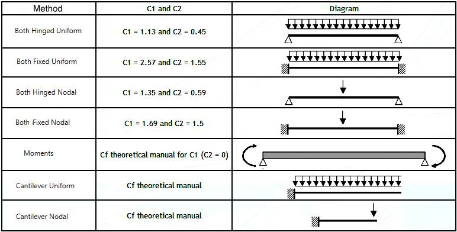

# Types and classes

Here is the list of all **types** and **classes** used in commands, some in user units, some in MKS units.

Alphabetic order :

---

* AnchorPlate

Anchor plate class.

```python
# Python script
from Cwantic.MetaPiping.Core import AnchorPlate

anchorPlate = AnchorPlate()
...
```

| Property | Type | Description |
| ---- | ----------- | ----- |
| bp | Float | Width of the plate |
| hp | Float | Height of the plate |
| tp | Float | Thickness of the plate |
| p1l | Float | Left distance of plate corners to concrete edges, default = infinite |
| p1r | Float | Right distance of plate corners to concrete edges, default = infinite |
| p2b | Float | Bottom distance of plate corners to concrete edges, default = infinite |
| p2t | Float | Top distance of plate corners to concrete edges, default = infinite |
| v1l | Bool | Left edge is a virtual free edge ? |
| v1r | Bool | Right edge is a virtual free edge ? |
| v2b | Bool | Bottom edge is a virtual free edge ? |
| v2t | Bool | Top edge is a virtual free edge ? |
| Dh | Float | hole diameter |
| Tolerance | Float | dimension c of square around of each hole |
| IsRegular | Bool | Regular position of anchors ? |
| n1 | Int | Number of anchors in x direction (column) |
| n2 | Int | Number of anchors in y direction (row) |
| s1 | Float | nominal spacings, = 0 if n1 = 1 |
| s2 | Float | nominal spacings, = 0 if n2 = 1 |
| e1 | Float | X excentricity from plate center to anchors center |
| e2 | Float | Y excentricity from plate center to anchors center |
| InternalFasteners | Bool | true if internal anchors |
| Positions | `List<Point>` | List of anchor (X, Y) positions, see below |
| Concrete | Concrete | See below |
| ShearLug | Bool | Shear lug ? |
| WasherNut | Bool | Washer nut ? |
| CantRotate | Bool | Cant rotate ? |
| tgrout | Float | Grouting thickness |
| fgrout | Float | Grouting strength |
| AttachCG | Point | position of cog relative to plate center, see below |
| PlateMaterial | Material | Plate material |
| WeldMaterial | Material | Weld material |
| af | Float | weld throat at flange |
| aw | Float | weld throat at web |
| DoubleFlangeWeld | Bool | Double flange weld |
| Stiffener | Stiffener | Stiffener definition, see below |
| Fastener | Fastener | Fastener definition, see below |

[Click here for more information about Material](https://documentation.metapiping.com/Python/Classes/material.html)

---

* BeamExtremity

Graphical ending of a beam

```python
# Python script
from Cwantic.MetaPiping.Core import BeamExtremity

end1 = BeamExtremity.Front
...
```

| Property | Value | Description |
| ---- | ----------- | ----- |
| None | 0 | - |
| Front | 1 | The beam continues onto the FIRST contact face of the other beam |
| Back | 2 | The beam continues onto the LAST contact face of the other beam |
| Miter | 3 | The beam meets the other at a miter joint |
| Plate | 4 | The beam continues onto the FIRST contact face of the plate |

---

* BeamJointType

Joint type of beam

```python
# Python script
from Cwantic.MetaPiping.Core import BeamJointType

jointType1 = BeamJointType.BoltedJoint
...
```

| Property | Value | Description |
| ---- | ----------- | ----- |
| Joint | 0 | Defined by stiffnesses |
| BoltedJoint | 1 | Defined by a bolting plate |
| WeldedJoint | 2 | Defined by welding properties |

---

* BeamSection

Section of a beam

```python
# Python script
from Cwantic.MetaPiping.Core import BeamSection

section = BeamSection()
section.Name = "HEA200"
...
```

| Property | Type | Description |
| ---- | ----------- | ----- |
| Name | String | Name of the section |
| Description | String | Description |
| A | Float | Section area |
| Ax | Float | Shear area in X axis |
| Ay | Float | Shear area in Y axis |
| Ix | Float | Weak inertia around X |
| Iy | Float | Strong inertia around Y |
| It | Float | Torsional inertia |
| LinearMass | Float | Linear mass |
| Type | BeamSectionType | BeamSectionType.I by default, see below |
| H | Float | Height of the section |
| B | Float | Width of the section |
| Tw | Float | Thickness of the web |
| Tf | Float | Thickness of the flanges |
| Y0 | Float | Shear centre on axis Y (from center of gravity) |
| X0 | Float | Shear centre on axis Z (from center of gravity) |
| Iw | Float | Inertia of warping |
| WT | Float | Torsion modulus |
| Wy | Float | Shear resistance along axis Y |
| Wx | Float | Shear resistance along axis X |
| WEly | Float | Elastic bending modulus along strong axis Y |
| WElx | Float | Elastic bending modulus along weak axis X |
| WPly | Float | Plastic bending modulus along strong axis Y |
| WPlx | Float | Plastic bending modulus along weak axis X |

---

* BeamSectionType

Types of standard beam section

```python
# Python script
from Cwantic.MetaPiping.Core import BeamSectionType

sectionType = BeamSectionType.I
...
```

| Property | Value |
| ---- | ----------- |
| NonStandard | 0 |
| I | 1 |
| Channel | 2 |
| Rect | 3 |
| Tee | 4 |
| EqualAngle | 5 |
| UnequalAngle | 6 |
| Round | 7 |
| Plate | 8 |

---

* Bolt

Bolt class

```python
# Python script
from Cwantic.MetaPiping.Core import Bolt

bolt = Bolt()
bolt.Name = "M10"
bolt.Diameter = 0.01
bolt.Pitch = 0.0015
bolt.ResistantArea = 0.000075
...
```

| Property | Type | MKS units |
| ---- | ----------- | ---- |
| Name | String | - |
| Diameter | Float | m |
| Pitch | Float | m |
| Material | Material | - |
| ResistantArea | Float | m² |

[See the description of the object material](https://documentation.metapiping.com/Python/Classes/material.html)

---

* BoltedJoint

Derivated class of *Joint* for bolting plate definition (see below)

```python
# Python script
from Cwantic.MetaPiping.Core import BoltedJoint

joint1 = BoltedJoint()
...
```

```json
// Property in metaL's JSON Elements list - inside Beam properties
    ...
    "Element": "Beam",
    "Joint1": {
        "Joint": "BoltedJoint",
        ...
        }
    ...  
```

The *BoltedJoint* has the same properties as the *Joint* plus :

| Property | Type | Description | MKS units |
| ---- | ----------- | ----- | ----- |
| Bolt | Bolt | See above | - |
| hp | Float | Height of the plate | m |
| bp | Float | Width of the plate | m |
| tp | Float | Thickness of the plate | m |
| AttachCG | Point | Gravity center position, see below | - |
| PlateMaterial | Material | Material of the plate | - |
| nInt | Int | Number of bolt rows inside beam flanges | - |
| nSup | Int | Number of bolt rows above the beam | - |
| nInf | Int | Number of bolt rows below the beam | - |
| sInt | Float | Vertical space between rows inside beam flanges | m |
| sSup | Float | Vertical space between rows above the beam | m |
| sInf | Float | Vertical space between rows below the beam | m |
| sWeb | Float | Horizontal space between the 2 bolts of a row | m |
| aInt | Float | Vertical offset for rows inside beam flanges | m |
| aSup | Float | Vertical offset for rows above the beam | m |
| aInf | Float | Vertical offset for rows below the beam | m |

[See the description of the object material](https://documentation.metapiping.com/Python/Classes/material.html)

---

* Clamp

U-bolt class.

| Property | Type | Description | MKS units |
| ---- | ----------- | ----- | ----- |
| Name | String | Name | - |
| Fa | Float | Allowable pulling force in the guided U-bolt | N |
| Fam | Float | Allowable force in pulling direction (mid point) | N |
| Fbm | Float | Allowable force in shear direction (mid point) | N |
| Fb | Float | Allowable shear force in the guided U-bolt | N |
| LevelBFactor | Float | Defined by the code, 1 by default | - |
| LevelCFactor | Float | Defined by the code, 1 by default | - |
| LevelDFactor | Float | Defined by the code, 1 by default | - |
| LevelTFactor | Float | Defined by the code, 1 by default | - |

REM : Set Fb = 0 to define a fixed U-bolt. Otherwise it is a guided U-bolt.

REM : In case of fixed U-bolt, Fa = Prestressing force in the fixed U-bolt

```python
# Python script
from Cwantic.MetaPiping.Core import Clamp

ubolt = Clamp()
...
```

---

* ColdSpring

Class of cold spring, positive value for extension

| Property | Type | MKS units |
| ---- | ----------- | ----- |
| LengthChange | float | m |

```python
# Python script
from Cwantic.MetaPiping.Core import ColdSpring

case = ColdSpring()
case.LengthChange = 0.01
```

---

* CombinationMethod

Method of combination.

| Property | Value |
| ---- | ----------- |
| Algebraic | 0 |
| Absolute | 1 |
| SRSS | 2 |
| Seismic | 3 |
| MaxAbsolute | 4 |
| MaxResultant | 5 |
| MaxAlgebraic | 6 |
| MinAlgebraic | 7 |
| Range | 8 |
| MomentRange | 9 |
| StressRange | 10 |

```python
# Python script
from Cwantic.MetaPiping.Core import CombinationMethod

combi = CombinationMethod.SRSS
```

---

* CombinationOrder

| Property | Value |
| ---- | ----------- |
| LevelModalSpatial | 0 |
| LevelSpatialModal | 1 |
| ModalLevelSpatial | 2 |

```python
# Python script
from Cwantic.MetaPiping.Core import CombinationOrder

order = CombinationOrder.LevelModalSpatial
```

---

* Concrete

Concrete class.

| Property | Type | Description | MKS units |
| ---- | ----------- | ----- | ----- |
| Class | ConcreteClass | Class of the concrete | - |
| IsCracked | Bool | Craqued ? | - |
| Thickness | Float | Thickness | m |
| DenseReinforcement | Bool | Dense reinforcement | - |
| SplittingReinforcement | Bool | Reinforcement to limit the crack width to Wk~0.30mm ? | - |
| EdgeReinforcement | Bool | Edge reinforcement | - |

ConcreteClass :

| Property | Value |
| ---- | ----------- |
| C20 | 0 |
| C25 | 1 |
| C30 | 2 |
| C35 | 3 |
| C40 | 4 |
| C45 | 5 |
| C50 | 6 |
| C55 | 7 |
| C60 | 8 |

---

* ContentDensity

Class of content density

| Property | Type | MKS Units |
| ---- | ----------- | --- |
| Density | float | - |

```python
# Python script
from Cwantic.MetaPiping.Core import ContentDensity

content = ContentDensity()
content.Density = 1
```

---

* CoordinateSystem

Coordinate system types.

```python
# Python script
from Cwantic.MetaPiping.Core import CoordinateSystem

coorsys = CoordinateSystem.Global
...
```

| Property | Value |
| ---- | ----------- |
| Global | 0 |
| LocalToConnectedElement | 1 |
| Local | 4 |

---

* DistributedLoad

Class of distributed load.

| Property | Type | MKS Units |
| ---- | ----------- | --- |
| Type | DistributedLoadType | See below |
| Load | Vector3D | N/m for FDIS or N/m² for WIND and SNOW |

```python
# Python script
from Cwantic.MetaPiping.Core import DistributedLoad
from System.Windows.Media.Media3D import Vector3D

case = DistributedLoad()
case.Type = DistributedLoadType.WIND
case.Load = Vector3D(0, 1000, 0)
```

---

* DistributedLoadType

All kind of distributed loads.

| Property | Value |
| ---- | ----------- |
| None | 0 |
| WIND | 1 |
| SNOW | 2 |
| FDIS | 3 |

```python
# Python script
from Cwantic.MetaPiping.Core import DistributedLoadType

type = DistributedLoadType.FDIS
```

---

* DLCS

Local coordinate system class.

| Property | Type | Description |
| ---- | ----------- | ----- |
| NodeAt | Node | Node |
| X | Vector3D | X direction |
| Z | Vector3D | Z direction |

REM : Y is deducted from X and Z vectors (cross product)

REM : stored in **model.DLCSs**

```python
# Python script
from Cwantic.MetaPiping.Core import DLCS
from System.Windows.Media.Media3D import Vector3D

dlcs = DLCS()
dlcs.NodeAt = N1 # an existing node
dlcs.X = Vector3D(1, 0, 0)
dlcs.Z = Vector3D(0, 0, 1)
```

---

* DynamicNodeLoad

Class of dynamic node load.

| Property | Type | Description |
| ---- | ----------- | ----- |
| Force | Vector3D | |
| Moment | Vector3D | |
| ForceFunction | int | |
| MomentFunction | int | |

```python
# Python script
from Cwantic.MetaPiping.Core import DynamicNodeLoad
from System.Windows.Media.Media3D import Vector3D

load = DynamicNodeLoad()
load.Force = Vector3D(0.001, 0, 0)
load.ForceFunction = 1
```

---

* Fastener

Fastener class.

Too complex. Use FastenerModel object to load a *.fastener from database.

```python
# Python script
from Cwantic.MetaPiping.Core import Fastener, FastenerModel

fastenerModel = FastenerModel("");
fastenerModel.LoadFromFile(fastenerFilename);

fastener = fastenerModel.fastener.DeepClone();
fastener.ConvertToMKS(fastenerModel.userUnits);
...
```

---

* GrossDisc

Class of gross discontinuity.

| Property | Type | MKS Units |
| ---- | ----------- | --- |
| Stress | float | N/m² |

```python
# Python script
from Cwantic.MetaPiping.Core import GrossDisc

case = GrossDisc()
case.Stress = 1000000
```

---

* InsertMode

| Property | Value |
| ---- | ----------- |
| ShiftForward | 0 |
| ShiftBackward | 1 |
| ReduceNext | 2 |
| ReducePrevious | 3 |
| ReduceNeighbors | 4 |

```python
# Python script
from Cwantic.MetaPiping.Core import InsertMode

mode = InsertMode.ReduceNeighbors
...
```

---

* Joint

Base class of beam joint

| Property | Type | Description | Default |
| ---- | ----------- | ----- | --- |
| JointType | BeamJointType | See above | BeamJointType.Joint |
| Kx | Float | Translational stiffeness along X | Model.ANCH_TSTIFF |
| Ky | Float | Translational stiffeness along Y | Model.ANCH_TSTIFF |
| Kz | Float | Translational stiffeness along Z | Model.ANCH_TSTIFF |
| Krx | Float | Rotational stiffeness around X | Model.ANCH_RSTIFF |
| Kry | Float | Rotational stiffeness around Y | Model.ANCH_RSTIFF |
| Krz | Float | Rotational stiffeness around Z | Model.ANCH_RSTIFF |

>Model.ANCH_TSTIFF = 1.75e13 in MKS units

>Model.ANCH_RSTIFF = 1.13e12 in MKS units

The derivated classes are *BoltedJoint* and *WeldedJoint*.

```python
# Python script
from Cwantic.MetaPiping.Core import Joint

joint1 = Joint()
...
```

---

* JointType

Type of node joint

```python
# Python script
from Cwantic.MetaPiping.Core import JointType

nodeJointType = JointType()
...
```

| Property | Value | Description |
| ---- | ----------- | ----- |
| None | 0 | - |
| ButtWeldFlush | 1 | For steel material |
| ButtWeldAsWelded | 2 | For steel material |
| FilletWeld | 3 | For steel material |
| CappedEnd | 4 | For steel material |
| FullFilletWeld | 6 | For steel material |
| TaperedFlush | 11 | For steel material |
| TaperedAsWelded | 12 | For steel material |
| Threaded | 13 | For steel material |
| Brazed | 14 | For steel material |
| OneThirdSlopeFlush | 15 | For steel material |
| OneThirdSlopeAsWelded | 16 | For steel material |
| LapFlange | 18 | For steel material |
| DoubleWeldSlipOnFlange | 19 | For steel material |
| SingleWeldSlipOnFlange | 20 | For steel material, B31J code only |
| AdhesiveBonded | 101 | For composite material |
| AdhesiveBondedWithOverlay | 102 | For composite material |
| GasketWithOverlay | 103 | For composite material |
| ButtAndStrap | 104 | For composite material |
| ConcentricFabricatedReducer | 201 | for HDPE material |
| ThrustCollar | 202 | for HDPE material |
| ElectrofusionCoupling | 203 | for HDPE material |
| HDPEBoltedFlange | 204 | for HDPE material |

---

* Layer

Class of layer for element

| Property | Type | Remark |
| ---- | ----------- | ----- |
| Name | String | - |
| Visible | Bool | True by default |

```python
# Python script
from Cwantic.MetaPiping.Core import Layer

layer = Layer()
layer.Name = "0"
layer.Visible = True
```

---

* LevelCombination

| Property | Value | Description |
| ---- | ----- | --- |
| AbsoluteWithoutPhase | 0 | |
| SRSSWithoutPhase | 1 | |
| Algebraic | 2 | |
| AbsoluteWithPhase | 3 | |
| SRSSWithPhase | 4 | |
| Envelope | 5 | |
| SRRSCounterphase | 6 | |

```python
# Python script
from Cwantic.MetaPiping.Core import LevelCombination

levelCombi = LevelCombination.Algebraic
```

---

* LoadCategory

Catagory of static load.

| Property | Value |
| ---- | ----- |
| OperatingWeight | 0 |
| TestWeight | 1 |
| EmptyWeight | 2 |
| DesignWeight | 3 |
| Wind | 4 |
| Snow | 5 |
| Distributed | 6 |
| Acceleration | 7 |
| SAM | 8 |
| Thermal | 9 |
| Settlement | 10 |
| ColdSpring | 11 |
| Dummy | 12 |
| UserDefined | 13 |

```python
# Python script
from Cwantic.MetaPiping.Core import LoadCategory

category = LoadCategory.Distributed
```

---

* LongWeldType

Type of longitudinal welding

```python
# Python script
from Cwantic.MetaPiping.Core import LongWeldType

type = LongWeldType.ButtWeldAsWelded
...
```

| Property | Value |
| ---- | ----- |
| None | 0 |
| ButtWeldFlush | 1 |
| ButtWeldAsWelded | 2 |

---

* LTBModel

Theoretical model of Lateral Torsional Buckling (Eurocode3)



```python
# Python script
from Cwantic.MetaPiping.Core import LTBModel

LTBmodel = LTBModel.CantileverUniform
...
```

| Property | Value |
| ---- | ----- |
| None | 0 |
| BothHingedUniform | 1 |
| BothHingedNodal | 2 |
| BothFixedUniform | 3 |
| BothFixedNodal | 4 |
| Moments | 5 |
| CantileverUniform | 6 |
| CantileverNodal | 7 |

---

* LumpedMass

Lumped mass class.

```python
# Python script
from Cwantic.MetaPiping.Core import LumpedMass

lump = LumpedMass()
...
```

| Param | Type | Description |
| ---- | ----------- | ----------- |
| Node | Node | Existing node |
| Mass | Float | Mass on node |

---

* MassModel

Indicates where the mass will be concentred during calculation

| Property | Value | Remark |
| ---- | ----------- | --- |
| None | 0 | |
| AtEnd | 1 | |
| AtStart | 2 | |
| HalfAtBoth | 3 | |
| LinearAtBoth | 4 | mass per unit length, lumped at both nodes |
| LinearAtEnd | 5 | mass per unit length, lumped at end |
| Linear | 6 | mass per unit length |
| Density | 7 | for beams only |
| MaterialDensity | 8 | for beams (no need of mass) |

```python
# Python script
from Cwantic.MetaPiping.Core import MassModel

massModel = MassModel.HalfAtBoth
```

---

* ModalCombination

| Property | Value |
| ---- | ----- |
| None | 0 |
| Grouping | 1 |
| TenPercent | 2 |
| DoubleSum | 3 |
| SRSS | 4 |
| AllCoupling | 5 |
| Rosenblueth | 6 |
| DerKiureghian | 7 |

```python
# Python script
from Cwantic.MetaPiping.Core import ModalCombination

modalCombi = ModalCombination.SRSS
```

---

* MoveMode

Type of move.

| Property | Value |
| ---- | ----------- |
| Translation | 0 |
| Rotation | 1 |
| Mirror | 2 |

```python
# Python script
from Cwantic.MetaPiping.Core import MoveMode

mode = MoveMode.Translation
...
```

---

* NodeLink

Link class between a node of a linked piping model and multiple nodes of current structural model.

| Property | Type | Description |
| ---- | ----------- | ----------- |
| StudyID | Int | The Id of the linked study of the piping model |
| ExternalNode | Node | A piping node in the linked piping model |
| NodeList | `List<Node>` | List of nodes of the current structural model |
| StaticFriction | Float | Static friction of the contact |
| DynamicFriction | Float | Dynamic friction of the contact |
| Clamp | Clamp | U-bolt object at node - can be None. See types page |

REM : saved in **model.Links**

```python
# Python script
from Cwantic.MetaPiping.Core import NodeLink

link = NodeLink()
...
```

---

* NodeLoad

Class of node load.

| Property | Type | MKS Units |
| ---- | ----------- | --- |
| Force | Vector3D | N |
| Moment | Vector3D | N.m |
| Local | bool | False by default |

```python
# Python script
from Cwantic.MetaPiping.Core import NodeLoad
from System.Windows.Media.Media3D import Vector3D

case = NodeLoad()
case.Force = Vector3D(0, 1000, 0)
case.Moment = Vector3D(0, 1000, 0)
```

---

* OperatingCondition

Class of operating condition

```python
# Python script
from Cwantic.MetaPiping.Core import OperatingCondition

oper = OperatingCondition()
oper.Temperature = "100"
oper.Pressure = 1
...
```

| Property | Type | MKS Units |
| ---- | ----------- | --- |
| Temperature | Float | °C |
| Pressure | Float | N/m² |

---

* OvalizationOption

Ovalization possible values

```python
# Python script
from Cwantic.MetaPiping.Core import OvalizationOption

option = OvalizationOption.Circular
...
```

| Property | Value |
| ---- | ----------- |
| Circular | 0 |
| Elliptical | 1 |
| Discontinuity | 2 |

---

* PinnedCase

Pinned possible values

```python
# Python script
from Cwantic.MetaPiping.Core import PinnedCase

pinned = PinnedCase.Design
...
```

| Property | Value |
| ---- | ----------- |
| Design | 0 |
| DesignAndTest | 1 |
| DesignAndEmpty | 2 |

---

* PipeModel

Class of piping section in USER units !

```python
# Python script
from Cwantic.MetaPiping.Core import PipeModel

pipeModel = PipeModel()
...
```

| Property | Type | Description | Unit Metric | Unit USA |
| ---- | ----------- | --- | ---- | ---- |
| DN | String | Piping size name | - | - |
| PN | String | Piping schedule | - | - |
| OutsideDiameter | Float | Outside diameter | mm | in |
| Thickness | Float | Thickness | mm | in |
| LinearMass | Float | Linear mass | kg/m | lb/ft |

---

* Point

2D point structure (X, Y)

```python
# Python script
from System.Windows import Point

pt = Point(0, 0)
...
```

---

* ReducerModulus

TO DO

---

* RCurve

Class of a spectrum curve.

| Property | Type | MKS Units |
| ---- | ----------- | --- |
| NbPoints | int | - |
| X | List of float | |
| Y | List of float | |
| F1 | float | |
| F2 | float | |

---

* RestraintMovement

Class of restraint movement.

| Property | Type | MKS Units |
| ---- | ----------- | --- |
| Translation | Vector3D | m |
| Rotation | Vector3D | rad |
| Local | bool | False by default |

```python
# Python script
from Cwantic.MetaPiping.Core import RestraintMovement
from System.Windows.Media.Media3D import Vector3D

case = RestraintMovement()
case.Translation = Vector3D(0, 0.01, 0)
case.Rotation = Vector3D(0, 0.72, 0)
```

---

* RigidCorrection

| Property | Value |
| ---- | ----------- |
| SRSS | 0 |
| None | 1 |
| Absolute | 2 |
| SRSSWithModal | 3 |
| Gupta | 4 |
| LindleyYow | 5 |

```python
# Python script
from Cwantic.MetaPiping.Core import RigidCorrection

correction = RigidCorrection.SRSS
```

---

* RInterpolationMethod

Interpolation methods :

| Property | Value |
| ---- | ----------- |
| Lin_Lin | 0 |
| LinFreq_Lin | 1 |
| LinPer_Lin | 2 |
| Log_Lin | 3 |
| Log_Log | 4 |

```python
# Python script
from Cwantic.MetaPiping.Core import RInterpolationMethod

method = RInterpolationMethod.Lin_Lin
```

---

* RLevel

Class of spectrum level.

| Property | Type | MKS Units |
| ---- | ----------- | --- |
| Name | string | - |
| Phase | int | - |
| XCurve | RCurve | - |
| YCurve | RCurve | - |
| ZCurve | RCurve | - |
| DX | float | m |
| DY | float | m |
| DZ | float | m |

```python
# Python script
from Cwantic.MetaPiping.Core import RLevel

level = RLevel()
level.Name = "A"
level.XCurve = RCurve()
```

---

* SecondaryCombination

| Property | Value |
| ---- | ----------- |
| Absolute | 0 |
| SRSS | 1 |

```python
# Python script
from Cwantic.MetaPiping.Core import SecondaryCombination

secondaryCombi = SecondaryCombination.SRSS
```

---

* SifParameters

Class that define parameters of a Stress Intensity Factor.

| Property | Type | Description |
| ---- | ----------- | --- |
| userSIF | UserSIF | SIF definition |
| sifValues | `Dictionary<string, double>` | Dictionary of SIF name, SIF value |

```python
# Python script
from System import String, Double
from System.Collections.Generic import Dictionary
from Cwantic.MetaPiping.Core import SifParameters

...
# Creation of a C# Dictionary<string, double>
newValues = Dictionary[String, Double]()
newValues.Add("i", 1.2)
...

sifParam = SifParameters()
sifParam.userSIF = Sif1
sifParam.sifValues = newValues
...
```

---

* Soil

Soil class.

| Property | Type | Description |
| ---- | ----------- | --- |
| Lk | Float | Influence length |
| Lf | Float | Slippage length |
| Nk | Float | Number of transverse springs along the influence length |
| Nf | Float | Number of axial springs along the slippage length |
| Kh | Float | Horizontal modulus of subgrade reaction |
| Ku | Float | Vertical upwards modulus of subgrade reaction |
| Kd | Float | Vertical downwards modulus of subgrade reaction |
| Ff | Float | Maximum unit friction force at the pipe/soil interface |
| Gh | Float | Pipe displacement at maximum horizontal resistance |
| Gu | Float | Pipe displacement at maximum upwards resistance |
| Gd | Float | Pipe displacement at maximum downwards resistance |
| Gf | Float | Axial pipe displacement at maximum friction force |
| Dm | Float | Maximum pipe length |
| Db | Float | Maximum bend length |
| Label | String | Label |

```python
# Python script
from Cwantic.MetaPiping.Core import Soil

soil = Soil()
```

---

* SpatialCombination

| Property | Value |
| ---- | ----------- |
| Absolute | 0 |
| SRSS | 1 |
| Newmark | 2 |

```python
# Python script
from Cwantic.MetaPiping.Core import SpatialCombination

spatialCombi = SpatialCombination.SRSS
```

---

* SpecificationBend

Class of bend specification in USER units !

| Property | Type | Description | Unit Metric | Unit USA |
| ---- | ----------- | --- | ---- | ---- |
| DN | String | Piping size name | - | - |
| LR | Float | Bend long radius | m | ft |
| SR | Float | Bend small radius | m | ft |
| Mass | Float | Bend mass | ton | kips |
| Diameter | Float | Piping diameter | mm | in |
| Thickness | Float | Piping thickness | mm | in |
| Material | String | Material description | - | - |

```python
# Python script
from Cwantic.MetaPiping.Core import SpecificationBend

bendSpec = SpecificationBend()
```

---

* SpecificationPipe

Class of piping specification and node joint in USER units !

| Property | Type | Description | Unit Metric | Unit USA |
| ---- | ----------- | --- | ---- | ---- |
| DN | String | Piping size name | - | - |
| PN | String | Piping schedule | - | - |
| Description | String | Piping size description | - | - |
| Diameter | Float | Piping diameter | mm | in |
| Thickness | Float | Piping thickness | mm | in |
| Material | String | Material description | - | - |
| Connection | JointType | Node connection, see above | - | - |
| Mismatch | Float | Node connection mismatch | mm | in |
| LongWeldType | LongWeldType | Node longitudinal weld type, see above | - | - |
| LongWeldMismatch | Float | Node longitudinal weld mismatch | mm | in |
| TotalMass | Float | Total linear mass | kg/m | lb/ft |
| InsulationThickness | Float | Node connection insulation thickness | mm | in |
| Corrosion | Float | Corrosion thickness | mm | in |
| Erosion | Float | Erosion thickness | mm | in |
| OutOfRoundnessShape | OvalizationOption | Ovalization, see above | - | - |
| OutOfRoundnessRatio | Float | Ovalization ratio | - | - |
| LinerThickness | Float | Liner thickness | mm | in |
| TopCoatThickness | Float | Top coat thickness | mm | in |
| SpecialThickness | Float | Special thickness | mm | in |
| BendThickness | Float | Bend thickness, by default = thickness | mm | in |
| OperatingDensity | Float | Operating fluid density | kg/m³ | lb/ft³ |
| TestDensity | Float | Test density | kg/m³ | lb/ft³ |

```python
# Python script
from Cwantic.MetaPiping.Core import SpecificationPipe

pipeSpec = SpecificationPipe()
```

---

* SpecificationReducer

Class of reducer specification in USER units !

| Property | Type | Description |
| ---- | ----------- | --- |
| DN | String | Piping size name |
| Material | String | Material description |
| Items | `List<SpecificationReducerItem>` | List of SpecificationReducerItem, see below |

```python
# Python script
from Cwantic.MetaPiping.Core import SpecificationReducer

reducerSpec = SpecificationReducer()
```

```python
# Python script
from Cwantic.MetaPiping.Core import SpecificationReducerItem
from System.Collections.Generic import List

...
# Creation of a C# list
Items = List[SpecificationReducerItem]()
Items.Add(item1) # Use Add instead of append with C# list !
```

---

* SpecificationReducerItem :

The definition of the reducer from one size to another size

| Property | Type | Description | Unit Metric | Unit USA |
| ---- | ----------- | --- | ---- | ---- |
| DN | String | Piping size name | - | - |
| Length | Float | Reducer length | m | ft |
| Diameter1 | Float | Start diameter | mm | in |
| Diameter2 | Float | End diameter | mm | in |
| Mass | Float | Reducer mass | ton | kips |
| Angle | Float | Reducer angle | deg | deg |
| MinR1R2 | Float | Min value between R1 and R2 (Class1) | mm | in |
| MinL1L2 | Float | Min value between L1 and L2 (Class1) | mm | in |
| Material | String | Material description | - | - |

```python
# Python script
from Cwantic.MetaPiping.Core import SpecificationReducerItem

item = SpecificationReducerItem()
...
```

---

* StaticAcceleration

Class of static acceleration

| Property | Type | MKS Units |
| ---- | ----------- | --- |
| Acceleration | Vector3D | fraction of G |

```python
# Python script
from Cwantic.MetaPiping.Core import StaticAcceleration
from System.Windows.Media.Media3D import Vector3D

acc = StaticAcceleration()
acc.Acceleration = Vector3D(2, 0, 0)
```

---

* Stiffener

Stiffeners configuration class.

| Property | Type | MKS Units |
| ---- | ----------- | --- |
| Configuration | StiffenerConfiguration | - |
| Height | Float | m |
| WeldHeight | Float | m |
| WebThickness | Float | m |
| WebPositiveXBottomLength | Float | m |
| WebNegativeXBottomLength | Float | m |
| WebPositiveXTopLength | Float | m |
| WebNegativeXTopLength | Float | m |
| WebBottomHeight | Float | m |
| FlangeThickness | Float | m |
| FlangePositiveYBottomLength | Float | m |
| FlangeNegativeYBottomLength | Float | m |
| FlangePositiveYTopLength | Float | m |
| FlangeNegativeYTopLength | Float | m |
| FlangeBottomHeight | Float | m |
| StiffenerPlates | `List<StiffenerPlate>` | - |

```python
# Python script
from Cwantic.MetaPiping.Core import StiffenerPlate
from System.Collections.Generic import List

...
# Creation of a C# list
StiffenerPlates = List[StiffenerPlate]()
StiffenerPlates.Add(item1) # Use Add instead of append with C# list !
...
```

StiffenerConfiguration :

| Property | Value |
| ---- | ----------- |
| None | 0 |
| Web | 1 |
| Flange | 2 |
| WebFlange | 3 |
| Special | 4 |
| Complete | 5 |

[See the description of the stiffeners configuration](https://documentation.metapiping.com/Structure/Elements/Restraint.html#27-stiffeners)

---

* StiffenerPlate

Stiffener plate class.

          TopLength
            |---|

        -   *****
        |   *    *
        |   *     *         Perpendicular to the anchorplate
     H  |   *      *
        |   *       *
        |   *        *   -
        |   *        *   |  BottomHeight
        -   **********   -

            |--------|
          X1,Y1    X2,Y2    On the plane of anchorplate

| Property | Type | MKS Units |
| ---- | ----------- | --- |
| X1 | Float | m |
| Y1 | Float | m |
| X2 | Float | m |
| Y2 | Float | m |
| Thickness | Float | m |
| Height | Float | m |
| BottomHeight | Float | m |
| TopLength | Float | m |

[See the description of the free stiffeners](https://documentation.metapiping.com/Structure/Elements/Restraint.html#276-free-stiffeners)

---

* Stratification

Class of stratification load.

| Property | Type | MKS Units |
| ---- | ----------- | --- |
| Type | StratificationType | See below |
| Alpha | float | |
| T1 | float | °C |
| T2 | float | °C |
| V1 | float | m |
| V2 | float | m |
| Gu | float | °C/m |
| Gv | float | °C/m |
| V | Vector3D | - |

---

* StratificationType

Type of stratification

| Property | Value |
| ---- | ----------- |
| HorizontalLinear | 0 |
| HorizontalStep | 1 |
| HorizontalLaminar | 2 |
| HorizontalGu | 3 |
| Skewed | 4 |
| General | 5 |

---

* TeeModeling

TO DO

---

* TeeType

| Property | Value | Remark |
| ---- | ----------- | --- |
| BranchConnection | 0 | or electrofusion saddle fitting (HDPE) |
| WeldingTee | 1 | or equal outlet molded tee (HDPE) |
| NonStandard | 2 | |
| Fabricated | 3 | or equal outlet mitered tee (HDPE) - or equal Y if non-right angle (EDF) |
| SweepoletFlush | 4 | or sidewall fusion branch connection (HDPE) |
| SweepoletAsWelded | 5 | |
| Weldolet | 6 | |
| ExtrudedOutlet | 7 | |
| WeldedInContourInsert | 8 | |
| BranchWeldedOnFitting | 9 | |
| Lateral | 10 | |
| PartialPenetration | 11 | |

---

* Transient

Class of transient

| Property | Type | MKS Units |
| ---- | ----------- | --- |
| Type | TransientType | See below |
| Label | string | - |
| MaxTemperatureVariation | float | |
| OutsideTemperature | float | |
| OutsideFilmCoefficient | float | |
| PipeConductivity | float | |
| PipeDiffusivity | float | |
| PipeRoomExpansionCoefficient | float | |
| TR | float[,] | the x,y points of the transient curve |

---

* TransientType

Type of transient

| Property | Value | Remark |
| ---- | ----------- | --- |
| PT | 0 | |
| Film | 1 | |
| UserDef | 2 | |

---

* Units

TO DO

---

* UserSIF

Class that let the user create *Stress Intensification Factors* on node or body.

| Property | Type | Description |
| ---- | ----------- | --- |
| NodeAt | Node | Node where to apply SIFs |
| NodeAf | Node | Node2 that will defined the element (NodeAt-NodeAf) |
| IsBodySIF | Bool | Is a body SIF ? |
| SIFs | `Dictionary<string, double>` | Dictionary of SIF name, SIF value |

```python
# Python script
from System import String, Double
from System.Collections.Generic import Dictionary
from Cwantic.MetaPiping.Core import UserSIF

...
# Creation of a C# Dictionary<string, double>
Dic = Dictionary[String, Double]()
Dic.Add("i", 1.2)
...

sif = UserSIF()
sif.NodeAt = N1
sif.NodeAf = None
sif.IsBodySIF = False
sif.SIFs = Dic
...
```

---

* WeightOption

Weight option of static load.

| Property | Value |
| ---- | ----------- |
| None | 0 |
| Operating | 1 |
| Test | 2 |
| Empty | 3 |
| Design | 4 |

---

* WeldedJoint

Derivated class of *Joint* with weld definition (see above)

```python
# Python script
from Cwantic.MetaPiping.Core import WeldedJoint

joint1 = WeldedJoint()
...
```

```json
// Property in metaL's JSON Elements list - inside Beam properties
    ...
    "Element": "Beam",
    "Joint1": {
        "Joint": "WeldedJoint",
        ...
        }
    ...  
```

The *WeldedJoint* has the same properties as the *Joint* plus :

| Property | Type | Description | MKS units |
| ---- | ----------- | ----- | ----- |
| WeldMaterial | Material | Material of the welding | - |
| af | Float | Weld throat at flange | m |
| aw | Float | Weld throat at web | m |
| DoubleFlangeWeld | Bool | Also welded in the interior of the flanges ? | - |

[See the description of the object material](https://documentation.metapiping.com/Python/Classes/material.html)

---

