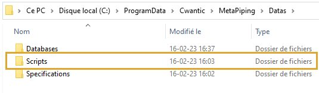
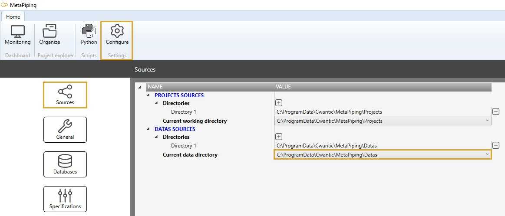

# Configuration

The **Python integration** in MetaPiping is automatically made during installation but you have the possibility to manually change some settings.

---

## 1. Python

MetaPiping 2023 is intalled with Python version :

>Python 3.7

The directory of Python's sources is :

>C:\ProgramData\Cwantic\MetaPiping\Settings\Pythons

This directory cannot be changed.

---

## 2. Scripts

The user's scripts are by default set in the directory :

>C:\ProgramData\Cwantic\MetaPiping\Datas\Scripts

This **Datas** directory contains all user's datas like :

- Databases
- Python Scripts
- Specifications

All user's datas can so be shared between users.

This directory can be changed via the configuration settings :

[See the settings page for more information](https://documentation.metapiping.com/Settings/index.html)

{: .warning }
> Attention ! Changing the data directory could break the link between Python scripts and projects.
