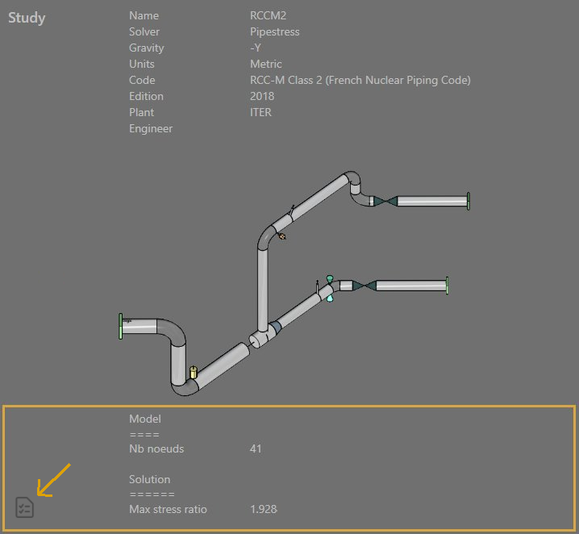
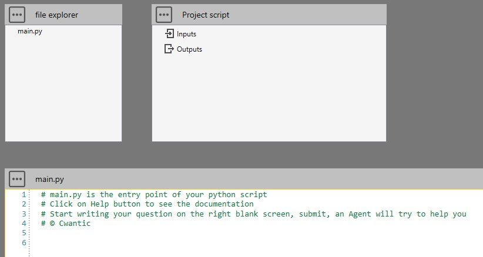

# Info script

In the explorer of projects, user can show informations about the model and/or the results of a study via a special python script :



This script do not use ***Python Virtual Environment*** and is so very fast.

This script can also be used for **project/study** purpose.

## 1. Script definition

From Home/Python, click on button 2 (Add script) :


Select "Simple script" and give it a name.

A new *main.py* will be created in the file explorer and *Inputs* and *Outputs* nodes in the Project script. Requirements.txt is hidden and the Editor is empty :



In the Editor, you have access to the object **study** that exposes some functions. A dropdown menu will appear after writing :

```python
study.
```


The main usefull functions are ***getMetal()***, ***getSolution()*** and  ***showInformation()***

[See the description of the object study](https://documentation.metapiping.com/Python/Classes/study.html)

## 2. Example

[See an example here](https://documentation.metapiping.com/Python/Samples/info.html) : Show informations about a study.