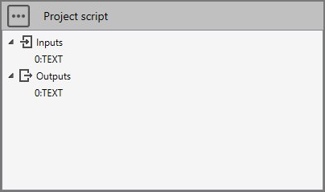

# Sample 3 : Converter

## 1. Goal

Create a script that will (after pressing **RUN** button) convert user data in a EXCEL file to metaL file format.

## 2. Script definition

From the Home/Python, click on button 1 (Add project script) :


Give it the name "Convert XLSX to MetaL".

## 3. Script properties

Add 1 TEXT input and 1 TEXT output :



The input TEXT must receive a XLSX filename from a connection.

The output TEXT is the path to **conception.metaL** filename (the internal file format of MetaPiping). This output can be connected to the main **study** brick.

## 4. requirements.txt

To be able to read EXCEL file, we need some pip libraries :


Add this two libraries in requirements.txt, **save** and **install** it from the three points button.

This window will appears :


{: .warning }
> If you don't see this window, it means that the library has not been correctly installed. Close the application and reinstall requirements.txt.

## 5. Data

Imagine that user has some data in EXCEL file and want to convert it into a 3D piping model.

The XLSX file has 4 sheets : MATERIALS, SECTIONS, NODES and ELEMENTS :


It represents a single pipe.

## 6 main.py

Select the file.

Copy/paste this code in the Editor :

```python
import os
import pandas as pd
from Cwantic.MetaPiping.Core import Layer, RegularMaterial, MaterialType, PipeSection, Node, Pipe
from System.Windows.Media.Media3D import Point3D, Vector3D

filename = study.Inputs[0]
study.Outputs[0] = "Invalid EXCEL file"

def readMaterials(df, metal):
    for index, row in df.iterrows():
        name = row["NAME"]
        temp = row["TEMP"]
        if not pd.isna(name):
            material = RegularMaterial()
            material.Name = str(int(name))
            material.Description = str(row["DESCRIPTION"])
            material.Type = MaterialType(int(row["TYPE"]))
            material.RefTemperature = row["REFTEMPERATURE"]
            material.MaxTemperature = row["MAXTEMPERATURE"]
            material.Density = row["DENSITY"]
            material.Poisson = row["POISSON"]
            metal.Materials.Add(material) # Attention ! metal.Materials is a C# list. Use Add instead of append
        elif not pd.isna(temp):
            if not pd.isna(row["EH"]):
                material.SetProperty("EH", row["EH"], temp)
            if not pd.isna(row["EX"]):
                material.SetProperty("EX", row["EX"], temp)
            if not pd.isna(row["SH"]):
                material.SetProperty("SH", row["SH"], temp)
            if not pd.isna(row["SY"]):
                material.SetProperty("SY", row["SY"], temp)
            if not pd.isna(row["SU"]):
                material.SetProperty("SU", row["SU"], temp)
            if not pd.isna(row["SM"]):
                material.SetProperty("SM", row["SM"], temp)
            if not pd.isna(row["CR"]):
                material.SetProperty("CR", row["CR"], temp)
            if not pd.isna(row["GH"]):
                material.SetProperty("GH", row["GH"], temp)
            if not pd.isna(row["CO"]):
                material.SetProperty("CO", row["CO"], temp)
            if not pd.isna(row["DI"]):
                material.SetProperty("DI", row["DI"], temp)  

def readSections(df, metal):
    for index, row in df.iterrows():
        name = row["NAME"]
        if not pd.isna(name):
            section = PipeSection()
            section.Name = str(int(name))
            section.Description = str(row["DESCRIPTION"])
            section.Diameter = row["DIAMETER"]
            section.Thickness = row["THICKNESS"]
            section.LinearMass = row["LINEARMASS"]
            metal.Sections.Add(section) # Attention ! metal.Sections is a C# list. Use Add instead of append
    
def readNodes(df, metal):
    for index, row in df.iterrows():
        name = row["NAME"]
        if not pd.isna(name):
            node = Node()
            node.Name = str(int(name))
            node.Coor = Point3D(row["X"], row["Y"], row["Z"])
            metal.Nodes.Add(node) # Attention ! metal.Nodes is a C# list. Use Add instead of append

def readElements(df, metal):
    for index, row in df.iterrows():
        type = row["TYPE"]
        if type == "PIPE":
            node1 = metal.Nodes[int(row["ID NODE1"])]
            node2 = metal.Nodes[int(row["ID NODE2"])]
            material = metal.Materials[int(row["ID MATERIAL"])]
            section = metal.Sections[int(row["ID SECTION"])]
            dl = Vector3D(node2.Coor.X - node1.Coor.X, node2.Coor.Y - node1.Coor.Y, node2.Coor.Z - node1.Coor.Z)
            xdir = Vector3D(row["XDIR_X"], row["XDIR_Y"], row["XDIR_Z"])
            pipe = Pipe(0, node1, node2, dl, material, xdir, section)
            metal.Elements.Add(pipe) # Attention ! metal.Elements is a C# list. Use Add instead of append
        else:
            pass # TO DO : decode all possible types
        
if os.path.exists(filename):
    df_materials = pd.read_excel(filename, sheet_name="MATERIALS")
    df_sections = pd.read_excel(filename, sheet_name="SECTIONS")
    df_nodes = pd.read_excel(filename, sheet_name="NODES")
    df_elements = pd.read_excel(filename, sheet_name="ELEMENTS")
    
    if not df_materials.empty and not df_sections.empty and not df_nodes.empty and not df_elements.empty:
        # 1. output filename
        dir = study.getStudyDirectory()
        filename = os.path.join(dir, "conception.metaL")
        
        # 2. Create empty metaL
        metal = study.createMetal()
        
        # 3. Layer
        layer = Layer("0")
        metal.Layers.Add(layer) # Attention ! metal.Layers is a C# list. Use Add instead of append
        
        # 4. Materials
        readMaterials(df_materials, metal)      
        
        # 5. Sections
        readSections(df_sections, metal)
        
        # 6. Nodes
        readNodes(df_nodes, metal)
        
        # 7. Elements
        readElements(df_elements, metal)
        
        # 8. Save metaL
        metal.SaveToFile(filename)

        # 9. Show filename for connection
        study.Outputs[0] = filename
```

Save it !

## 7. Result

 After IMPORT of the EXCEL file, the connection to the first TEXT and a click on the RUN button :


And in the Design mode :


With the material and section correctly set.

Click [here](https://metapiping.com/wp-content/uploads/2023/02/Sample3.xlsx)  to download the EXCEL file used in this example.
