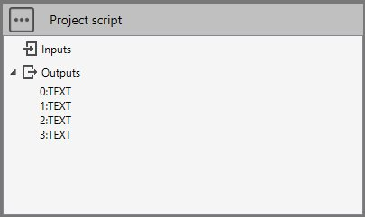
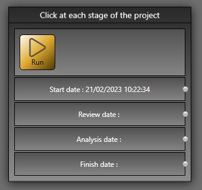

# Sample 1 : Date, time and file manipulation

## 1. Goal

Create a script that will (after pressing **RUN** button) save the current date and hour in a file and show it in the *brick*.

We suppose 4 predetermined dates : 

1. Start date
2. Review date
3. Analysis date
4. Finish date

The user must clic on the button only when the phase is ready.
The script must save the dates in the current study directory.

## 2. Script definition

From the Home/Python, click on button 1 (Add project script) :


Give it the name "Click at each stage of the project"

## 3. Script properties

Add 4 TEXT output :



Nothing to add to requirements.txt.

## 4. Main.py

Copy/paste this code in the Editor :

```python
import os
from datetime import datetime

# Initialize outputs
study.Outputs[0] = "Start date : "
study.Outputs[1] = "Review date : "
study.Outputs[2] = "Analysis date : "
study.Outputs[3] = "Finish date : "

dates = []

# Current date and hour
now = datetime.now()
now_string = now.strftime("%d/%m/%Y %H:%M:%S")

# info.txt is the file that contains all dates in the current study directory
dir = study.getDirectory()
filename = os.path.join(dir, "info.txt")

# Read the file if exists
if os.path.exists(filename):
    with open(filename) as f:
        dates = f.read().splitlines()
    
# Add current date to the list
if (len(dates) < 4):
    dates.append(now_string)

# Save the dates
with open(filename,'w') as f:
	f.write('\n'.join(dates))

# Show the dates
if (len(dates) > 0):
    study.Outputs[0] += dates[0]
if (len(dates) > 1):
    study.Outputs[1] += dates[1]
if (len(dates) > 2):
    study.Outputs[2] += dates[2]
if (len(dates) > 3):
    study.Outputs[3] += dates[3]
```

Save it !
## 5. Result

When you add this script in a current study, and after a first click on the **RUN** button :

