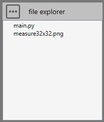
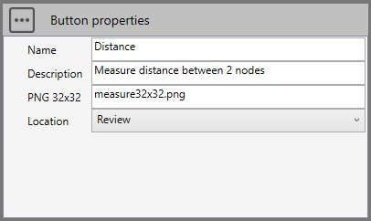
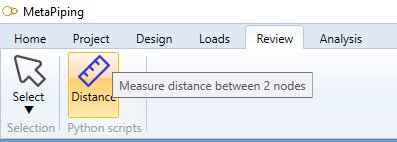
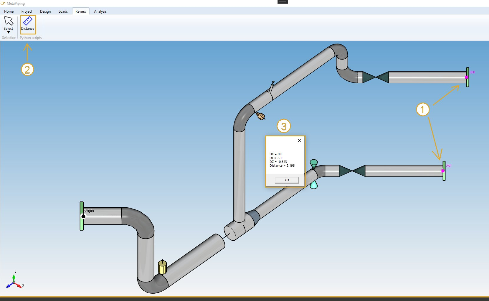

# Sample 9 : Measure the distance between 2 nodes by message

## 1. Goal

Create a script that will (after pressing a **button** in the ribbon) show by message the distance between 2 selected nodes.


## 2. Script definition

From the Home/Python, click on **button 2** (Add 3D script) :


Give it the name "Distance between 2 nodes by message"

>Say **NO** to the question about creation of virtual environment. The Requirements.txt will be hidden.


## 3. Script files

This kind of script needs an **image** in order to illustrate the **button**.



Press the "three points" button and select "Import image". You need to create a 32x32 transparent PNG for the icon of the button.

## 4. Script properties

In this kind of script, user has to define the **button** :



The location will be **Review** so that the button appears at the end of the ribbon with its name, icon and description :



## 5. main.py

Select the file.

Copy/paste this code in the Editor :

```python
from math import *

# Inspect selection
n = len(design.selectedList)
res = "Select 2 nodes !"

if n==2:
    # Check the type of selected
    if design.isType(design.selectedList[0], "Node") and design.isType(design.selectedList[1], "Node"):
        node1 = design.selectedList[0]
        node2 = design.selectedList[1]
        dx = node2.Coor.X - node1.Coor.X
        dy = node2.Coor.Y - node1.Coor.Y
        dz = node2.Coor.Z - node1.Coor.Z
        d = sqrt(dx*dx + dy*dy + dz*dz)

        res = "DX = " + str(round(dx, 3)) + "\n" + "DY = " + str(round(dy, 3)) + "\n" + "DZ = " + str(round(dz, 3)) + "\n" + "Distance = " + str(round(d, 3))

# Show a message (if res != "")
design.result = res
```

Save it !

## 6. Result

In **Review mode**, select 2 nodes and press the **button** :



A message shows the distance !