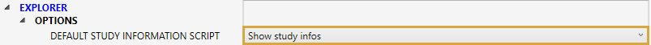
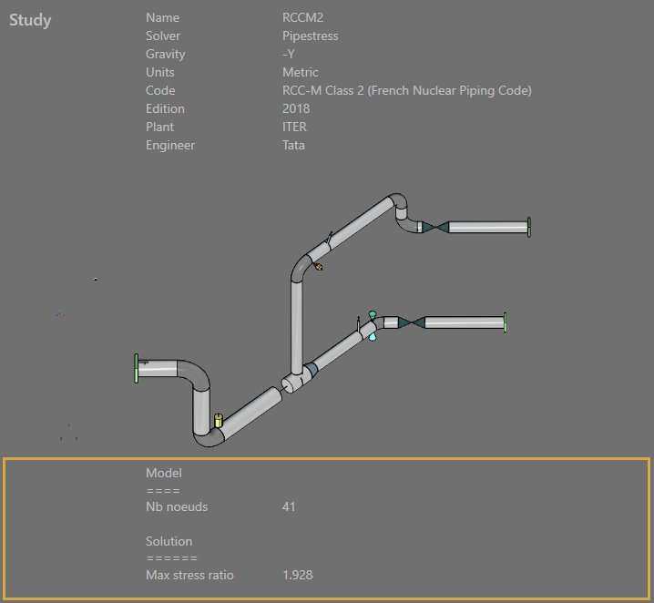

# Sample 10 : Show informations about a study

## 1. Goal

Create a script that will show informations about the MetaL and the results of the current selected study in **Explorer**.

>In this example, we will just access the **MetaL** file and retrieve the number of nodes then access the **solution** and retrieve the maxStressRatio value.

## 2. Script definition

From the Home/Python, click on **button 6** (Add simple script) :


Give it the name "Show study infos"

## 3. main.py

Select the file.

Copy/paste this code in the Editor :

```python
metal = study.getMetal()
if metal != None:
    study.showInformation('Model', '')
    study.showInformation('====', '')
    nb = metal.Nodes.Count
    study.showInformation('Nb noeuds', str(nb))

study.showInformation('', '')

solution = study.getSolution()
if solution != None:
    study.showInformation('Solution', '')
    study.showInformation('======', '')
    maxStressRatio = solution.getMaxStressRatio()
    study.showInformation('Max stress ratio', str(maxStressRatio))
```
Save it !

Click [here](https://documentation.metapiping.com/Python/Classes/study.html) to have more information about the object **study**.

## 4. Settings

Restart the application and go to the **settings**. In the tab **General**, change the "Default study information script" to "Show study infos" (our current script) :



## 5. Result

In **Explorer of project**, select a study and visualize the informations :


