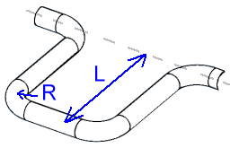
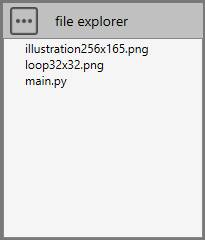
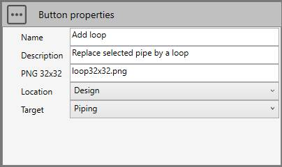
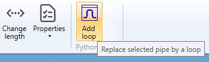
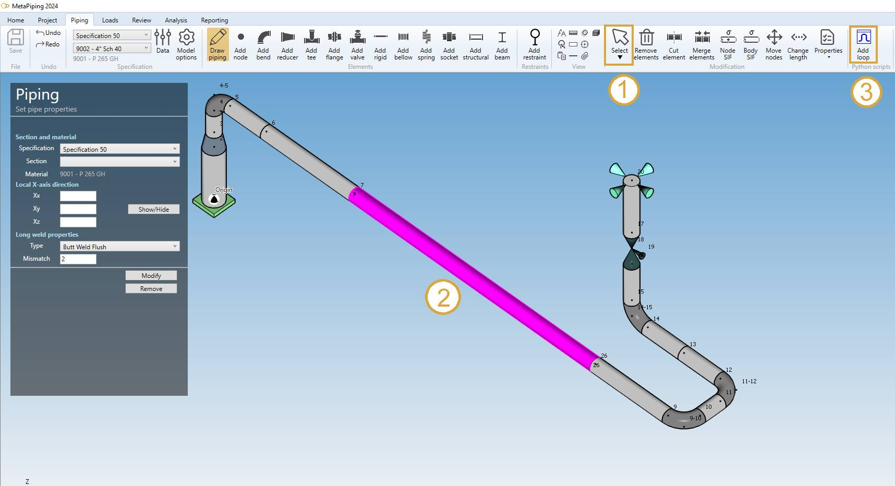
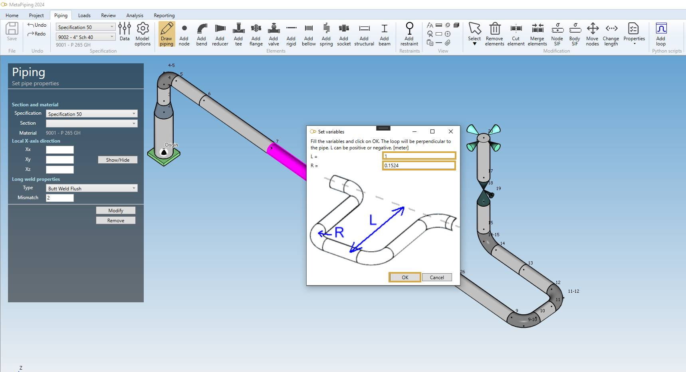
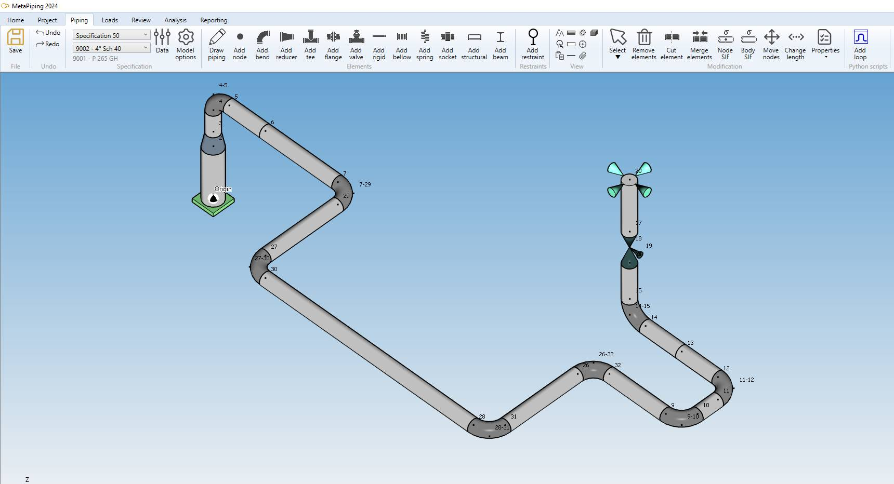

# Sample 8 : Replace a selected pipe by an expansion loop (without virtual env.)

## 1. Goal

Create a script that will (after pressing a **button** in the ribbon) replace a selected pipe by an expansion loop. A window will appear to define the size and the default bend radius.



>This feature does not exists in MetaPiping 2024 so it is useful that user can create his own COMMANDS based on the MetaL internal format and the existing documented commands.

>Since the user has to create a COMMAND, the application will manage the undo/redo operations by itself !

## 2. Script definition

From the Home/Python, click on **button 2** (Add 3D script) :


Give it the name "Add loop"

>Say **NO** to the question about creation of virtual environment. The Requirements.txt will be hidden.


## 3. Script files

This kind of script needs some **images** in order to illustrate the **button** and the **window**.



Press the "three points" button and select "Import image". You need to create a 32x32 transparent PNG for the icon of the button and an illustration of the expansion loop for the window.

## 4. Script properties

In this kind of script, user has to define the **button** :



The location will be **Design** (Piping ribbon) so that the button appears at the end of the ribbon with its name, icon and description :



The target is for piping system.

## 5. main.py

Select the file.

Copy/paste this code in the Editor :

```python
############################
# CWANTIC LOOP GUI EXAMPLE #
############################

import os
from System.Windows.Media.Media3D import Vector3D
from Cwantic.MetaPiping.Core import RemoveElementCommand, AddNodeCommand, DrawPipingCommand, InsertBendCommand
   
# Inspect selection
n = len(design.selectedList)
res = "Select a pipe !"

if n==1:
    # Check the type of selected element
    if design.isType(design.selectedList[0], "Pipe"):
        pipe = design.selectedList[0]
        p1 = pipe.Node1.Coor
        p2 = pipe.Node2.Coor
        
        # Get the current model
        model = design.getMetal()
        
        # Get the scene vertical vector (+Z or +Y)
        verticalvec = design.getVerticalVector()
        
        # Get the current piping values (section, material, radius,...)
        currentValues = design.getCurrentSpecValues()
        
        # Memorize current radius
        currentRadius = currentValues.MKS_BendRadius
        
        # Get the pipe direction vector
        vec1 = Vector3D(pipe.DL.X, pipe.DL.Y, pipe.DL.Z)
        
        # Get the script directory
        directory = design.getScriptDirectory()

        # Compute the cross product to determine the loop direction
        dir = Vector3D.CrossProduct(vec1, verticalvec)
        dir.Normalize()

        # Create a new USER command : cmd
        cmd = design.createCommand("AddLoop")
        
        # 1 : Remove the selected pipe
        
        # 1.1 : Create params for command "RemoveElementCommand" (see Help)
        params = []
        params.append(design.selectedList)
        
        # 1.2 : Add sub command to user command cmd
        valid = cmd.addSubCommand("RemoveElementCommand", params)

        if valid:
            # Get variable values - create a window
            window = design.createVariableWindow()
            window.AddComment("Fill the variables and click on OK. The loop will be perpendicular to the pipe. L can be positive or negative. [meter]")
            window.AddValue("L", "L =", 1)
            window.AddValue("R", "R =", currentRadius)
            window.AddImage(os.path.join(directory, "illustration256x165.png"))
            if window.ShowModal():
                # retrieve the size and radius from the window
                size = window.GetValue("L")
                currentValues.MKS_BendRadius = window.GetValue("R")
                                    
                # TIP : Create 2 new nodes (N3 and N4) with "AddNodeCommand"
                node1Cmd = AddNodeCommand(model, p1.X + size*dir.X, p1.Y + size*dir.Y, p1.Z + size*dir.Z, "", False, currentValues)
                N3 = node1Cmd.Node
                
                node2Cmd = AddNodeCommand(model, p2.X + size*dir.X, p2.Y + size*dir.Y, p2.Z + size*dir.Z, "", False, currentValues)
                N4 = node2Cmd.Node

                # Create node sub commands
                cmd.addSubCommand("AddNodeCommand", [N3])
                cmd.addSubCommand("AddNodeCommand", [N4])

                # Create new pipe perpendicular to selected pipe from node1

                # 2.1 : Create params for command "DrawPipingCommand" (see Help)
                params = []
                params.append(pipe.Node1)
                params.append(N3)
                params.append(size*dir.X)
                params.append(size*dir.Y)
                params.append(size*dir.Z)
                params.append(0.0)
                params.append(0.0)
                params.append(0.0)
                params.append(currentValues)
                
                # 2.2 : Add sub command
                valid = cmd.addSubCommand("DrawPipingCommand", params)

                if valid:
                    # 3 : Create new pipe parallel to selected pipe
                
                    # 3.1 : Create params for command "DrawPipingCommand" (see Help)
                    params = []
                    params.append(N3)
                    params.append(N4)
                    params.append(vec1.X)
                    params.append(vec1.Y)
                    params.append(vec1.Z)
                    params.append(0.0)
                    params.append(0.0)
                    params.append(0.0)
                    params.append(currentValues)

                    # 3.2 : Add sub command
                    valid = cmd.addSubCommand("DrawPipingCommand", params)

                    if valid:
                        # 4 : Create new pipe to close the loop
                        
                        # 4.1 : Create params for command "DrawPipingCommand" (see Help)
                        params = []
                        params.append(N4)
                        params.append(pipe.Node2)
                        params.append(-size*dir.X)
                        params.append(-size*dir.Y)
                        params.append(-size*dir.Z)
                        params.append(0.0)
                        params.append(0.0)
                        params.append(0.0)
                        params.append(currentValues)
                    
                        # 4.2 : Add sub command
                        valid = cmd.addSubCommand("DrawPipingCommand", params)
                    
                        if valid:
                            # 5 : Insert a bend at the last node

                            # 5.1 Create params for command "InsertBendCommand"
                            params = []
                            params.append(pipe.Node2)
                            params.append(currentValues)
                            
                            # 5.2 : Add sub command
                            valid = cmd.addSubCommand("InsertBendCommand", params)
               
        # Execute command
        if valid:
            design.executeCommand(cmd)
            res = ""
        else:
            res = "Incorrect params"
        # Restore the radius
        currentValues.MKS_BendRadius = currentRadius
    else:
        res = "The selected element is not a pipe"
    
# Show a message (if res != "")
design.result = res
```

Save it !

## 6. Result

In **Piping screen**, select a pipe (1 & 2) that you want to replace by an expansion loop :



Click on the new button **Add loop** (3).



Complete **L**, **R** and press **OK**.



The expansion loop appears !

You can undo/redo your COMMAND !