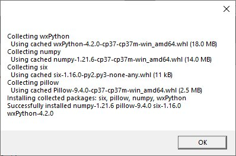
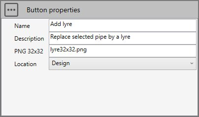

# Sample 7 : Replace a selected pipe by an expansion loop

## 1. Goal

Create a script that will (after pressing a **button** in the ribbon) replace a selected pipe by an expansion loop. A window will appear to define the size and the default bend radius.


>This feature does not exists in MetaPiping 2024 so it is useful that user can create his own COMMANDS based on the MetaL internal format and the existing documented commands.

>Since the user will have to create a COMMAND, the application will manage the undo/redo operations by itself !

## 2. Script definition

From the Home/Python, click on **button 3** (Add 3D script) :


Give it the name "Add loop"

## 3. requirements.txt

We want to show a **window** so that the user can define the **L** and **R** values, respectively the size and the bend radius of the expansion loop.

We ask [ChatGPT](https://documentation.metapiping.com/Python/chatGPT.html) to recommand some python libraries :


We will choose wxPython :


Add this library in requirements.txt, **save** and **install** it from the three points button.

This window will appears :



{: .warning }
> If you don't see this window, it means that the library has not been correctly installed. Close the application and reinstall requirements.txt.

## 4. Script files

This kind of script needs some **images** in order to illustrate the **button** and the **window**.


Press the "three points" button and select "Import image". You need to create a 32x32 transparent PNG for the icon of the button and an illustration of the expansion loop for the window.

Press the "three points" button and select "Add a python file". We will create a file for some trigonometric functions and one for the definition of the window.

### 4.1 trigonometry.py

Select the file.

Copy/paste this code in the Editor :

```python
def cross(vec1, vec2):
    return [vec1[1]*vec2[2] - vec1[2]*vec2[1], vec1[2]*vec2[0] - vec1[0]*vec2[2], vec1[0]*vec2[1] - vec1[1]*vec2[0]]

def length(vec):
    return (vec[0] ** 2 + vec[1] ** 2 + vec[2] ** 2) ** 0.5

def normalize(vec):
    l = length(vec)
    return [vec[0]/l, vec[1]/l, vec[2]/l]
```

Save it !

### 4.2 window.py

Ask help to [ChatGPT](https://documentation.metapiping.com/Python/chatGPT.html) :


After some research and multiple tests :

```python
import wx
import os

class Frame(wx.Frame):
    def __init__(self, parent, id, title, app, defaultsize, defaultRadius):
        wx.Frame.__init__(self, parent, id, title, size=(300, 310))
        self.app = app
        
        panel = wx.Panel(self)
        panel.BackgroundColour = 'white'
                
        png = wx.Image(os.path.join(os.path.dirname(__file__), 'illustration256x165.png'), wx.BITMAP_TYPE_PNG).ConvertToBitmap()
        sb = wx.StaticBitmap(panel, -1, png, (0, 0), (png.GetWidth(), png.GetHeight()))
        
        text = wx.StaticText(panel, -1, "L =", pos = (10, 183))
        text.SetSize(text.GetBestSize())
        
        self.edit = wx.TextCtrl(panel, -1, str(defaultsize), size=(100, -1), pos = (50, 180))
        self.edit.SetInsertionPoint(0)
        
        text2 = wx.StaticText(panel, -1, "R =", pos = (10, 213))
        text2.SetSize(text2.GetBestSize())
        
        self.edit2 = wx.TextCtrl(panel, -1, str(defaultRadius), size=(100, -1), pos = (50, 210))
        self.edit2.SetInsertionPoint(0)
        
        btn = wx.Button(panel, -1, "Run", size=(100, 20), pos = (100, 240))
        self.Bind(wx.EVT_BUTTON, self.OnRun, btn)

        self.CenterOnScreen(wx.BOTH)

    def OnRun(self, evt):
        self.app.SetLValue(self.edit.GetValue())
        self.app.SetRValue(self.edit2.GetValue())
        self.Close()


class App(wx.App):
    def __init__(self, defaultsize, defaultRadius):
        wx.App.__init__(self)
        self.Lvalue = ""
        self.Rvalue = ""
        self.frame = Frame(None, wx.ID_ANY, "Loop definition", self, defaultsize, defaultRadius)
        self.SetTopWindow(self.frame)
        self.frame.Show(True)
        
    def SetRValue(self, value):
        self.Rvalue = value
        
    def GetRValue(self):
        return self.Rvalue

    def SetLValue(self, value):
        self.Lvalue = value
        
    def GetLValue(self):
        return self.Lvalue
```

Save it !

This will create a window with an illustration and 2 edits, one for the length and one for the radius.

You can set the **default values** in the parameters of the App.

GetLValue() gives the user length.

GetRValue() gives the user radius.

## 5. Script properties

In this kind of script, user has to define the **button** :



The location will be **Design** so that the button appears at the end of the ribbon with its name, icon and description :


## 6. main.py

Select the file.

Copy/paste this code in the Editor :

```python
############################
# CWANTIC LOOP GUI EXAMPLE #
############################

from window import App
from System.Windows.Media.Media3D import Vector3D
from Cwantic.MetaPiping.Core import RemoveElementCommand, AddNodeCommand, DrawPipingCommand, InsertBendCommand
   
# Inspect selection
n = len(design.selectedList)
res = "Select a pipe !"

if n==1:
    # Check the type of selected element
    if design.isType(design.selectedList[0], "Pipe"):
        pipe = design.selectedList[0]
        p1 = pipe.Node1.Coor
        p2 = pipe.Node2.Coor
        
        # Get the current model
        model = design.getMetal()
        
        # Get the scene vertical vector (+Z or +Y)
        verticalvec = design.getVerticalVector()
        
        # Get the current piping values (section, material, radius,...)
        currentValues = design.getCurrentSpecValues()
        
        # Memorize current radius
        currentRadius = currentValues.MKS_BendRadius
        
        # Get the pipe direction vector
        vec1 = Vector3D(pipe.DL.X, pipe.DL.Y, pipe.DL.Z)
        
        # Compute the cross product to determine the loop direction
        dir = Vector3D.CrossProduct(vec1, verticalvec)
        dir.Normalize()

        # Create a new USER command : cmd
        cmd = design.createCommand("AddLoop")
        
        # 1 : Remove the selected pipe
        
        # 1.1 : Create params for command "RemoveElementCommand" (see Help)
        params = []
        params.append(design.selectedList)
        
        # 1.2 : Add sub command to user command cmd
        valid = cmd.addSubCommand("RemoveElementCommand", params)

        if valid:
            # 2.0 : Launch window to get loop's size and bend radius. Default size = 1.0, default radius = currentRadius
            app = App(1.0, currentRadius)
            app.MainLoop()
            
            # retrieve the size and radius from the app
            size = float(app.GetLValue())
            # Set the new Radius for next commands
            currentValues.MKS_BendRadius = float(app.GetRValue())
                        
            # TIP : Create 2 new nodes (N3 and N4) with "AddNodeCommand"
            node1Cmd = AddNodeCommand(model, p1.X + size*dir.X, p1.Y + size*dir.Y, p1.Z + size*dir.Z, "", False, currentValues)
            N3 = node1Cmd.Node
            
            node2Cmd = AddNodeCommand(model, p2.X + size*dir.X, p2.Y + size*dir.Y, p2.Z + size*dir.Z, "", False, currentValues)
            N4 = node2Cmd.Node
            # Create new pipe perpendicular to selected pipe from node1

            # 2.1 : Create params for command "DrawPipingCommand" (see Help)
            params = []
            params.append(pipe.Node1)
            params.append(N3)
            params.append(size*dir.X)
            params.append(size*dir.Y)
            params.append(size*dir.Z)
            params.append(0.0)
            params.append(0.0)
            params.append(0.0)
            params.append(currentValues)
            
            # 2.2 : Add sub command
            valid = cmd.addSubCommand("DrawPipingCommand", params)

            if valid:
                # 3 : Create new pipe parallel to selected pipe
             
                # 3.1 : Create params for command "DrawPipingCommand" (see Help)
                params = []
                params.append(N3)
                params.append(N4)
                params.append(vec1.X)
                params.append(vec1.Y)
                params.append(vec1.Z)
                params.append(0.0)
                params.append(0.0)
                params.append(0.0)
                params.append(currentValues)

                # 3.2 : Add sub command
                valid = cmd.addSubCommand("DrawPipingCommand", params)

                if valid:
                    # 4 : Create new pipe to close the loop
                    
                    # 4.1 : Create params for command "DrawPipingCommand" (see Help)
                    params = []
                    params.append(N4)
                    params.append(pipe.Node2)
                    params.append(-size*dir.X)
                    params.append(-size*dir.Y)
                    params.append(-size*dir.Z)
                    params.append(0.0)
                    params.append(0.0)
                    params.append(0.0)
                    params.append(currentValues)
                
                    # 4.2 : Add sub command
                    valid = cmd.addSubCommand("DrawPipingCommand", params)
                
                    if valid:
                        # 5 : Insert a bend at the last node

                        # 5.1 Create params for command "InsertBendCommand"
                        params = []
                        params.append(pipe.Node2)
                        params.append(currentValues)
                        
                        # 5.2 : Add sub command
                        valid = cmd.addSubCommand("InsertBendCommand", params)
               
        # Execute command
        if valid:
            design.executeCommand(cmd)
            res = ""
        else:
            res = "Incorrect params"
        # Restore the radius
        currentValues.MKS_BendRadius = currentRadius
    else:
        res = "The selected element is not a pipe"
    
# Show a message (if res != "")
design.result = res
```

Save it !

## 7. Result

In **Design mode**, select a pipe that you want to replace by an expansion loop :


Click on the new button **Add loop** :


Complete **L**, **R** and press **Run** :


The expansion loop appears !

You can undo/redo your COMMAND !