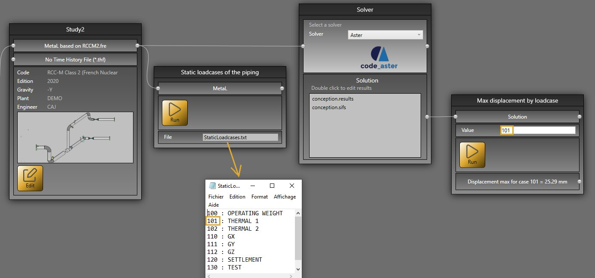
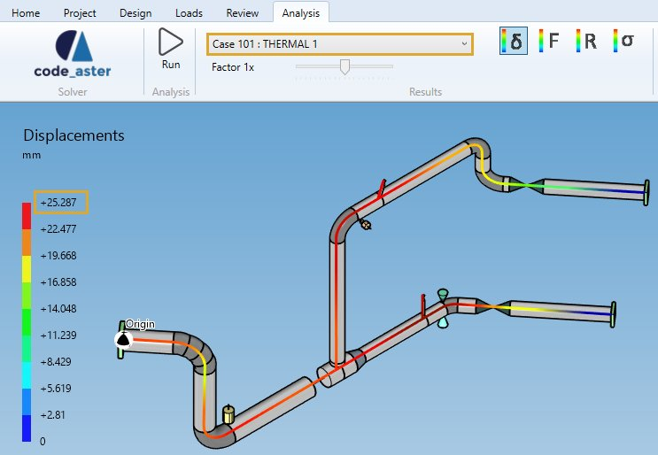

# Sample 6 : Max displacement by static case number

## 1. Goal

Create a script that will (after pressing **RUN** button) retrieve the **displacement max** in mm of the whole piping for a particular loadcase number.


## 2. Script definition

From the Home/Python, click on button 1 (Add project script) :


Give it the name "Max displacement by loadcase number"

## 3. Script properties

Add 1 SOLUTION input, 1 EDIT input and 1 TEXT output :


The input SOLUTION must receive a connection from the Solution connector of the **solver** brick.

The input EDIT must receive the static loadcase number.

The output TEXT will show the result.

Nothing to add to requirements.txt.

## 4. Main.py

Copy/paste this code in the Editor :

```python
import math

# Check if the connection has been made with the Solution connector
solution = study.getSolution()
if solution != None:
    # Check if Inputs[1] is an integer
    try:
        case = int(study.Inputs[1])
    except ValueError:
        case = 0
    
    if case>0:
        # Get displacements from solution with case number
        displacements = solution.GetDisplacements(case)
        if len(displacements)>0:
            # Calculate the max
            max = -999999
            for displacement in displacements:
                d = displacement.Item1
                l = math.sqrt(d.X**2 + d.Y**2 + d.Z**2)
                if l > max:
                    max = l
            study.Outputs[0] = "Displacement max for case {} = {} mm".format(case, round(max, 2))
        else:
            study.Outputs[0] = "This loadcase number doesn't exists !"
    else:
        study.Outputs[0] = "Please enter an existing loadcase number !"
else:
    study.Outputs[0] = "Please connect Solution !"
```

Save it !

## 5. Result

When you add this script in a current study, connect the Solution output of the **solver brick**, enter a static loadcase number and after a click on the **RUN** button :



You have the max displacement !


This sample use [sample5](https://documentation.metapiping.com/Python/Samples/staticases.html) to show all possible static loadcases.

And in **Design** mode :

