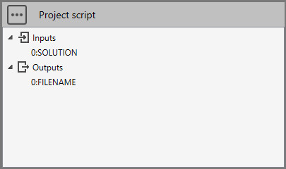
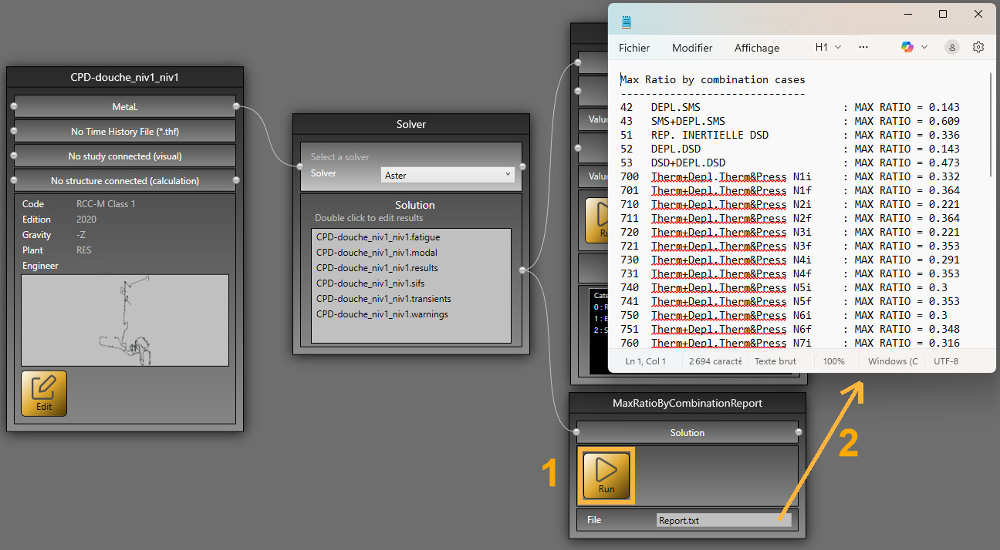

# Sample 14 : Get max stress ratio report for all combination cases

## 1. Goal

Create a script that will create a report (Report.txt) with the max stress ratio of all combination cases.

## 2. Script definition

From the Home/Python, click on button 2 (Add script) :


Select "Project script" and give it the name "MaxRatioByCombinationReport"

>Say **NO** to the question about creation of virtual environment. The Requirements.txt will be hidden.


## 3. Script properties

Add 1 SOLUTION input and 1 FILENAME output :



The input SOLUTION must receive a connection from the Solution connector of the **solver** brick.

The output FILENAME will expose a TXT file. You can double click to see the content.

## 4. Main.py

Copy/paste this code in the Editor :

```python
# © Cwantic
import os
import math

study.Outputs[0] = ""
solution = study.getSolution()
if solution != None:
    metal = solution.getMetal()
    if metal != None and metal.CombiCases.Count>0:
        study.Outputs[0] = "Report.txt"
        dir = study.getDirectory()
        filename = os.path.join(dir, study.Outputs[0])
        
        with open(filename,'w') as f:
            f.write("Max Ratio by combination cases" + "\n")
            f.write("------------------------------" + "\n")
            # Get all combination cases
            for combiCase in metal.CombiCases:
                stressRatios = solution.getStresses(combiCase.Number, 0) # 0 for Ratios
                if len(stressRatios) > 0:
                    maxRatio = 0
                    for ratio in stressRatios:
                        if ratio > maxRatio:
                            maxRatio = ratio
                    st = "{:<4} {:<30} : MAX RATIO = {:<5}".format(combiCase.Number, combiCase.Title, round(maxRatio, 3))
                    f.write(st + "\n")

```

Save it !

## 5. Result

Add this script in a study, connect the **Solution** output of the **solver brick** and after a click on the **RUN** button (1) :



Double click on **Report.txt** to open the results (2).
