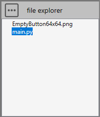
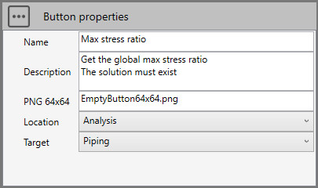
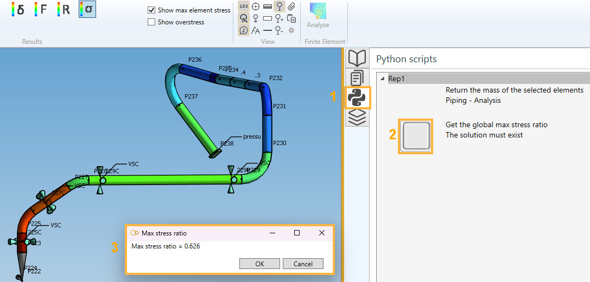

# Sample 13 : Get max stress ratio in Analysis tab

## 1. Goal

Create a script that will (after pressing a **button** in the python tab) show the max stress ratio of the whole solution. This tool will only be accessible in **Analysis** tab.

## 2. Script definition

From the Home/Python, click on **button 2** (Add script) :


Select "Design script" and give it the name "MaxStressRatio_Analysis"

>Say **NO** to the question about creation of virtual environment. The Requirements.txt will be hidden.


## 3. Script files

This kind of script needs an **image** in order to illustrate the **button**.



Press the "three points" button and select "Import image". You need to create a 64x64 png image for the icon of the button.

## 4. Script properties

In this kind of script, user has to define the **button** :



The location will be **Analysis** so that the button appears on the right tab with its icon and description. The target is **piping** system.

## 5. main.py

Select the file.

Copy/paste this code in the Editor :

```python
############################################
# Get the max stress ratio in Analysis tab #
#                @CWANTIC                  #
############################################
solution = design.getSolution()
if solution != None:
    window = design.createVariableWindow()
    window.SetTitle("Max stress ratio")
    window.AddComment("Max stress ratio = {}".format(round(solution.getMaxStressRatio(),3)))
    window.ShowModal()
    solution.Dispose()
else:
    window = design.createVariableWindow()
    window.SetTitle("Max stress ratio")
    window.AddComment("No solution !")
    window.ShowModal()

```

Save it !

## 6. Result

In **Analysis**, open the **Python** tab (1), click on the new script image (2). The window shows the result (3):



## 7. Conclusion

This example illustrates how to access the solution and show on a custom window all results or post-processing calculations.

Click [here](https://documentation.metapiping.com/Python/Classes/solution.html) to have more informations about the **solution** object.

Click [here](https://documentation.metapiping.com/Python/Classes/design.html#13-createvariablewindow) to have more informations about the **Variable Window** object.