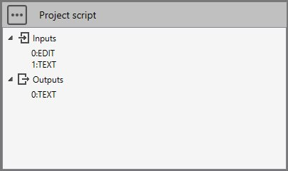
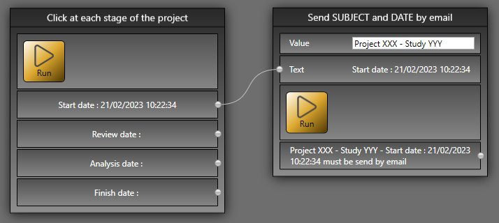
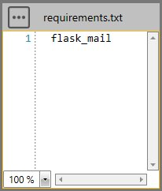
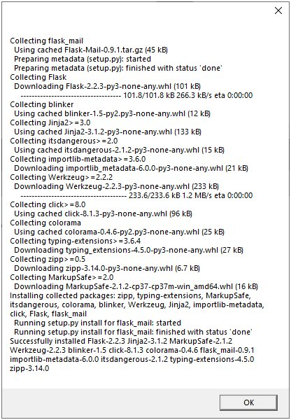
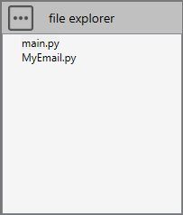
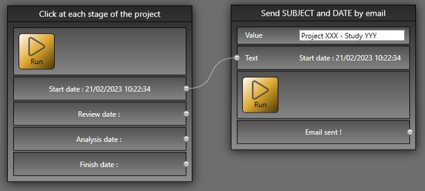
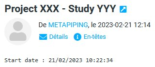

# Sample 2 : Send an email

## 1. Goal

Create a script that will (after pressing **RUN** button) send an email to a fixed recipient with a SUBJECT defined by the user and a DATE coming from [Sample1](https://documentation.metapiping.com/Python/Samples/datetimefile.html).

## 2. Script definition

From the Home/Python, click on button 1 (Add project script) :


Give it the name "Send SUBJECT and DATE by email".

You need to create a virtual environment :


## 3. Script properties

Add 1 EDIT input, 1 TEXT input and 1 TEXT output :



Don't forget to save !

The EDIT is for the SUBJECT

The TEXT is for the date with a connection to script "Click at each stage of the project"

## 4. Main.py

Copy/paste this code in the Editor :

```python
study.Outputs[0] = study.Inputs[0] + " - " + study.Inputs[1] + " must be sent by email"
```

study.Inputs[0] take the text that user write in the EDIT.

study.Inputs[1] take the text coming from a connection.

Save it !

## 5. Result

When you add this script in a current study, write a SUBJECT, connect a DATE to the second input text and after a click on the **RUN** button :



## 6. Add a new script for email

To send an email, we will use **flask_mail** library from pip.

### 6.1 requirements.txt

Add flask_mail in requirements.txt, **save** and **install** it from the three points button.



This may take a few minutes...

This window will appears :



{: .warning }
> If you don't see this window, it means that the library has not been correctly installed. Close the application and reinstall requirements.txt.

### 6.2 file explorer

Add a new python file and name it **MyEmail.py** from the three points button.



{: .warning }
> Use name that don't exists in Python. In this example, if you choose the name email.py, it would not work !

### 6.3 MyEmail.py

Select the file.

Copy/paste this code in the Editor :

```python
import os
from flask import Flask
from flask_mail import Mail, Message
import mimetypes

MAIL_SERVER = ''            # To be completed by user
MAIL_PORT = 0               # To be completed by user
MAIL_USE_TLS = False        # To be completed by user
MAIL_USE_SSL = True         # To be completed by user
MAIL_USERNAME = ''          # To be completed by user
MAIL_PASSWORD = ''          # To be completed by user
MAIL_SUBJECT_PREFIX = ''    # To be completed by user
MAIL_SENDER = ''            # To be completed by user

def send_email(to_email, subject, body, attachement = None):
    mail = Mail()

    app = Flask(__name__)
    app.config['MAIL_SERVER'] = MAIL_SERVER
    app.config['MAIL_PORT'] = MAIL_PORT
    app.config['MAIL_USE_TLS'] = MAIL_USE_TLS
    app.config['MAIL_USE_SSL'] = MAIL_USE_SSL
    app.config['MAIL_USERNAME'] = MAIL_USERNAME
    app.config['MAIL_PASSWORD'] = MAIL_PASSWORD

    mail.init_app(app)

    msg = Message(subject,
                  sender = MAIL_SENDER,
                  recipients = [to_email])            
    msg.body = body
    if attachement != None:
        mime = mimetypes.guess_type(attachement)
        filename = os.path.basename(attachement)
        with open(attachement,'rb') as f:
            msg.attach(filename=filename, content_type=mime[0], data=f.read(), disposition=None, headers=None)
            
    with app.app_context():
        mail.send(msg)
```

Complete it with your email server data and save it !

### 6.4 main.py

Select the file.

Copy/paste this code in the Editor and change the email *info@cwantic.com* to another destination :

```python
from MyEmail import send_email

send_email(to_email='info@cwantic.com', subject=study.Inputs[0], body=study.Inputs[1])
    
study.Outputs[0] = 'Email sent !'
```

Save it !

## 7. New result

 After a click on the RUN button :



And in the email box :

