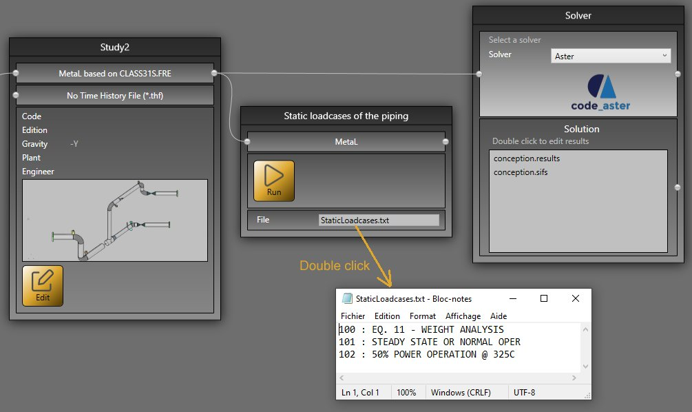

# Sample 5 : Static loadcases of a piping

## 1. Goal

Create a script that will (after pressing **RUN** button) retrieve all static cases (Number + Title) of a piping based on the **MetaL** file.

## 2. Script definition

From the Home/Python, click on button 1 (Add project script) :


Give it the name "Static loadcases of the piping"

>Say **NO** to the question about creation of virtual environment. The Requirements.txt will be hidden.


## 3. Script properties

Add 1 METAL input and 1 FILENAME output :


The input METAL must receive the MetaL file (the internal file format of MetaPiping) from a connection of the main **study** brick.

The output FILENAME will expose a TXT file. You can double click to see the content.

## 4. Main.py

Copy/paste this code in the Editor :

```python
import os

# Check if the connection has been made with the MetaL connector
metal = study.getMetal()
if metal != None:
    dir = study.getDirectory()
    filename = os.path.join(dir, "StaticLoadcases.txt")
    
    # Get all static cases
    cases = []
    for item in metal.StaticCases:
        st = "{} : {}".format(item.Number, item.Title)
        cases.append(st)
        
    # Save the file
    with open(filename,'w') as f:
	    f.write('\n'.join(cases))
    
    study.Outputs[0] = "StaticLoadcases.txt"
else:
    study.Outputs[0] = "Please connect MetaL !"
```

Save it !

## 5. Result

When you add this script in a current study, connect the MetaL output of the **study brick** and after a click on the **RUN** button :



You have the list of all static cases !