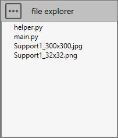

# Sample 12 : Create a beam support of a piping on a node

## 1. Goal

Create a script that will (after selecting a piping node with a restraint and pressing a **button** in the ribbon) show a window with variables and build several beams like in this picture :


>Since the user will have to create a COMMAND, the application will manage the undo/redo operations by itself !

## 2. Script definition

From the Home/Python, click on **button 2** (Add script) :


Select "Design script" and give it the name "Support1"

>Say **NO** to the question about creation of virtual environment. The Requirements.txt will be hidden.

## 3. Script files

This kind of script needs some **images** in order to illustrate the **button** and the **window**.



Press the "three points" button and select "Import image". You need to create a 32x32 transparent PNG for the icon of the button and an illustration of the support for the window.

Press the "three points" button and select "Add a python file". We will create a file for some helper functions.

### 3.1 helper.py

Select the file.

Copy/paste this code in the Editor :

```python
##########################
# Model helper functions #
##########################

from Cwantic.MetaPiping.Core import BeamExtremity, LTBModel

# Method that check if a node contains a restraint
def getRestraint(node, model):
    for restraint in model.Restraints:
        if restraint.Node == node:
            return restraint
    return None

# Method that return the first pipe on node
def getFirstPipe(design, node):
    for element in node.Elements:
        if design.isType(element, "Pipe"):
            return element
    return None

# Initialize a new CurrentValues for beam
def initializeCurrentValues(currentValues):
    other = currentValues.Clone()
    other.BeamIndexExtremity1 = 0
    other.BeamIndexExtremity2 = 0
    other.BeamOffset1 = 0
    other.BeamOffset2 = 0
    other.BeamJoint1 = None
    other.BeamJoint2 = None
    other.BeamLTBModel = LTBModel.BothHingedUniform
    other.BeamExtremity1 = BeamExtremity(0)    # Tip : cannot set BeamExtremity.None so use 0 instead
    other.BeamExtremity2 = BeamExtremity(0)    # Tip : cannot set BeamExtremity.None so use 0 instead
    other.CheckModel = False
    return other
```

Save it !

## 4. Script properties

In this kind of script, user has to define the **button** :


The **Target** is Structure!

The location will be **Design** so that the button appears on the right tab with its icon and description.

## 5. main.py

Select the file.

Copy/paste this code in the Editor :

```python
###################################
# Create support on selected node #
###################################

import os
from System.Windows.Media.Media3D import Vector3D
from System.Collections.Generic import List
from helper import getRestraint, getFirstPipe, initializeCurrentValues
from Cwantic.MetaPiping.Core import Node, Element, AddNodeCommand, AddBeamCommand, MassModel, BeamExtremity, CoordinateSystem

# Default error message
message = "Select a node with restraint !"
 
# Inspect selection
n = len(design.selectedList)
if n==1:
    # Check the type of selected element
    if design.isType(design.selectedList[0], "Node"):
        node = design.selectedList[0]
        
        # Get the current metal
        model = design.getMetal()
        
        # Get the metal of the node (can be a LINKED metal so do not use getMetal)
        selectedModel = design.getMetalWithSelection(node)
        
        # Get the script directory
        directory = design.getScriptDirectory()
        
        # Check if a restraint exists on this node
        restraint = getRestraint(node, selectedModel)
        if restraint != None:
            # Get the first pipe on node
            pipe = getFirstPipe(design, node)
            if pipe != None:
                # Get the pipe ray
                ray = pipe.Section.Diameter / 2
                # Get the pipe direction
                pipevec = Vector3D(pipe.DL.X, pipe.DL.Y, pipe.DL.Z)
                pipevec.Normalize()
                # Get the model vertical vector (+Z or +Y)
                verticalvec = design.getVerticalVector()
                # Get the horizontal vector perpendicular to pipe
                horizontalvec = Vector3D.CrossProduct(pipevec, verticalvec)
                horizontalvec.Normalize()
                
                # Get the current beam default values (section, material, extremities,...)
                currentValues = design.getCurrentSpecValues()
                
                # Add the half distance of the current beam section to ray
                dist = ray + currentValues.MKS_SpecBeamSection.H / 2
                
                # Get node altitude
                if verticalvec.Y == 1:
                    altitude = node.Coor.Y
                else:
                    altitude = node.Coor.Z
                    
                # Initialize offset and anchor
                offset = 0
                anchor = True
                
                # Get variable values - create a window
                window = design.createVariableWindow()
                window.AddComment("Fill the variables and click on OK. The support will be perpendicular to the pipe and tangent. L can be positive or negative. [meter]")
                window.AddValue("L", "L =", 2)
                window.AddValue("H", "H =", altitude)
                window.AddValue("DL", "L1 =", 1)
                window.AddValue("DH", "H1 =", 0.5)
                window.AddList("OFFSET", "Offset =", ["No offset", "Pipe ray", "0.5 m"], 1)
                window.AddCheck("ANCHOR", "Anchor =", anchor)
                window.AddImage(os.path.join(directory, "Support1_300x300.jpg"))
                if window.ShowModal():
                    L = window.GetValue("L")
                    H = window.GetValue("H")
                    DL = window.GetValue("DL") * L / abs(L)
                    DH = window.GetValue("DH")
                    OFFSET_ID = window.GetValue("OFFSET")
                    if OFFSET_ID == 1:
                        offset = ray
                    else:
                        if OFFSET_ID == 2:
                            offset = 0.5
                    ANCHOR_ID = window.GetValue("ANCHOR")
                    anchor = ANCHOR_ID == 1
                    
                    # Create a new USER command : cmd
                    cmd = design.createCommand("AddSupport1")
                
                    # Create nodes - we need temporary commands to get new nodes (1 to 5) to pass to node, beam and anchor commands
                    node1Cmd = AddNodeCommand(model, node.Coor.X - dist*verticalvec.X, node.Coor.Y - dist*verticalvec.Y, node.Coor.Z - dist*verticalvec.Z, "", False, currentValues)
                    node1 = node1Cmd.Node
                    
                    node2Cmd = AddNodeCommand(model, node1.Coor.X + (L-DL)*horizontalvec.X, node1.Coor.Y + (L-DL)*horizontalvec.Y, node1.Coor.Z + (L-DL)*horizontalvec.Z, "", False, currentValues)
                    node2 = node2Cmd.Node
                    
                    node3Cmd = AddNodeCommand(model, node1.Coor.X + L*horizontalvec.X, node1.Coor.Y + L*horizontalvec.Y, node1.Coor.Z + L*horizontalvec.Z, "", False, currentValues)
                    node3 = node3Cmd.Node
                    
                    node4Cmd = AddNodeCommand(model, node3.Coor.X - DH*verticalvec.X, node3.Coor.Y - DH*verticalvec.Y, node3.Coor.Z - DH*verticalvec.Z, "", False, currentValues)
                    node4 = node4Cmd.Node
                    
                    node5Cmd = AddNodeCommand(model, node3.Coor.X - H*verticalvec.X, node3.Coor.Y - H*verticalvec.Y, node3.Coor.Z - H*verticalvec.Z, "", False, currentValues)
                    node5 = node5Cmd.Node
                    
                    # Create node sub commands
                    cmd.addSubCommand("AddNodeCommand", [node1, -1])
                    cmd.addSubCommand("AddNodeCommand", [node2, -1])
                    cmd.addSubCommand("AddNodeCommand", [node3, -1])
                    cmd.addSubCommand("AddNodeCommand", [node4, -1])
                    cmd.addSubCommand("AddNodeCommand", [node5, -1])
                    
                    # Create beam sub commands
                    # Tip : each command must have its own currentValues, initializeCurrentValues create a clone and initialize values
                    currentValues = initializeCurrentValues(currentValues)
                    currentValues.BeamOffset1 = offset
                    cmd.addSubCommand("AddBeamCommand", [node1, node2, node2.Coor.X-node1.Coor.X, node2.Coor.Y-node1.Coor.Y, node2.Coor.Z-node1.Coor.Z, MassModel.HalfAtBoth, 0.0, verticalvec.X, verticalvec.Y, verticalvec.Z, currentValues, -1])

                    currentValues = initializeCurrentValues(currentValues)
                    beamCmd = AddBeamCommand(model, node2, node3, node3.Coor.X-node2.Coor.X, node3.Coor.Y-node2.Coor.Y, node3.Coor.Z-node2.Coor.Z, MassModel.HalfAtBoth, 0.0, verticalvec.X, verticalvec.Y, verticalvec.Z, currentValues, -1)
                    beam1 =  beamCmd.Beam 
                    cmd.addSubCommand("AddBeamCommand", [beam1])
                    
                    currentValues = initializeCurrentValues(currentValues)
                    beamCmd2 = AddBeamCommand(model, node3, node4, node4.Coor.X-node3.Coor.X, node4.Coor.Y-node3.Coor.Y, node4.Coor.Z-node3.Coor.Z, MassModel.HalfAtBoth, 0.0, horizontalvec.X, horizontalvec.Y, horizontalvec.Z, currentValues, -1)
                    beam2 =  beamCmd2.Beam
                    cmd.addSubCommand("AddBeamCommand", [beam2])
                    
                    # Set connectivity between Beam1 and Beam2
                    beam1.Extremity2 = BeamExtremity.Back
                    beam1.Extremity2Beam = beam2
                    beam2.Extremity1 = BeamExtremity.Front
                    beam2.Extremity1Beam = beam1
                    
                    currentValues = initializeCurrentValues(currentValues)
                    beamCmd3 = AddBeamCommand(model, node4, node5, node5.Coor.X-node4.Coor.X, node5.Coor.Y-node4.Coor.Y, node5.Coor.Z-node4.Coor.Z, MassModel.HalfAtBoth, 0.0, horizontalvec.X, horizontalvec.Y, horizontalvec.Z, currentValues, -1)
                    beam3 =  beamCmd3.Beam 
                    cmd.addSubCommand("AddBeamCommand", [beam3])
                    
                    currentValues = initializeCurrentValues(currentValues)
                    currentValues.BeamExtremity1 = BeamExtremity.Front
                    currentValues.BeamIndexExtremity1 = 1
                    currentValues.BeamExtremity2 = BeamExtremity.Front
                    currentValues.BeamIndexExtremity2 = 1
                    cmd.addSubCommand("AddBeamCommand", [node4, node2, node2.Coor.X-node4.Coor.X, node2.Coor.Y-node4.Coor.Y, node2.Coor.Z-node4.Coor.Z, MassModel.HalfAtBoth, 0.0, verticalvec.X, verticalvec.Y, verticalvec.Z, currentValues, -1])

                    # Create anchor command - need a list of node as first parameter
                    if anchor:
                        Nodes = List[Node]()
                        Nodes.Add(node5)
                        
                        Attached = List[Element]()
                        Attached.Add(beam3)
                        
                        TSTIFF = model.ANCH_TSTIFF
                        RSTIFF = model.ANCH_RSTIFF
                        cmd.addSubCommand("CreateAnchorCommand", [Nodes, CoordinateSystem.LocalToConnectedElement, Attached, "", TSTIFF, TSTIFF, TSTIFF, RSTIFF, RSTIFF, RSTIFF, currentValues.Layer, ""])
                    
                    design.executeCommand(cmd)
                    message = ""
                else:
                    message = "Cancel by user !"
            else:
                message = "No pipe on this node !"
        else:
            message = "No restraint on this node !"

design.result = message
```

Save it !

## 6. Result

Create a **piping study** with some restraints on node.

Create a **structure study** with a link to the previous study.

Select a restrainted node in the link model and press the **Support1** button.


This window will appear :


Change values and click OK :


