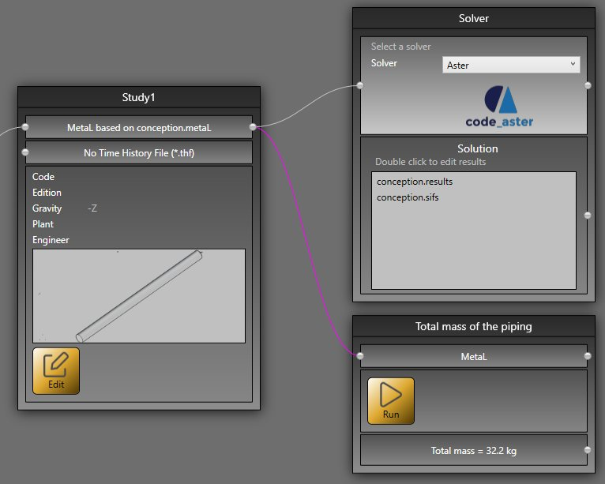

# Sample 4 : Total mass of a piping

## 1. Goal

Create a script that will (after pressing **RUN** button) calculate the total mass of a piping based on the **MetaL** file.

## 2. Script definition

From the Home/Python, click on button 1 (Add project script) :


Give it the name "Total mass of the piping"

>Say **NO** to the question about creation of virtual environment. The Requirements.txt will be hidden.


## 3. Script properties

Add 1 METAL input and 1 TEXT output :


The input METAL must receive the MetaL file (the internal file format of MetaPiping) from a connection of the main **study** brick.

The output TEXT shows the result.

## 4. Main.py

Copy/paste this code in the Editor :

```python
from Cwantic.MetaPiping.Core import Piping

# Check if the connection has been made with the MetaL connector
metal = study.getMetal()
if metal != None:
    total = 0
    for item in metal.Elements:
        if isinstance(item, Piping):
            # item is a Piping so we can access the Section property
            mass = item.Section.LinearMass * item.DL.Length
            total += mass
    study.Outputs[0] = "Total mass = {} kg".format(total)
else:
    study.Outputs[0] = "Please connect MetaL !"
```

Save it !

## 5. Result

When you add this script in a current study, connect the MetaL output of the **study brick** and after a click on the **RUN** button :



You have the total mass !