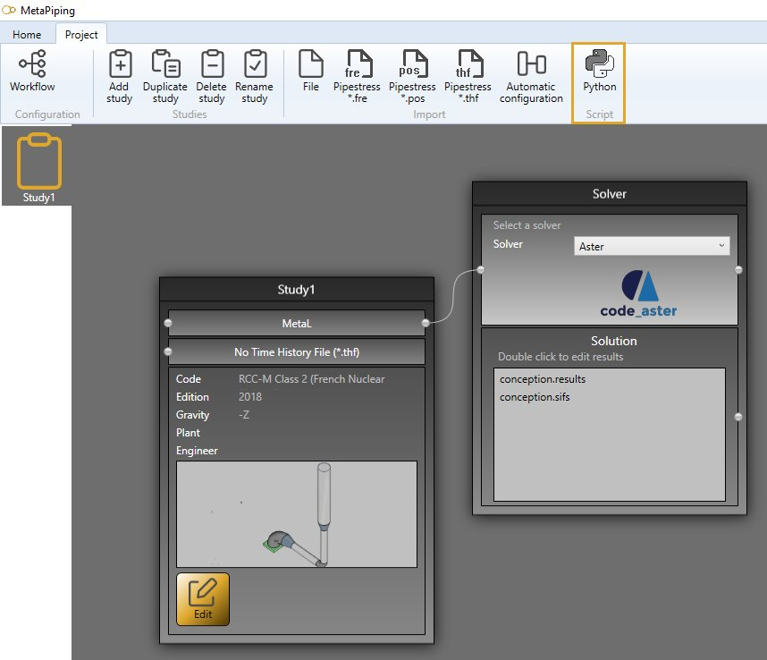
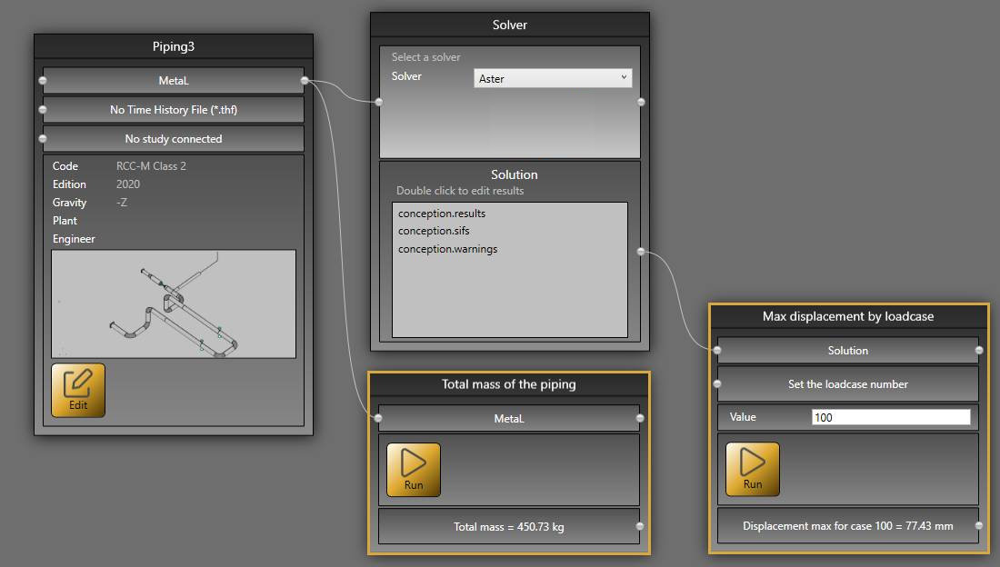
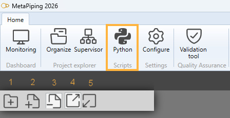
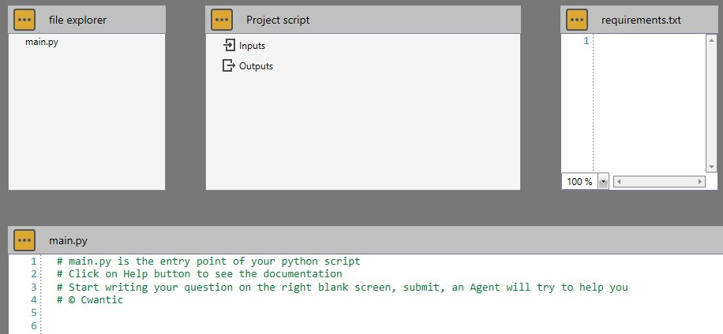
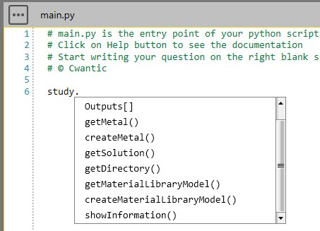

# Study

A study is a workflow of **bricks** and **connections** - [See Study page for more information](https://documentation.metapiping.com/Explorer/Study.html)

User can create its own **bricks** via Python scripts.

Click on **Python** in application's ribbon in the current study :



Select a script via the dropdown list :



You can create scripts that are independant of the current study, you can **inject** data to the internal model (MetaL - point 1), you can **extract** data from the internal model (MetaL - point 2), or you can **extract** data from the solution (Solution - point 3).

Let's see how to create this kind of script.

---

## 1. Script definition

From the Home/Python, click on button 1 (Add project script) :



Give it a name and wait several seconds the ***Python Virtual Environment*** is generating...

A new *main.py* will be created in the file explorer and *Inputs* and *Outputs* nodes in the Project script. Requirements.txt and the Editor are empty :



Buttons with three points indicates the presence of a dropdown list :

In file explorer :

```
    - Add a python file         : Add an empty *.py file in the script directory
    - Import image              : Open a dialog to import *.jpg/*.png image
    - Open folder in explorer   : Open the current script folder
    - Refresh                   : Refresh the file explorer to show the new imported files
    - Remove selected file      : Remove the selected file in the file explorer
```

In Project script :

```
    - Add TEXT input            : Add a text in the script brick
    - Add EDIT input            : Add an edit in the script brick where user can write values
    - Add METAL input           : Add an access to the internal structure metaL
    - Add SOLUTION input        : Add an access to the solution
    - Add TEXT output           : Add an output text in the script brick
    - Add FILENAME output       : Add an output filename that can be edit by the user by double clic
    - Save                      : Save the script definition
    - Remove                    : Remove the selected item
```

The TEXT input can only receive an information by connection from a TEXT output of another script.

In requirements.txt :


```
    - Save                      : Save the file
    - Install                   : Install the libraries defined in the file
```

This file must contain the name and version of the Python libraries used in the script. MetaPiping will install all libraries by internally doing :

```python
pip install -r requirements.txt
```

[See the specification of the file for more information](https://pip.pypa.io/en/stable/reference/requirements-file-format/)


In main.py

```
    - Save                      : Save the current python file
```

A *study script* brick contains a **RUN** button that will execute the **main.py** file.


In the Editor, you have access to the object **study** that exposes some functions. A dropdown menu will appear after writing :

```python
study.
```



[See the description of the object study](https://documentation.metapiping.com/Python/Classes/study.html)

---

## 2. Independant script

This kind of script don't need to have access to the files of the current study/project/metaL/solution but only some interaction with the user.

It can for example ask some data from the user via INPUT **EDIT** and give answers after treatment via OUTPUTS **TEXT**.

[See an example of independant script](https://documentation.metapiping.com/Python/Samples/datetimefile.html) : Date, time and file

[See another example of independant script](https://documentation.metapiping.com/Python/Samples/sendemail.html) : Send an email

---
## 3. MetaL injection

Based on the explained [MetaL](https://documentation.metapiping.com/Python/Classes/metal.html) internal structure, user can create his own **CONVERTERS** from other file format or from company's internal datas.

Cwantic has created **PLUGINS**, with the same principle, that converts **PIPESTRESS**, **PIPSYS** and **PCF** file format to MetaL file format.

User can for example inject **LOADIND TEMPLATES** in current project based on his own datas.

[See an example of a CONVERTER from Excel file to MetaL](https://documentation.metapiping.com/Python/Samples/converter.html) : Converter

---

## 4. MetaL extraction

Based on the explained [MetaL](https://documentation.metapiping.com/Python/Classes/metal.html) internal structure, user can create his own script to retrieve informations of the model. 


[See an example of MetaL data extraction](https://documentation.metapiping.com/Python/Samples/totalmass.html) : Calculate the total mass of a piping


[See another example of MetaL data extraction](https://documentation.metapiping.com/Python/Samples/staticases.html) : Get all static cases of a piping

---

## 5. Solution extraction

Based on the explained [Solution](https://documentation.metapiping.com/Python/Classes/solution.html) internal structure, user can create his own script to retrieve informations of the solution. 


[See an example of Solution data extraction](https://documentation.metapiping.com/Python/Samples/maxdisplacement.html) : Get the max displacement by static case number
