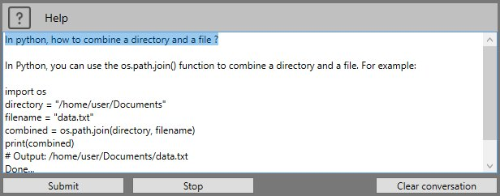

# ChatGPT

MetaPiping provides a privileged connection to **ChatGPT** through an official license to the API.

>ChatGPT (Chat Generative Pre-trained Transformer) is a chatbot developed by OpenAI and launched in November 2022. It is built on top of OpenAI's GPT-3 family of large language models and has been fine-tuned (an approach to transfer learning) using both supervised and reinforcement learning techniques.


MetaPiping uses the model **text-davinci-003** : Most capable GPT-3 model. It can do any task the other models can do, often with higher quality, longer output and better instruction-following. Also supports inserting completions within text.
## 1. Codex

ChatGPT is able to help user in Python development thanks to its **Codex**.

>OpenAI Codex is a descendant of GPT-3; its training data contains both natural language and billions of lines of source code from publicly available sources, including code in public GitHub repositories. OpenAI Codex is most capable in Python, ... It has a memory of 14KB for Python code, compared to GPT-3 which has only 4KB—so it can take into account over 3x as much contextual information while performing any task.

MetaPiping uses the model **code-davinci-002** : Most capable Codex model. Particularly good at translating natural language to code. In addition to completing code, also supports inserting completions within code.

---

## 2. Screen

The prompt for a conversation with ChatGPT is on area 5 (in the Python screen)


---
## 3. Goal

One of the main feature of MetaPiping is the **Python integration**.

User can make his own scripts to interact with the application or manipulate the input and output data.

Cwantic chooses **Python** language to create these scripts. But Why **Python** ? Let ChatGPT answers :


1. Write your question in english our in your native language
2. Submit
3. ChatGPT will answer

Here is its answer :

```
1. Easy to read and understand: Python has a simple syntax and readable code, making it easier to read and understand compared to many other languages.

2. Cross platform support: Python is available on multiple platforms including Windows, Mac, Linux and many other systems. This means that you can develop applications that can run on any platform.

3. Extensive library support: Python comes with a wide range of libraries that can be used to develop applications quickly and efficiently.

4. High-level language: Python can be used to develop high-level applications without having to write complex code.

5. Flexibility and dynamic typing: Python is flexible and does not enforce any particular style or structure on the code. In addition, it supports dynamic typing and does not require explicit variable declaration.
```
---
## 4. Conversation

ChatGPT knows almost everything and retains the thread of the conversation.

Here is an example of a conversation. In blue the question asked by the user. Click on **Submit** button. Then in black the answer :


---
## 5. Python language

ChatGPT is also an **expert** in Python.

Examples :





These answers were used to create [Sample1](https://documentation.metapiping.com/Python/Samples/datetimefile.html).

---
## 6. Python libraries

ChatGPT is also an **expert** in all libraries of **pip**.

Examples used to create [Sample3](https://documentation.metapiping.com/Python/Samples/converter.html) about **EXCEL** files :


---
## 7. Conclusion

ChatGPT is the perfect **companion** to help the user writing **scripts** by finding all the necessary information on any subject but more specifically on the use of the **python language** and its numerous mathematical, scientific and computer **libraries**.