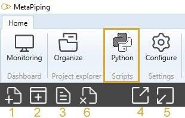

# Design

The **Design** mode is the part of the application dedicated to :

- Design : model the piping, configure the settings
- Loads : create several types of loads
- Review : review everything before launching the calculation
- Analysis : analyze the piping

## 1. Goal

The goal of this kind of script is to create functions that doesn't exist in the application.


User can create his own **commands** to "interact" with the model and especially with the **selection** object.

He can add buttons on ribbons with a name, a description, an image and of course a **script** (main.py).

## 2. Script definition

From Home/Python, click on button 2 (Add script) :



Select "Design script", give it a name and answer **YES** if you need ***Python Virtual Environment*** for libraries. In this case, wait until the Virtual Environment is generating...


The whole screen and the dropdown lists are the same as the
[study](https://documentation.metapiping.com/Python/Study.html) scripts.

The only change is the **Button properties** :


You have 3 lines of text (Description) + 64x64 image to explain what the script does.

This button will appear on the possible locations :

- Test      : nowhere, only for test purpose
- Design    : In Design tab
- Loads     : In Loads tab
- Review    : In Review tab
- Analysis  : In Analysis tab

The Target can be **Piping** or **Structure**.

A new *main.py* will be created in the file explorer and requirements.txt and the Editor will be empty.

In the Editor, you have access to the object **design** that exposes some functions. A dropdown menu will appear after writing :

```python
design.
```


[See the description of the object design](https://documentation.metapiping.com/Python/Classes/design.html)

## 3. Presentation of the design scripts

If one script exists for the specified location and target, the **Python** logo will appear on the right tab with all scripts of this category :


The folders will appear in gray. You can easily organize your scripts with this herarchy tree.

## 4. Design script

If a tool is missing, user can create his own **command** that can interact with the user and modify the selected elements or the whole model.

[See an example of a Design script](https://documentation.metapiping.com/Python/Samples/lyre.html) : Replace a selected pipe by a loop

## 5. Review script

If a tool is missing, user can create his own **tool** to inspect the objects in selection or the whole model.

[See an example of a Review script](https://documentation.metapiping.com/Python/Samples/distance.html) : Measure the distance between 2 nodes by message


[See another example of a Review script](https://documentation.metapiping.com/Python/Samples/distance2.html) : Show the distance between 2 nodes in left frame

