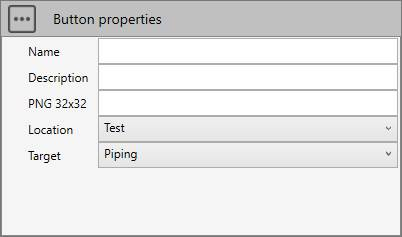

# Design

The **Design** mode is the part of the application dedicated to :

- Design : model the piping, configure the settings
- Loads : create several type of loads
- Review : review everything before launching the calculations
- Analysis : analyze the piping

>MetaPiping 2023.0 gives an access to **Design** and **Review**.

The other parts will come soon...

---

## 1. Goal

The goal of this kind of script is to create functions that doesn't exists in the application.


User can create his own **commands** to "interact" with the model and especially with the **selection** object.

He can add buttons on ribbons with a name, a description, an image and of course a **script** (main.py).

---

## 2. Script definition

From the Home/Python, click on button 3 (Add 3D script) :


Give it a name and wait several seconds the ***Python Virtual Environment*** is generating...

The whole screen and the dropdown lists are the same as the
[study](https://documentation.metapiping.com/Python/Study.html) scripts.

The only change is the **Button properties** :



This 32x32 button will appear on the possible locations :

- Test      : nowhere, only for test purpose
- Design    : In Design ribbon
- Loads     : In Loads ribbon
- Review    : In Review ribbon
- Analysis  : In Analysis ribbon


A new *main.py* will be created in the file explorer and requirements.txt and the Editor will be empty.

In the Editor, you have access to the object **design** that exposes some functions. A dropdown menu will appear after writing :

```python
design.
```


---

## 3. Design script

If a tool is missing, user can create his own **command** that can interact with the user and modify the whole model.

[See an example of a Design script](https://documentation.metapiping.com/Python/Samples/lyre.html) : Replace a selected pipe by a lyre

## 4. Review script

If a tool is missing, user can create his own **tool** to inspect the objects in selection or the whole model.

[See an example of a Review script](https://documentation.metapiping.com/Python/Samples/distance.html) : Measure the distance between 2 nodes by message


[See another example of a Review script](https://documentation.metapiping.com/Python/Samples/distance2.html) : Show the distance between 2 nodes in left frame
