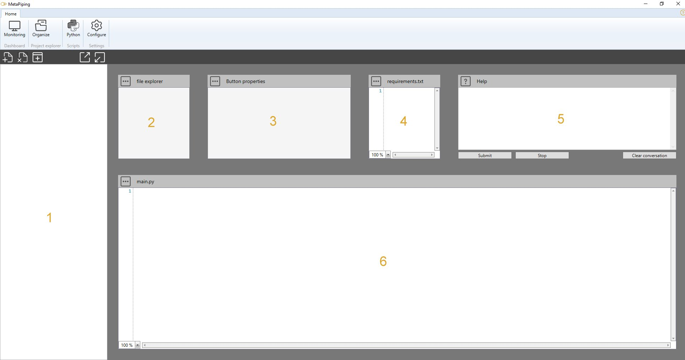

# Python integration

MetaPiping offers to user the possibility to manipulate datas produced by the software in order to operate custom treatment.

These manipulations can be done via **Python** scripts, a simple and well documented language, with a great free mathematical, scientific and computer library, appreciated by engineers.

A script contains one or more *.py files in a **python virtual environment**. 

**Main.py** is mantadory and represents the main access of the script.

---
## Script types

The integration can be done at 2 different levels :

- Project/study phase - [See Study page for more information](https://documentation.metapiping.com/Python/Study.html) 
- Design phase - [See Design page for more information](https://documentation.metapiping.com/Python/Design.html) 

---
## Main menu

Select **Python** in the application's ribbon :

On the upper left menu, a **menu** proposes several tools :

1. Create a script for **study** level - [See Study page for more information](https://documentation.metapiping.com/Python/Study.html) 
2. Remove the selected script
3. Create a script for **design** level - [See Design page for more information](https://documentation.metapiping.com/Python/Design.html) 
4. Save a script to disk - [See Pyckage page for more information](https://documentation.metapiping.com/Python/Pyckage.html) 
5. Load a script from disk - [See Pyckage page for more information](https://documentation.metapiping.com/Python/Pyckage.html) 

---
## Screen

The screen is made up of different parts :

1. The list of all scripts (of all type)
2. The files (and directories) used in the script - select a file shows it in the editor (6)
3. The properties of the script (Type, Name, Input, Output...)
4. The **Requirements.txt** of the virtual environment of the script
5. The chatGPT help - [See chatGPT page for more information](https://documentation.metapiping.com/Python/chatGPT.html) 
6. The Python **Editor** - or image viewer if you select an image in the file explorer (2)
